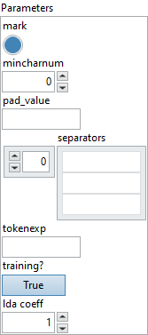

<h1>Tokenizer</h1>

<h2>Description</h2>

Tokenizer divides each string in X into a vector of strings along the last axis.

Allowed input shapes are [C] and [N, C]. If the maximum number of tokens found per input string is D, the output shape would be [N, C, D] when input shape is [N, C]. Similarly, if input shape is [C] then the output should be [C, D]. Tokenizer has two different operation modes. The first mode is selected when “tokenexp” is not set and “separators” is set. If “tokenexp” is set and “separators” is not set, the second mode will be used. The first mode breaks each input string into tokens by matching and removing separators. “separators” is a list of strings which are regular expressions. “tokenexp” is a single regular expression. Let’s assume “separators” is [” “] and consider an example. If input is [“Hello World”, “I love computer science !”] whose shape is [2], then the output would be [[“Hello”, “World”, padvalue, padvalue, padvalue], [“I”, “love”, “computer”, “science”, “!”]] whose shape is [2, 5] because you can find at most 5 tokens per input string. Note that the input at most can have two axes, so 3-D and higher dimension are not supported. If “separators” contains a single empty string, the Tokenizer will enter into character tokenezation mode. This means all strings will be broken part into individual characters. For each input string, the second mode searches matches of “tokenexp” and each match will be a token in Y. The matching of “tokenexp” is conducted greedily (i.e., a match should be as long as possible). This operator searches for the first match starting from the beginning of the considered string, and then launches another search starting from the first remained character after the first matched token. If no match found, this operator will remove the first character from the remained string and do another search. This procedure will be repeated until reaching the end of the considered string. Let’s consider another example to illustrate the effect of setting “mark” to true. If input is [“Hello”, “World”], then the corresponding output would be [0x02, “Hello”, “World”, 0x03]. This implies that if mark is true, [C]/[N, C] – input’s output shape becomes [C, D+2]/[N, C, D+2]. If tokenizer removes the entire content of [C]-input, it will produce [[]]. I.e. the output shape should be [C][0] or [N][C][0] if input shape was [N][C]. If the tokenizer receives empty input of [0] then the output is [0] if empty input of [N, 0] then [N, 0].

<h3>Input parameters</h3>

<table>
  <tbody>
    <tr>
      <td width="64" valign="top"></td>
      <td valign="top"><strong><a href="../../../../../../more-deep-learning/nodes-parameters/specified_outputs_name/README.md">specified_outputs_name</a> : <em>array, </em></strong>this parameter lets you manually assign custom names to the output tensors of a node.</td>
    </tr>
    <tr>
      <td width="64" valign="top"></td>
      <td valign="top"><strong>X (heterogeneous) – T : <em>object, </em></strong>strings to tokenize.</td>
    </tr>
  </tbody>
</table>

<table>
  <tbody>
    <tr>
      <td valign="top" width="70%">
<strong>Parameters : <em>cluster,</em></strong>

<table>
  <tbody>
    <tr>
      <td width="64" valign="top"></td>
      <td valign="top"><strong>mark :</strong> <em><strong>boolean</strong></em>, boolean whether to mark the beginning/end character with start of text character (0x02)/end of text character (0x03).</td>
    </tr>
    <tr>
      <td width="64" valign="top"></td>
      <td valign="top">Default value “True”.</td>
    </tr>
    <tr>
      <td width="64" valign="top"></td>
      <td valign="top"><strong>mincharnum : <em>integer,</em></strong> minimum number of characters allowed in the output. For example, if mincharnum is 2, tokens such as “A” and “B” would be ignored.</td>
    </tr>
    <tr>
      <td width="64" valign="top"></td>
      <td valign="top">Default value “0”.</td>
    </tr>
    <tr>
      <td width="64" valign="top"></td>
      <td valign="top"><strong>pad_value : <em>string,</em></strong> the string used to pad output tensors when the tokens extracted doesn’t match the maximum number of tokens found. If start/end markers are needed, padding will appear outside the markers.</td>
    </tr>
    <tr>
      <td width="64" valign="top"></td>
      <td valign="top"><strong>separators : <em>array,</em></strong> an optional list of strings attribute that contains a list of separators – regular expressions to match separators Two consecutive segments in X connected by a separator would be divided into two tokens. For example, if the input is “Hello World!” and this attribute contains only one space character, the corresponding output would be [“Hello”, “World!”]. To achieve character-level tokenization, one should set the ‘separators’ to [“”], which contains an empty string.r.</td>
    </tr>
    <tr>
      <td width="64" valign="top"></td>
      <td valign="top">Default value “empty”.</td>
    </tr>
    <tr>
      <td width="64" valign="top"></td>
      <td valign="top"><strong>tokenexp : <em>string,</em></strong> an optional string. Token’s regular expression in basic POSIX format (pubs.opengroup.org/onlinepubs/9699919799/basedefs/V1_chap09.html#tag_09_03). If set, tokenizer may produce tokens matching the specified pattern. Note that one and only of ‘tokenexp’ and ‘separators’ should be set.</td>
    </tr>
    <tr>
      <td width="64" valign="top"></td>
      <td valign="top"><strong>training? :</strong> <em><strong>boolean</strong></em>, whether the layer is in training mode (can store data for backward).</td>
    </tr>
    <tr>
      <td width="64" valign="top"></td>
      <td valign="top">Default value “True”.</td>
    </tr>
    <tr>
      <td width="64" valign="top"></td>
      <td valign="top"><strong>lda coeff :</strong> <em><strong>float</strong></em>, defines the coefficient by which the loss derivative will be multiplied before being sent to the previous layer (since during the backward run we go backwards).</td>
    </tr>
    <tr>
      <td width="64" valign="top"></td>
      <td valign="top">Default value “1”.</td>
    </tr>
    <tr>
      <td width="64" valign="top"></td>
      <td valign="top"><strong>name (optional) :</strong> <em><strong>string,</strong></em> name of the node.</td>
    </tr>
  </tbody>
</table></td>
      <td valign="top" width="30%">

</td>
    </tr>
  </tbody>
</table>

<h3>Output parameters</h3>

<table>
  <tbody>
    <tr>
      <td width="64" valign="top"></td>
      <td valign="top"><strong>Y (heterogeneous) – T : <em>object, </em></strong>tokenized strings.</td>
    </tr>
  </tbody>
</table>

<h2>Type Constraints</h2>

<strong>T</strong> in (<code>tensor(string)</code>) : Input/Output is a string tensor.

<h2>Example</h2>

All these exemples are snippets PNG, you can drop these Snippet onto the block diagram and get the depicted code added to your VI (Do not forget to install Deep Learning library to run it).

