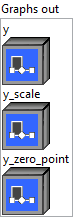

<h1>DynamicQuantizeLinear</h1>

<h2>Description</h2>

A Function to fuse calculation for Scale, Zero Point and FP32-&gt;8Bit conversion of FP32 Input data. Outputs Scale, ZeroPoint and Quantized Input for a given FP32 Input. Scale is calculated as :

y_scale

=

(

maximum

(

0

,

max

(

x

))

-

minimum

(

0

,

min

(

x

)))

/

(

qmax

-

qmin

)

<ul>
<li>where qmax and qmin are max and min values for quantization range i.e. [0, 255] in case of uint8</li>
<li>data range is adjusted to include 0.</li>
</ul>

Zero point is calculated as :

intermediate_zero_point

=

qmin

-

min

(

x

)

/

y_scale

y_zero_point

=

cast

(

round

(

saturate

(

itermediate_zero_point

)))

<ul>
<li>where qmax and qmin are max and min values for quantization range .i.e [0, 255] in case of uint8</li>
<li>for saturation, it saturates to [0, 255] if it’s uint8, or [-127, 127] if it’s int8. Right now only uint8 is supported.</li>
<li>rounding to nearest ties to even.</li>
</ul>

Data quantization formula is :

y

=

saturate

(

round

(

x

/

y_scale

)

+

y_zero_point

)

<ul>
<li>for saturation, it saturates to [0, 255] if it’s uint8, or [-127, 127] if it’s int8. Right now only uint8 is supported.</li>
<li>rounding to nearest ties to even.</li>
</ul>

<h3>Input parameters</h3>

<table>
  <tbody>
    <tr>
      <td width="64" valign="top"></td>
      <td valign="top"><strong><a href="../../../../../../more-deep-learning/nodes-parameters/specified_outputs_name/README.md">specified_outputs_name</a> : <em>array, </em></strong>this parameter lets you manually assign custom names to the output tensors of a node.</td>
    </tr>
    <tr>
      <td width="64" valign="top"></td>
      <td valign="top"><strong>x (heterogeneous) – T1 : <em>object, </em></strong>input tensor.</td>
    </tr>
  </tbody>
</table>

<table>
  <tbody>
    <tr>
      <td valign="top" width="70%">
<strong>Parameters : <em>cluster,</em></strong>

<table>
  <tbody>
    <tr>
      <td width="64" valign="top"></td>
      <td valign="top"><strong>training? :</strong> <em><strong>boolean</strong></em>, whether the layer is in training mode (can store data for backward).</td>
    </tr>
    <tr>
      <td width="64" valign="top"></td>
      <td valign="top">Default value “True”.</td>
    </tr>
    <tr>
      <td width="64" valign="top"></td>
      <td valign="top"><strong>lda coeff :</strong> <em><strong>float</strong></em>, defines the coefficient by which the loss derivative will be multiplied before being sent to the previous layer (since during the backward run we go backwards).</td>
    </tr>
    <tr>
      <td width="64" valign="top"></td>
      <td valign="top">Default value “1”.</td>
    </tr>
    <tr>
      <td width="64" valign="top"></td>
      <td valign="top"><strong>name (optional) :</strong> <em><strong>string,</strong></em> name of the node.</td>
    </tr>
  </tbody>
</table></td>
      <td valign="top" width="30%">

</td>
    </tr>
  </tbody>
</table>

<h3>Output parameters</h3>

<table>
  <tbody>
    <tr>
      <td valign="top" width="70%">
<strong>Graphs out :</strong><strong><em>cluster,</em></strong> ONNX model architecture.

<table>
  <tbody>
    <tr>
      <td width="64" valign="top"></td>
      <td valign="top"><strong>y (heterogeneous) – T2 : <em>object, </em></strong>quantized output tensor.</td>
    </tr>
    <tr>
      <td width="64" valign="top"></td>
      <td valign="top"><strong>y_scale (heterogeneous) – tensor(float) : <em>object, </em></strong>output scale. It’s a scalar, which means a per-tensor/layer quantization.</td>
    </tr>
    <tr>
      <td width="64" valign="top"></td>
      <td valign="top"><strong>y_zero_point (heterogeneous) – T2 : <em>object, </em></strong>output zero point. It’s a scalar, which means a per-tensor/layer quantization.</td>
    </tr>
  </tbody>
</table></td>
      <td valign="top" width="30%">

</td>
    </tr>
  </tbody>
</table>

<h2>Type Constraints</h2>

<strong>T1</strong> in (<code>tensor(float)</code>) : Constrain ‘x’ to float tensor.

<strong>T2</strong> in (<code>tensor(uint8)</code>) : Constrain ‘y_zero_point’ and ‘y’ to 8-bit unsigned integer tensor.

<h2>Example</h2>

All these exemples are snippets PNG, you can drop these Snippet onto the block diagram and get the depicted code added to your VI (Do not forget to install Deep Learning library to run it).

