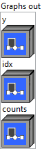

<h1>MicrosoftUnique</h1>

<h2>Description</h2>

Finds all the unique values (deduped list) present in the given input tensor. This operator returns 3 outputs. The first output tensor ‘uniques’ contains all of the unique elements of the input, sorted in the same order that they occur in the input. The second output tensor ‘idx’ is the same size as the input and it contains the index of each value of the input in ‘uniques’. The third output tensor ‘counts’ contains the count of each element of ‘uniques’ in the input. Example: input_x = [2, 1, 1, 3, 4, 3] output_uniques = [2, 1, 3, 4] output_idx = [0, 1, 1, 2, 3, 2] output_counts = [1, 2, 2, 1].

<h3>Input parameters</h3>

<table>
  <tbody>
    <tr>
      <td width="64" valign="top"></td>
      <td valign="top"><strong><a href="../../../../../../more-deep-learning/nodes-parameters/specified_outputs_name/README.md">specified_outputs_name</a> : <em>array, </em></strong>this parameter lets you manually assign custom names to the output tensors of a node.</td>
    </tr>
    <tr>
      <td width="64" valign="top"></td>
      <td valign="top"><strong>x (heterogeneous) – T : <em>object, </em></strong>a 1-D input tensor that is to be processed.</td>
    </tr>
  </tbody>
</table>

<table>
  <tbody>
    <tr>
      <td valign="top" width="70%">
<strong>Parameters : <em>cluster,</em></strong>

<table>
  <tbody>
    <tr>
      <td width="64" valign="top"></td>
      <td valign="top"><strong>training? :</strong> <em><strong>boolean</strong></em>, whether the layer is in training mode (can store data for backward).</td>
    </tr>
    <tr>
      <td width="64" valign="top"></td>
      <td valign="top">Default value “True”.</td>
    </tr>
    <tr>
      <td width="64" valign="top"></td>
      <td valign="top"><strong>lda coeff :</strong> <em><strong>float</strong></em>, defines the coefficient by which the loss derivative will be multiplied before being sent to the previous layer (since during the backward run we go backwards).</td>
    </tr>
    <tr>
      <td width="64" valign="top"></td>
      <td valign="top">Default value “1”.</td>
    </tr>
    <tr>
      <td width="64" valign="top"></td>
      <td valign="top"><strong>name (optional) :</strong> <em><strong>string,</strong></em> name of the node.</td>
    </tr>
  </tbody>
</table></td>
      <td valign="top" width="30%">

</td>
    </tr>
  </tbody>
</table>

<h3>Output parameters</h3>

<table>
  <tbody>
    <tr>
      <td valign="top" width="70%">
<strong>Graphs out :</strong><strong><em>cluster,</em></strong> ONNX model architecture.

<table>
  <tbody>
    <tr>
      <td width="64" valign="top"></td>
      <td valign="top"><strong>y (heterogeneous) – T : <em>object, </em></strong>a 1-D tensor of the same type as ‘x’ containing all the unique values in ‘x’ sorted in the same order that they occur in the input ‘x’</td>
    </tr>
    <tr>
      <td width="64" valign="top"></td>
      <td valign="top"><strong>idx (heterogeneous) – tensor(int64) : <em>object, </em></strong>a 1-D INT64 tensor of the same size as ‘x’ containing the indices for each value in ‘x’ in the output ‘uniques’.</td>
    </tr>
    <tr>
      <td width="64" valign="top"></td>
      <td valign="top"><strong>counts (heterogeneous) – tensor(int64) : <em>object, </em></strong>a 1-D INT64 tensor containing the the count of each element of ‘uniques’ in the input ‘x’.</td>
    </tr>
  </tbody>
</table></td>
      <td valign="top" width="30%">

</td>
    </tr>
  </tbody>
</table>

<h2>Type Constraints</h2>

<strong>T</strong> in (<code>tensor(uint8)</code>, <code>tensor(uint16)</code>, <code>tensor(uint32)</code>, <code>tensor(uint64)</code>, <code>tensor(int8)</code>, <code>tensor(int16)</code>, <code>tensor(int32)</code>, <code>tensor(int64)</code>, <code>tensor(float16)</code>, <code>tensor(float)</code>, <code>tensor(double)</code>, <code>tensor(string)</code>, <code>tensor(bool)</code>, <code>tensor(complex64)</code>, <code>tensor(complex128)</code>) : Input can be of any tensor type.

<h2>Example</h2>

All these exemples are snippets PNG, you can drop these Snippet onto the block diagram and get the depicted code added to your VI (Do not forget to install Deep Learning library to run it).

