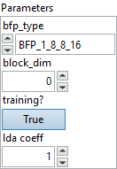
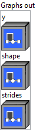

<h1>QuantizeBFP</h1>

<h2>Description</h2>

The BFP quantization operator. It consumes a full precision tensor and computes an BFP tensor. More documentation on the BFP format can be found in this paper: <a href="https://www.microsoft.com/en-us/research/publication/pushing-the-limits-of-narrow-precision-inferencing-at-cloud-scale-with-microsoft-floating-point/">https://www.microsoft.com/en-us/research/publication/pushing-the-limits-of-narrow-precision-inferencing-at-cloud-scale-with-microsoft-floating-point/</a>

<h3>Input parameters</h3>

<table>
  <tbody>
    <tr>
      <td width="64" valign="top"></td>
      <td valign="top"><strong><a href="../../../../../../more-deep-learning/nodes-parameters/specified_outputs_name/README.md">specified_outputs_name</a> : <em>array, </em></strong>this parameter lets you manually assign custom names to the output tensors of a node.</td>
    </tr>
    <tr>
      <td width="64" valign="top"></td>
      <td valign="top"><strong>x (heterogeneous) – T1 : <em>object, </em></strong>N-D full precision input tensor to be quantized.</td>
    </tr>
  </tbody>
</table>

<table>
  <tbody>
    <tr>
      <td valign="top" width="70%">
<strong>Parameters : <em>cluster,</em></strong>

<table>
  <tbody>
    <tr>
      <td width="64" valign="top"></td>
      <td valign="top"><strong>bfp_type : <em>enum,</em></strong> the type of BFP.</td>
    </tr>
    <tr>
      <td width="64" valign="top"></td>
      <td valign="top">Default value “BFP_1_8_8_16”.</td>
    </tr>
    <tr>
      <td width="64" valign="top"></td>
      <td valign="top"><strong>block_dim : <em>integer,</em></strong> each bounding box spans this dimension. Typically, the block dimension corresponds to the reduction dimension of the matrix multipication that consumes the output of this operator.For example, for a 2D matrix multiplication A@W, QuantizeBFP(A) would use block_dim 1 and QuantizeBFP(W) would use block_dim 0. The default is the last dimension.</td>
    </tr>
    <tr>
      <td width="64" valign="top"></td>
      <td valign="top">Default value “0”.</td>
    </tr>
    <tr>
      <td width="64" valign="top"></td>
      <td valign="top"><strong>training? :</strong> <em><strong>boolean</strong></em>, whether the layer is in training mode (can store data for backward).</td>
    </tr>
    <tr>
      <td width="64" valign="top"></td>
      <td valign="top">Default value “True”.</td>
    </tr>
    <tr>
      <td width="64" valign="top"></td>
      <td valign="top"><strong>lda coeff :</strong> <em><strong>float</strong></em>, defines the coefficient by which the loss derivative will be multiplied before being sent to the previous layer (since during the backward run we go backwards).</td>
    </tr>
    <tr>
      <td width="64" valign="top"></td>
      <td valign="top">Default value “1”.</td>
    </tr>
    <tr>
      <td width="64" valign="top"></td>
      <td valign="top"><strong>name (optional) :</strong> <em><strong>string,</strong></em> name of the node.</td>
    </tr>
  </tbody>
</table></td>
      <td valign="top" width="30%">

</td>
    </tr>
  </tbody>
</table>

<h3>Output parameters</h3>

<table>
  <tbody>
    <tr>
      <td valign="top" width="70%">
<strong>Graphs out :</strong><strong><em>cluster,</em></strong> ONNX model architecture.

<table>
  <tbody>
    <tr>
      <td width="64" valign="top"></td>
      <td valign="top"><strong>y (heterogeneous) – T2 : <em>object, </em></strong>1-D, contiguous BFP data.</td>
    </tr>
    <tr>
      <td width="64" valign="top"></td>
      <td valign="top"><strong>shape (heterogeneous) – T3 : <em>object, </em></strong>shape of x.</td>
    </tr>
    <tr>
      <td width="64" valign="top"></td>
      <td valign="top"><strong>strides (heterogeneous) – T3 : <em>object, </em></strong>strides of x.</td>
    </tr>
  </tbody>
</table></td>
      <td valign="top" width="30%">

</td>
    </tr>
  </tbody>
</table>

<h2>Type Constraints</h2>

<strong>T1</strong> in (<code>tensor(float)</code>, <code>tensor(float16)</code>), <code>tensor(bfloat16)</code> : Constrain the input to float and bfloat.

<strong>T2</strong> in (<code>tensor(uint8)</code>) : Constrain y to uint8.

<strong>T3</strong> in (<code>tensor(int64)</code>) : Constrain shape and strides to uint64.

<h2>Example</h2>

All these exemples are snippets PNG, you can drop these Snippet onto the block diagram and get the depicted code added to your VI (Do not forget to install Deep Learning library to run it).

