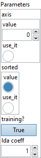
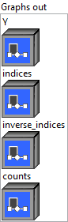

<h1>Unique</h1>

<h2>Description</h2>

Find the unique elements of a tensor. When an optional attribute ‘axis’ is provided, unique subtensors sliced along the ‘axis’ are returned. Otherwise the input tensor is flattened and unique values of the flattened tensor are returned.

This operator returns the unique values or sliced unique subtensors of the input tensor and three optional outputs. The first output tensor ‘Y’ contains all unique values or subtensors of the input. The second optional output tensor ‘indices’ contains indices of ‘Y’ elements’ first occurrence in ‘X’. The third optional output tensor ‘inverse_indices’ contains, for elements of ‘X’, its corresponding indices in ‘Y’. The fourth optional output tensor ‘counts’ contains the count of each element of ‘Y’ in the input.

Outputs are either sorted in ascending order or optionally in the order of the first occurrence of the values in the input.

<a href="https://docs.scipy.org/doc/numpy/reference/generated/numpy.unique.html">https://docs.scipy.org/doc/numpy/reference/generated/numpy.unique.html</a>

<h3>Input parameters</h3>

<table>
  <tbody>
    <tr>
      <td width="64" valign="top"></td>
      <td valign="top"><strong><a href="../../../../../../more-deep-learning/nodes-parameters/specified_outputs_name/README.md">specified_outputs_name</a> : <em>array, </em></strong>this parameter lets you manually assign custom names to the output tensors of a node.</td>
    </tr>
    <tr>
      <td width="64" valign="top"></td>
      <td valign="top"><strong>X (heterogeneous) – T : <em>object, </em></strong>a N-D input tensor that is to be processed.</td>
    </tr>
  </tbody>
</table>

<table>
  <tbody>
    <tr>
      <td valign="top" width="70%">
<strong>Parameters : <em>cluster,</em></strong>

<table>
  <tbody>
    <tr>
      <td width="64" valign="top"></td>
      <td valign="top"><strong>axis : <em>integer,</em></strong> the dimension to apply unique. If not specified, the unique elements of the flattened input are returned. Negative value means counting dimensions from the back. Accepted range is [-r, r-1] where r = rank(input).</td>
    </tr>
    <tr>
      <td width="64" valign="top"></td>
      <td valign="top">Default value “0”.</td>
    </tr>
    <tr>
      <td width="64" valign="top"></td>
      <td valign="top"><strong>sorted :</strong> <em><strong>boolean</strong></em>, whether to sort the unique elements in ascending order before returning as output.</td>
    </tr>
    <tr>
      <td width="64" valign="top"></td>
      <td valign="top">Default value “True”.</td>
    </tr>
    <tr>
      <td width="64" valign="top"></td>
      <td valign="top"><strong>training? :</strong> <em><strong>boolean</strong></em>, whether the layer is in training mode (can store data for backward).</td>
    </tr>
    <tr>
      <td width="64" valign="top"></td>
      <td valign="top">Default value “True”.</td>
    </tr>
    <tr>
      <td width="64" valign="top"></td>
      <td valign="top"><strong>lda coeff :</strong> <em><strong>float</strong></em>, defines the coefficient by which the loss derivative will be multiplied before being sent to the previous layer (since during the backward run we go backwards).</td>
    </tr>
    <tr>
      <td width="64" valign="top"></td>
      <td valign="top">Default value “1”.</td>
    </tr>
    <tr>
      <td width="64" valign="top"></td>
      <td valign="top"><strong>name (optional) :</strong> <em><strong>string,</strong></em> name of the node.</td>
    </tr>
  </tbody>
</table></td>
      <td valign="top" width="30%">

</td>
    </tr>
  </tbody>
</table>

<h3>Output parameters</h3>

<table>
  <tbody>
    <tr>
      <td valign="top" width="70%">
<strong>Graphs out :</strong><strong><em>cluster,</em></strong> ONNX model architecture.

<table>
  <tbody>
    <tr>
      <td width="64" valign="top"></td>
      <td valign="top"><strong>Y (heterogeneous) – T : <em>object, </em></strong>a tensor of the same type as ‘X’ containing all the unique values or subtensors sliced along a provided ‘axis’ in ‘X’, either sorted or maintained in the same order they occur in input ‘X’.</td>
    </tr>
    <tr>
      <td width="64" valign="top"></td>
      <td valign="top"><strong>indices (optional, heterogeneous) – tensor(int64) : <em>object, </em></strong>a 1-D INT64 tensor containing indices of ‘Y’ elements’ first occurrence in ‘X’. When ‘axis’ is provided, it contains indices to subtensors in input ‘X’ on the ‘axis’. When ‘axis’ is not provided, it contains indices to values in the flattened input tensor.</td>
    </tr>
    <tr>
      <td width="64" valign="top"></td>
      <td valign="top"><strong>inverse_indices (optional, heterogeneous) – tensor(int64) : <em>object, </em></strong>a 1-D INT64 tensor containing, for elements of ‘X’, its corresponding indices in ‘Y’. When ‘axis’ is provided, it contains indices to subtensors in output ‘Y’ on the ‘axis’. When ‘axis’ is not provided, it contains indices to values in output ‘Y’.</td>
    </tr>
    <tr>
      <td width="64" valign="top"></td>
      <td valign="top"><strong>counts (optional, heterogeneous) – tensor(int64) : <em>object, </em></strong>a 1-D INT64 tensor containing the count of each element of ‘Y’ in input ‘X’.</td>
    </tr>
  </tbody>
</table></td>
      <td valign="top" width="30%">

</td>
    </tr>
  </tbody>
</table>

<h2>Type Constraints</h2>

<strong>T</strong> in (<code>tensor(bool)</code>, <code>tensor(complex128)</code>, <code>tensor(complex64)</code>, <code>tensor(double)</code>, <code>tensor(float)</code>, <code>tensor(float16)</code>, <code>tensor(int16)</code>, <code>tensor(int32)</code>, <code>tensor(int64)</code>, <code>tensor(int8)</code>, <code>tensor(string)</code>, <code>tensor(uint16)</code>, <code>tensor(uint32)</code>, <code>tensor(uint64)</code>, <code>tensor(uint8)</code>) : Input can be of any tensor type.

<h2>Example</h2>

All these exemples are snippets PNG, you can drop these Snippet onto the block diagram and get the depicted code added to your VI (Do not forget to install Deep Learning library to run it).

