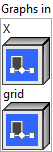

<h1>GridSample</h1>

<h2>Description</h2>

Given an input <code>X</code> and a flow-field <code>grid</code>, computes the output <code>Y</code> using <code>X</code> values and pixel locations from the <code>grid</code>.

For spatial input <code>X</code> with shape (N, C, H, W), the <code>grid</code> will have shape (N, H_out, W_out, 2), the output <code>Y</code> will have shape (N, C, H_out, W_out). For volumetric input <code>X</code> with shape (N, C, D, H, W), the <code>grid</code> will have shape (N, D_out, H_out, W_out, 3), the output <code>Y</code> will have shape (N, C, D_out, H_out, W_out). More generally, for an input <code>X</code> of rank r+2 with shape (N, C, d1, d2, …, dr), the <code>grid</code> will have shape (N, D1_out, D2_out, …, Dr_out, r), the output <code>Y</code> will have shape (N, C, D1_out, D2_out, …, Dr_out).

The tensor <code>X</code> contains values at centers of square pixels (voxels, etc) locations such as (n, c, d1_in, d2_in, …, dr_in). The (n, d1_out, d2_out, …, dr_out, values from the tensor <code>grid</code> are the normalized positions for interpolating the values at the (n, c, d1_out, d2_out, …, dr_out) locations from the output tensor <code>Y</code> using a specified interpolation method (the mode) and a padding mode (for <code>grid</code> positions falling outside the 2-dimensional image).

For example, the values in <code>grid[n, h_out, w_out, :]</code> are size-2 vectors specifying normalized positions in the 2-dimensional space of <code>X</code>. They are used to interpolate output values of <code>Y[n, c, h_out, w_out]</code>.

The GridSample operator is often used in doing grid generator and sampler in the <a href="https://arxiv.org/abs/1506.02025">Spatial Transformer Networks</a>. See also in <a href="https://pytorch.org/docs/stable/generated/torch.nn.functional.grid_sample.html">torch.nn.functional.grid_sample</a>.

<h3>Input parameters</h3>

<table>
  <tbody>
    <tr>
      <td width="64" valign="top"></td>
      <td valign="top"><strong><a href="../../../../../../more-deep-learning/nodes-parameters/specified_outputs_name/README.md">specified_outputs_name</a> : <em>array, </em></strong>this parameter lets you manually assign custom names to the output tensors of a node.</td>
    </tr>
  </tbody>
</table>

<table>
  <tbody>
    <tr>
      <td valign="top" width="70%"><table>
  <tbody>
    <tr>
      <td width="64" valign="top"></td>
      <td valign="top"><strong>Graphs in :</strong> <strong><em>cluster,</em></strong> ONNX model architecture.</td>
    </tr>
    <tr>
      <td></td>
      <td valign="top"><table>
  <tbody>
    <tr>
      <td width="64" valign="top"></td>
      <td valign="top"><strong>X (heterogeneous) –</strong> <strong>T1 :</strong> <em><strong>object,</strong></em> input tensor of rank r+2 that has shape (N, C, D1, D2, …, Dr), where N is the batch size, C is the number of channels, D1, D2, …, Dr are the spatial dimensions.</td>
    </tr>
    <tr>
      <td width="64" valign="top"></td>
      <td valign="top"><strong>grid (heterogeneous) – T2 : <em>object, </em></strong>input offset of shape (N, D1_out, D2_out, …, Dr_out, r), where D1_out, D2_out, …, Dr_out are the spatial dimensions of the grid and output, and r is the number of spatial dimensions. Grid specifies the sampling locations normalized by the input spatial dimensions. Therefore, it should have most values in the range of [-1, 1]. If the grid has values outside the range of [-1, 1], the corresponding outputs will be handled as defined by padding_mode. Following computer vision convention, the coordinates in the length-r location vector are listed from the innermost tensor dimension to the outermost, the opposite of regular tensor indexing.</td>
    </tr>
  </tbody>
</table></td>
    </tr>
  </tbody>
</table></td>
      <td valign="top" width="30%">

</td>
    </tr>
  </tbody>
</table>

<table>
  <tbody>
    <tr>
      <td valign="top" width="70%"><table>
  <tbody>
    <tr>
      <td width="64" valign="top"></td>
      <td valign="top"><strong>Parameters : <em>cluster,</em></strong></td>
    </tr>
    <tr>
      <td></td>
      <td valign="top"><table>
  <tbody>
    <tr>
      <td width="64" valign="top"></td>
      <td valign="top"><strong>align_corners :</strong> <em><strong>boolean</strong></em>, if align_corners=true, the extrema (-1 and 1) are considered as referring to the center points of the input’s corner pixels (voxels, etc.). If align_corners=false, they are instead considered as referring to the corner points of the input’s corner pixels (voxels, etc.), making the sampling more resolution agnostic.</td>
    </tr>
    <tr>
      <td width="64" valign="top"></td>
      <td valign="top">Default value “False”.</td>
    </tr>
    <tr>
      <td width="64" valign="top"></td>
      <td valign="top"><strong>mode : <em>enum,</em></strong> three interpolation modes: linear (default), nearest and cubic. The “linear” mode includes linear and N-linear interpolation modes depending on the number of spatial dimensions of the input tensor (i.e. linear for 1 spatial dimension, bilinear for 2 spatial dimensions, etc.). The “cubic” mode also includes N-cubic interpolation modes following the same rules. The “nearest” mode rounds to the nearest even index when the sampling point falls halfway between two indices.</td>
    </tr>
    <tr>
      <td width="64" valign="top"></td>
      <td valign="top">Default value “linear”.</td>
    </tr>
    <tr>
      <td width="64" valign="top"></td>
      <td valign="top"><strong>padding_mode : <em>enum,</em></strong> support padding modes for outside grid values: <code>zeros</code>(default), <code>border</code>, <code>reflection</code>. zeros: use 0 for out-of-bound grid locations, border: use border values for out-of-bound grid locations, reflection: use values at locations reflected by the border for out-of-bound grid locations. If index 0 represents the margin pixel, the reflected value at index -1 will be the same as the value at index 1. For location far away from the border, it will keep being reflected until becoming in bound. If pixel location x = -3.5 reflects by border -1 and becomes x’ = 1.5, then reflects by border 1 and becomes x’’ = 0.5.</td>
    </tr>
    <tr>
      <td width="64" valign="top"></td>
      <td valign="top">Default value “zeros”.</td>
    </tr>
    <tr>
      <td width="64" valign="top"></td>
      <td valign="top"><strong>training? :</strong> <em><strong>boolean</strong></em>, whether the layer is in training mode (can store data for backward).</td>
    </tr>
    <tr>
      <td width="64" valign="top"></td>
      <td valign="top">Default value “True”.</td>
    </tr>
    <tr>
      <td width="64" valign="top"></td>
      <td valign="top"><strong>lda coeff :</strong> <em><strong>float</strong></em>, defines the coefficient by which the loss derivative will be multiplied before being sent to the previous layer (since during the backward run we go backwards).</td>
    </tr>
    <tr>
      <td width="64" valign="top"></td>
      <td valign="top">Default value “1”.</td>
    </tr>
  </tbody>
</table></td>
    </tr>
    <tr>
      <td width="64" valign="top"></td>
      <td valign="top"><strong>name (optional) :</strong> <em><strong>string,</strong></em> name of the node.</td>
    </tr>
  </tbody>
</table></td>
      <td valign="top" width="30%">

</td>
    </tr>
  </tbody>
</table>

<h3>Output parameters</h3>

<table>
  <tbody>
    <tr>
      <td width="64" valign="top"></td>
      <td valign="top"><strong>Y (heterogeneous) – T1 : <em>object, </em></strong>output tensor of rank r+2 that has shape (N, C, D1_out, D2_out, …, Dr_out) of the sampled values. For integer input types, intermediate values are computed as floating point and cast to integer at the end.</td>
    </tr>
  </tbody>
</table>

<h2>Type Constraints</h2>

<strong>T1</strong> in (<code>tensor(bool)</code>, <code>tensor(complex128)</code>, <code>tensor(complex64)</code>, <code>tensor(double)</code>, <code>tensor(float)</code>, <code>tensor(float16)</code>, <code>tensor(int16)</code>,  <code>tensor(int32)</code>, <code>tensor(int64)</code>, <code>tensor(int8)</code>, <code>tensor(string)</code>, <code>tensor(uint16)</code>, <code>tensor(uint32)</code>, <code>tensor(uint64)</code>, <code>tensor(uint8)</code>) : Constrain input <code>X</code> and output <code>Y</code> types to all tensor types.

<strong>T2</strong> in (<code>tensor(double)</code>, <code>tensor(float)</code>, <code>tensor(float16)</code>) : Constrain grid types to float tensors.

<h2>Example</h2>

All these exemples are snippets PNG, you can drop these Snippet onto the block diagram and get the depicted code added to your VI (Do not forget to install Deep Learning library to run it).

