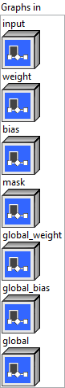
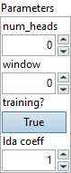

<h1>LongformerAttention</h1>

<h2>Description</h2>

Longformer Self Attention with a local context and a global context. Tokens attend locally: Each token attends to its W previous tokens and W succeeding tokens with W being the window length. A selected few tokens attend globally to all other tokens.

The attention mask is of shape (batch_size, sequence_length), where sequence_length is a multiple of 2W after padding. Mask value &lt; 0 (like -10000.0) means the token is masked, 0 otherwise. Global attention flags have value 1 for the tokens attend globally and 0 otherwise.

<table>
  <tbody>
    <tr>
      <td width="64" valign="top"></td>
      <td valign="top">

<pre> </pre>

<h3>Input parameters</h3>

 <strong><a href="../../../../../../more-deep-learning/nodes-parameters/specified_outputs_name/README.md">specified_outputs_name</a> : <em>array, </em></strong>this parameter lets you manually assign custom names to the output tensors of a node.
</td>
    </tr>
  </tbody>
</table>

<table>
  <tbody>
    <tr>
      <td valign="top" width="70%"><table>
  <tbody>
    <tr>
      <td width="64" valign="top"></td>
      <td valign="top"><strong>Graphs in :</strong> <strong><em>cluster,</em></strong> ONNX model architecture.</td>
    </tr>
    <tr>
      <td></td>
      <td valign="top"><table>
  <tbody>
    <tr>
      <td width="64" valign="top"></td>
      <td valign="top"><strong>input</strong> <strong>(heterogeneous) –</strong> <strong>T :</strong> <em><strong>object,</strong></em> 3D input tensor with shape (batch_size, sequence_length, hidden_size), hidden_size = num_heads * head_size.</td>
    </tr>
    <tr>
      <td width="64" valign="top"></td>
      <td valign="top"><strong>weight (heterogeneous) – T : <em>object, </em></strong>2D input tensor with shape (hidden_size, 3 * hidden_size).</td>
    </tr>
    <tr>
      <td width="64" valign="top"></td>
      <td valign="top"><strong>bias (heterogeneous) – T : <em>object, </em></strong>1D input tensor with shape (3 * hidden_size).</td>
    </tr>
    <tr>
      <td width="64" valign="top"></td>
      <td valign="top"><strong>mask (heterogeneous) –</strong> <strong>T :</strong> <em><strong>object,</strong></em> attention mask with shape (batch_size, sequence_length).</td>
    </tr>
    <tr>
      <td width="64" valign="top"></td>
      <td valign="top"><strong>global_weight (heterogeneous) – T : <em>object, </em></strong>2D input tensor with shape (hidden_size, 3 * hidden_size).</td>
    </tr>
    <tr>
      <td width="64" valign="top"></td>
      <td valign="top"><strong>global_bias</strong> <strong>(heterogeneous) – T : <em>object, </em></strong>1D input tensor with shape (3 * hidden_size).</td>
    </tr>
    <tr>
      <td width="64" valign="top"></td>
      <td valign="top"><strong>global</strong> <strong>(heterogeneous) – G : <em>object, </em></strong>global attention flags with shape (batch_size, sequence_length).</td>
    </tr>
  </tbody>
</table></td>
    </tr>
  </tbody>
</table></td>
      <td valign="top" width="30%">

</td>
    </tr>
  </tbody>
</table>

<table>
  <tbody>
    <tr>
      <td valign="top" width="70%"><table>
  <tbody>
    <tr>
      <td width="64" valign="top"></td>
      <td valign="top"><strong>Parameters : <em>cluster,</em></strong></td>
    </tr>
    <tr>
      <td></td>
      <td valign="top"><table>
  <tbody>
    <tr>
      <td width="64" valign="top"></td>
      <td valign="top"><strong>num_heads : <em>integer,</em></strong> number of attention heads.</td>
    </tr>
    <tr>
      <td width="64" valign="top"></td>
      <td valign="top">Default value “0”.</td>
    </tr>
    <tr>
      <td width="64" valign="top"></td>
      <td valign="top"><strong>window</strong> <strong>: <em>integer</em><em>,</em></strong> one sided attention windows length W, or half of total window length.</td>
    </tr>
    <tr>
      <td width="64" valign="top"></td>
      <td valign="top">Default value “0”.</td>
    </tr>
    <tr>
      <td width="64" valign="top"></td>
      <td valign="top"><strong>training? :</strong> <em><strong>boolean</strong><strong>,</strong></em> whether the layer is in training mode (can store data for backward).</td>
    </tr>
    <tr>
      <td width="64" valign="top"></td>
      <td valign="top">Default value “True”.</td>
    </tr>
    <tr>
      <td width="64" valign="top"></td>
      <td valign="top"><strong>lda coeff :</strong> <em><strong>float</strong><strong>,</strong></em> defines the coefficient by which the loss derivative will be multiplied before being sent to the previous layer (since during the backward run we go backwards).</td>
    </tr>
    <tr>
      <td width="64" valign="top"></td>
      <td valign="top">Default value “1”.</td>
    </tr>
  </tbody>
</table></td>
    </tr>
    <tr>
      <td width="64" valign="top"></td>
      <td valign="top"><strong>name (optional) :</strong> <em><strong>string,</strong></em> name of the node.</td>
    </tr>
  </tbody>
</table></td>
      <td valign="top" width="30%">

</td>
    </tr>
  </tbody>
</table>

<h3>Output parameters</h3>

<table>
  <tbody>
    <tr>
      <td width="64" valign="top"></td>
      <td valign="top"><strong>output (heterogeneous) –</strong> <strong>T : <em>object,</em></strong> 3D output tensor with shape (batch_size, sequence_length, hidden_size).</td>
    </tr>
  </tbody>
</table>

<h2>Type Constraints</h2>

<strong>T</strong> in (<code>tensor(float)</code>, <code>tensor(float16)</code>) : Constrain input and output types to float tensors.

<strong>G</strong> in (<code>tensor(int32)</code>) : Constrain to integer types.

<h2>Example</h2>

All these exemples are snippets PNG, you can drop these Snippet onto the block diagram and get the depicted code added to your VI (Do not forget to install Deep Learning library to run it).

