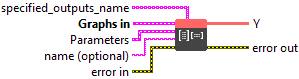
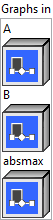
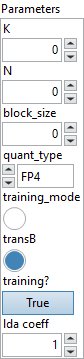

<h1>MatMulBnb4</h1>

<h2>Description</h2>

MatMulBnb4 is a <a href="../matmul/README.md">MatMul</a> with weight quantized with 4 bits using either FP4 or NF4 data type (<a href="https://arxiv.org/pdf/2305.14314.pdf">https://arxiv.org/pdf/2305.14314.pdf</a>). It does Matrix Multiplication like <a href="../matmul/README.md">MatMul</a> (<a href="https://github.com/onnx/onnx/blob/main/docs/Operators.md#matmul">https://github.com/onnx/onnx/blob/main/docs/Operators.md#matmul</a>) with differences: 1. Input B is a 2D constant Matrix. Its input feature count and output feature count are specified by attribute ‘K’ and ‘N’. 2. Input B is quantized with 4 bits with quantization data type specified by attribute ‘quant_type’. It is transposed, flattened and quantized blockwisely with block size specified by attribute ‘block_size’. And block_size is not an arbitrary number and must be a power of 2 and not smaller than 16, like 16, 32, 64, 128,.. 3. Input B’s quantization constants or scales are specified by input ‘absmax’.

<h3>Input parameters</h3>

<table>
  <tbody>
    <tr>
      <td width="64" valign="top"></td>
      <td valign="top"><strong><a href="../../../../../../more-deep-learning/nodes-parameters/specified_outputs_name/README.md">specified_outputs_name</a> : <em>array, </em></strong>this parameter lets you manually assign custom names to the output tensors of a node.</td>
    </tr>
  </tbody>
</table>

<table>
  <tbody>
    <tr>
      <td valign="top" width="70%"><table>
  <tbody>
    <tr>
      <td width="64" valign="top"></td>
      <td valign="top"><strong>Graphs in :</strong> <strong><em>cluster,</em></strong> ONNX model architecture.</td>
    </tr>
    <tr>
      <td></td>
      <td valign="top"><table>
  <tbody>
    <tr>
      <td width="64" valign="top"></td>
      <td valign="top"><strong>A</strong> <strong>(heterogeneous) –</strong> <strong>T1 :</strong> <em><strong>object,</strong></em> the input tensor, not quantized.</td>
    </tr>
    <tr>
      <td width="64" valign="top"></td>
      <td valign="top"><strong>B (heterogeneous) – T2 : <em>object, </em></strong>1-dimensional quantized data for weight.</td>
    </tr>
    <tr>
      <td width="64" valign="top"></td>
      <td valign="top"><strong>absmax (heterogeneous) – T1 : <em>object, </em></strong>quantization constants.</td>
    </tr>
  </tbody>
</table></td>
    </tr>
  </tbody>
</table></td>
      <td valign="top" width="30%">

</td>
    </tr>
  </tbody>
</table>

<table>
  <tbody>
    <tr>
      <td valign="top" width="70%"><table>
  <tbody>
    <tr>
      <td width="64" valign="top"></td>
      <td valign="top"><strong>Parameters : <em>cluster,</em></strong></td>
    </tr>
    <tr>
      <td></td>
      <td valign="top"><table>
  <tbody>
    <tr>
      <td width="64" valign="top"></td>
      <td valign="top"><strong>K : <em>integer,</em></strong> size of each input feature.</td>
    </tr>
    <tr>
      <td width="64" valign="top"></td>
      <td valign="top">Default value “0”.</td>
    </tr>
    <tr>
      <td width="64" valign="top"></td>
      <td valign="top"><strong>N : <em>integer,</em></strong> size of each output feature.</td>
    </tr>
    <tr>
      <td width="64" valign="top"></td>
      <td valign="top">Default value “0”.</td>
    </tr>
    <tr>
      <td width="64" valign="top"></td>
      <td valign="top"><strong>block_size : <em>integer,</em></strong> number of groupsize used for weight quantization. It needs to be a power of 2 and not smaller than 16.</td>
    </tr>
    <tr>
      <td width="64" valign="top"></td>
      <td valign="top">Default value “0”.</td>
    </tr>
    <tr>
      <td width="64" valign="top"></td>
      <td valign="top"><strong>quant_type : <em>enum,</em></strong> quantization data type.</td>
    </tr>
    <tr>
      <td width="64" valign="top"></td>
      <td valign="top">Default value “FP4”.</td>
    </tr>
    <tr>
      <td width="64" valign="top"></td>
      <td valign="top"><strong>training_mode :</strong> <em><strong>boolean</strong><strong>,</strong></em> indicate if the ops run in training_mode.</td>
    </tr>
    <tr>
      <td width="64" valign="top"></td>
      <td valign="top">Default value “False”.</td>
    </tr>
    <tr>
      <td width="64" valign="top"></td>
      <td valign="top"><strong>transB :</strong> <em><strong>boolean</strong><strong>,</strong></em> whether B should be transposed on the last two dimensions before doing multiplication.</td>
    </tr>
    <tr>
      <td width="64" valign="top"></td>
      <td valign="top">Default value “True”.</td>
    </tr>
    <tr>
      <td width="64" valign="top"></td>
      <td valign="top"><strong>training? :</strong> <em><strong>boolean</strong><strong>,</strong></em> whether the layer is in training mode (can store data for backward).</td>
    </tr>
    <tr>
      <td width="64" valign="top"></td>
      <td valign="top">Default value “True”.</td>
    </tr>
    <tr>
      <td width="64" valign="top"></td>
      <td valign="top"><strong>lda coeff :</strong> <em><strong>float</strong><strong>,</strong></em> defines the coefficient by which the loss derivative will be multiplied before being sent to the previous layer (since during the backward run we go backwards).</td>
    </tr>
    <tr>
      <td width="64" valign="top"></td>
      <td valign="top">Default value “1”.</td>
    </tr>
  </tbody>
</table></td>
    </tr>
    <tr>
      <td width="64" valign="top"></td>
      <td valign="top"><strong>name (optional) :</strong> <em><strong>string,</strong></em> name of the node.</td>
    </tr>
  </tbody>
</table></td>
      <td valign="top" width="30%">

</td>
    </tr>
  </tbody>
</table>

<h3>Output parameters</h3>

<table>
  <tbody>
    <tr>
      <td width="64" valign="top"></td>
      <td valign="top"><strong>Y (heterogeneous) – T1 :</strong> <em><strong>object,</strong></em> tensor. The output tensor has the same rank as the input.</td>
    </tr>
  </tbody>
</table>

<h2>Type Constraints</h2>

<strong>T1</strong> in (<code>tensor(float)</code>, <code>tensor(float16)</code>, <code>tensor(bfloat16)</code>) : Constrain input and output types to float/half_float/brain_float tensors.

<strong>T2</strong> in (<code>tensor(uint8)</code>) : Constrain quantized weight types to uint8.

<h2>Example</h2>

All these exemples are snippets PNG, you can drop these Snippet onto the block diagram and get the depicted code added to your VI (Do not forget to install Deep Learning library to run it).

