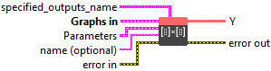
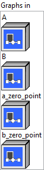

<h1>MatMulInteger</h1>

<h2>Description</h2>

Matrix product that behaves like <a href="https://numpy.org/doc/stable/reference/generated/numpy.matmul.html">numpy.matmul</a>. The production MUST never overflow. The accumulation may overflow if and only if in 32 bits.

<h3>Input parameters</h3>

<table>
  <tbody>
    <tr>
      <td width="64" valign="top"></td>
      <td valign="top"><strong><a href="../../../../../../more-deep-learning/nodes-parameters/specified_outputs_name/README.md">specified_outputs_name</a> : <em>array, </em></strong>this parameter lets you manually assign custom names to the output tensors of a node.</td>
    </tr>
  </tbody>
</table>

<table>
  <tbody>
    <tr>
      <td valign="top" width="70%"><table>
  <tbody>
    <tr>
      <td width="64" valign="top"></td>
      <td valign="top"><strong>Graphs in :</strong> <strong><em>cluster,</em></strong> ONNX model architecture.</td>
    </tr>
    <tr>
      <td></td>
      <td valign="top"><table>
  <tbody>
    <tr>
      <td width="64" valign="top"></td>
      <td valign="top"><strong>A</strong> <strong>(heterogeneous) –</strong> <strong>T1 :</strong> <em><strong>object,</strong></em> N-dimensional matrix A.</td>
    </tr>
    <tr>
      <td width="64" valign="top"></td>
      <td valign="top"><strong>B (heterogeneous) – T2 : <em>object, </em></strong>N-dimensional matrix B.</td>
    </tr>
    <tr>
      <td width="64" valign="top"></td>
      <td valign="top"><strong>a_zero_point (optional, heterogeneous) – T1 : <em>object, </em></strong>zero point tensor for input ‘A’. It’s optional and default value is 0. It could be a scalar or N-D tensor. Scalar refers to per tensor quantization whereas N-D refers to per row quantization. If the input is 2D of shape [M, K] then zero point tensor may be an M element vector [zp_1, zp_2, …, zp_M]. If the input is N-D tensor with shape [D1, D2, M, K] then zero point tensor may have shape [D1, D2, M, 1].</td>
    </tr>
    <tr>
      <td width="64" valign="top"></td>
      <td valign="top"><strong>b_zero_point (optional, heterogeneous) – T2 : <em>object, </em></strong>zero point tensor for input ‘B’. It’s optional and default value is 0. It could be a scalar or a N-D tensor, Scalar refers to per tensor quantization whereas N-D refers to per col quantization. If the input is 2D of shape [K, N] then zero point tensor may be an N element vector [zp_1, zp_2, …, zp_N]. If the input is N-D tensor with shape [D1, D2, K, N] then zero point tensor may have shape [D1, D2, 1, N].</td>
    </tr>
  </tbody>
</table></td>
    </tr>
  </tbody>
</table></td>
      <td valign="top" width="30%">

</td>
    </tr>
  </tbody>
</table>

<table>
  <tbody>
    <tr>
      <td valign="top" width="70%"><table>
  <tbody>
    <tr>
      <td width="64" valign="top"></td>
      <td valign="top"><strong>Parameters : <em>cluster,</em></strong></td>
    </tr>
    <tr>
      <td></td>
      <td valign="top"><table>
  <tbody>
    <tr>
      <td width="64" valign="top"></td>
      <td valign="top"><strong>training? :</strong> <em><strong>boolean</strong><strong>,</strong></em> whether the layer is in training mode (can store data for backward).</td>
    </tr>
    <tr>
      <td width="64" valign="top"></td>
      <td valign="top">Default value “True”.</td>
    </tr>
    <tr>
      <td width="64" valign="top"></td>
      <td valign="top"><strong>lda coeff :</strong> <em><strong>float</strong><strong>,</strong></em> defines the coefficient by which the loss derivative will be multiplied before being sent to the previous layer (since during the backward run we go backwards).</td>
    </tr>
    <tr>
      <td width="64" valign="top"></td>
      <td valign="top">Default value “1”.</td>
    </tr>
  </tbody>
</table></td>
    </tr>
    <tr>
      <td width="64" valign="top"></td>
      <td valign="top"><strong>name (optional) :</strong> <em><strong>string,</strong></em> name of the node.</td>
    </tr>
  </tbody>
</table></td>
      <td valign="top" width="30%">

</td>
    </tr>
  </tbody>
</table>

<h3>Output parameters</h3>

<table>
  <tbody>
    <tr>
      <td width="64" valign="top"></td>
      <td valign="top"><strong>Y (heterogeneous) – T3 :</strong> <em><strong>object,</strong></em> matrix multiply results from A * B.</td>
    </tr>
  </tbody>
</table>

<h2>Type Constraints</h2>

T1

in (

tensor(int8)

,

tensor(uint8)

) : Constrain input A data type to 8-bit integer tensor.

<strong>T2</strong> in (<code>tensor(int8)</code>, <code>tensor(uint8)</code>) : Constrain input B data type to 8-bit integer tensor.

<strong>T3</strong> in (<code>tensor(int32)</code>) : Constrain output Y data type as 32-bit integer tensor.

<h2>Example</h2>

All these exemples are snippets PNG, you can drop these Snippet onto the block diagram and get the depicted code added to your VI (Do not forget to install Deep Learning library to run it).

