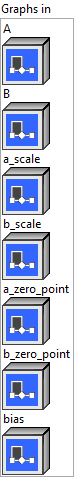

<h1>MatMulIntergerToFloat</h1>

<h2>Description</h2>

MatMulIntegerToFloat is used to perform a matrix multiplication (matmul) between integers (quantized) and convert the result to floating point (float).

<h3>Input parameters</h3>

<table>
  <tbody>
    <tr>
      <td width="64" valign="top"></td>
      <td valign="top"><strong><a href="../../../../../../more-deep-learning/nodes-parameters/specified_outputs_name/README.md">specified_outputs_name</a> : <em>array, </em></strong>this parameter lets you manually assign custom names to the output tensors of a node.</td>
    </tr>
  </tbody>
</table>

<table>
  <tbody>
    <tr>
      <td valign="top" width="70%"><table>
  <tbody>
    <tr>
      <td width="64" valign="top"></td>
      <td valign="top"><strong>Graphs in :</strong> <strong><em>cluster,</em></strong> ONNX model architecture.</td>
    </tr>
    <tr>
      <td></td>
      <td valign="top"><table>
  <tbody>
    <tr>
      <td width="64" valign="top"></td>
      <td valign="top"><strong>A</strong> <strong>(heterogeneous) –</strong> <strong>T1 :</strong> <em><strong>object,</strong></em> N-dimensional matrix A.</td>
    </tr>
    <tr>
      <td width="64" valign="top"></td>
      <td valign="top"><strong>B (heterogeneous) – T2 : <em>object, </em></strong>N-dimensional matrix B.</td>
    </tr>
    <tr>
      <td width="64" valign="top"></td>
      <td valign="top"><strong>a_scale (heterogeneous) – T3 : <em>object, </em></strong>scale of quantized input ‘A’. It could be a scalar or a 1-D tensor, which means a per-tensor or per-column quantization. If it’s a 1-D tensor, its number of elements should be equal to the number of columns of input ‘A’.</td>
    </tr>
    <tr>
      <td width="64" valign="top"></td>
      <td valign="top"><strong>b_scale (heterogeneous) –</strong> <strong>T3 :</strong> <em><strong>object,</strong></em> scale of quantized input ‘B’. It could be a scalar or a 1-D tensor, which means a per-tensor or per-column quantization. If it’s a 1-D tensor, its number of elements should be equal to the number of columns of input ‘B’.</td>
    </tr>
    <tr>
      <td width="64" valign="top"></td>
      <td valign="top"><strong>a_zero_point (optional, heterogeneous) – T1 : <em>object, </em></strong>zero point tensor for input ‘A’. It’s optional and default value is 0. It could be a scalar or a 1-D tensor, which means a per-tensor or per-column quantization. If it’s a 1-D tensor, its number of elements should be equal to the number of columns of input ‘A’.</td>
    </tr>
    <tr>
      <td width="64" valign="top"></td>
      <td valign="top"><strong>b_zero_point</strong> <strong>(optional, heterogeneous) – T2 : <em>object, </em></strong>zero point tensor for input ‘B’. It’s optional and default value is 0. It could be a scalar or a 1-D tensor, which means a per-tensor or per-column quantization. If it’s a 1-D tensor, its number of elements should be equal to the number of columns of input ‘B’.</td>
    </tr>
    <tr>
      <td width="64" valign="top"></td>
      <td valign="top"><strong>bias (optional, heterogeneous) – T3 : <em>object, </em></strong>1D input tensor, whose dimension is same as B’s last dimension.</td>
    </tr>
  </tbody>
</table></td>
    </tr>
  </tbody>
</table></td>
      <td valign="top" width="30%">

</td>
    </tr>
  </tbody>
</table>

<table>
  <tbody>
    <tr>
      <td valign="top" width="70%"><table>
  <tbody>
    <tr>
      <td width="64" valign="top"></td>
      <td valign="top"><strong>Parameters : <em>cluster,</em></strong></td>
    </tr>
    <tr>
      <td></td>
      <td valign="top"><table>
  <tbody>
    <tr>
      <td width="64" valign="top"></td>
      <td valign="top"><strong>training? :</strong> <em><strong>boolean</strong><strong>,</strong></em> whether the layer is in training mode (can store data for backward).</td>
    </tr>
    <tr>
      <td width="64" valign="top"></td>
      <td valign="top">Default value “True”.</td>
    </tr>
    <tr>
      <td width="64" valign="top"></td>
      <td valign="top"><strong>lda coeff :</strong> <em><strong>float</strong><strong>,</strong></em> defines the coefficient by which the loss derivative will be multiplied before being sent to the previous layer (since during the backward run we go backwards).</td>
    </tr>
    <tr>
      <td width="64" valign="top"></td>
      <td valign="top">Default value “1”.</td>
    </tr>
  </tbody>
</table></td>
    </tr>
    <tr>
      <td width="64" valign="top"></td>
      <td valign="top"><strong>name (optional) :</strong> <em><strong>string,</strong></em> name of the node.</td>
    </tr>
  </tbody>
</table></td>
      <td valign="top" width="30%">

</td>
    </tr>
  </tbody>
</table>

<h3>Output parameters</h3>

<table>
  <tbody>
    <tr>
      <td width="64" valign="top"></td>
      <td valign="top"><strong>Y (heterogeneous) – T3 :</strong> <em><strong>object,</strong></em> matrix multiply results from A * B.</td>
    </tr>
  </tbody>
</table>

<h2>Type Constraints</h2>

<strong>T1</strong> in (<code>tensor(int8)</code>, <code>tensor(uint8)</code>) : Constrain input A data type to 8-bit integer tensor.

<strong>T2</strong> in (<code>tensor(int8)</code>, <code>tensor(uint8)</code>) : Constrain input B data type to 8-bit integer tensor.

<strong>T3</strong> in (<code>tensor(float)</code>, <code>tensor(float16)</code>) : Constrain input a_scale, b_scale and output Y data type as float tensor.

<h2>Example</h2>

All these exemples are snippets PNG, you can drop these Snippet onto the block diagram and get the depicted code added to your VI (Do not forget to install Deep Learning library to run it).

