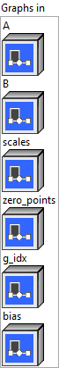
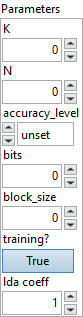

<h1>MatMulNBits</h1>

<h2>Description</h2>

MatMulNBits performs a matrix multiplication where the right-hand-side matrix (weights) is quantized to N bits.

It is a fusion of two operations :

<ol>
<li>Linear dequantization of the quantized weights using scale and (optionally) zero-point with formula: dequantized_weight = (quantized_weight – zero_point) * scale</li>
<li>Matrix multiplication between the input matrix A and the dequantized weight matrix.</li>
</ol>

The weight matrix is a 2D constant matrix with the input feature count and output feature count specified by attributes ‘K’ and ‘N’. It is quantized block-wise along the K dimension with a block size specified by the ‘block_size’ attribute. The block size must be a power of 2 and not smaller than 16 (e.g., 16, 32, 64, 128). Each block has its own scale and zero-point. The quantization is performed using a bit-width specified by the ‘bits’ attribute, which can take values from 2 to 8.

The quantized weights are stored in a bit-packed format along the K dimension, with each block being represented by a blob of uint8. For example, for 4 bits, the first 4 bits are stored in the lower 4 bits of a byte, and the second 4 bits are stored in the higher 4 bits of a byte.

<table>
  <tbody>
    <tr>
      <td width="64" valign="top"></td>
      <td valign="top">

<pre> </pre>

<h3>Input parameters</h3>

 <strong><a href="../../../../../../more-deep-learning/nodes-parameters/specified_outputs_name/README.md">specified_outputs_name</a> : <em>array, </em></strong>this parameter lets you manually assign custom names to the output tensors of a node.
</td>
    </tr>
  </tbody>
</table>

<table>
  <tbody>
    <tr>
      <td valign="top" width="70%"><table>
  <tbody>
    <tr>
      <td width="64" valign="top"></td>
      <td valign="top"><strong>Graphs in :</strong> <strong><em>cluster,</em></strong> ONNX model architecture.</td>
    </tr>
    <tr>
      <td></td>
      <td valign="top"><table>
  <tbody>
    <tr>
      <td width="64" valign="top"></td>
      <td valign="top"><strong>A</strong> <strong>(heterogeneous) –</strong> <strong>T1 :</strong> <em><strong>object,</strong></em> the input tensor, not quantized.</td>
    </tr>
    <tr>
      <td width="64" valign="top"></td>
      <td valign="top"><strong>B (heterogeneous) – T2 : <em>object, </em></strong>packed uint8 tensor of shape (N, k_blocks, blob_size), where k_blocks = ceil(K / block_size) and blob_size = (block_size * bits / 8). The quantized weights are stored in a bit-packed format along the K dimension, packed within each block_size.</td>
    </tr>
    <tr>
      <td width="64" valign="top"></td>
      <td valign="top"><strong>scales (heterogeneous) – T1 : <em>object, </em></strong>per-block scaling factors for dequantization with shape (N, k_blocks) and same data type as input A.</td>
    </tr>
    <tr>
      <td width="64" valign="top"></td>
      <td valign="top"><strong>zero_points (optional, heterogeneous) –</strong> <strong>T3 :</strong> <em><strong>object,</strong></em> per-block zero point for dequantization. It can be either packed or unpacked: Packed (uint8) format has shape (N, ceil(k_blocks * bits / 8)), and it uses same bit-packing method as Input B. Unpacked (same type as A) format has shape (N, k_blocks). If not provided, a default zero point is used: 2^(bits – 1) (e.g., 8 for 4-bit quantization, 128 for 8-bit).</td>
    </tr>
    <tr>
      <td width="64" valign="top"></td>
      <td valign="top"><strong>g_idx</strong> <strong>(optional, heterogeneous) – T4 : <em>object, </em></strong>group_idx. This input is deprecated.</td>
    </tr>
    <tr>
      <td width="64" valign="top"></td>
      <td valign="top"><strong>bias</strong> <strong>(optional, heterogeneous) – T1 : <em>object, </em></strong>bias to add to result. It should have shape [N].</td>
    </tr>
  </tbody>
</table></td>
    </tr>
  </tbody>
</table></td>
      <td valign="top" width="30%">

</td>
    </tr>
  </tbody>
</table>

<table>
  <tbody>
    <tr>
      <td valign="top" width="70%"><table>
  <tbody>
    <tr>
      <td width="64" valign="top"></td>
      <td valign="top"><strong>Parameters : <em>cluster,</em></strong></td>
    </tr>
    <tr>
      <td></td>
      <td valign="top"><table>
  <tbody>
    <tr>
      <td width="64" valign="top"></td>
      <td valign="top"><strong>K : <em>integer,</em></strong> input feature dimension of the weight matrix.</td>
    </tr>
    <tr>
      <td width="64" valign="top"></td>
      <td valign="top">Default value “0”.</td>
    </tr>
    <tr>
      <td width="64" valign="top"></td>
      <td valign="top"><strong>N : <em>integer,</em></strong> output feature dimension of the weight matrix.</td>
    </tr>
    <tr>
      <td width="64" valign="top"></td>
      <td valign="top">Default value “0”.</td>
    </tr>
    <tr>
      <td width="64" valign="top"></td>
      <td valign="top"><strong>accuracy_level</strong> <strong>: <em>enum,</em></strong> the minimum accuracy level of input A, can be: 0(unset), 1(fp32), 2(fp16), 3(bf16), or 4(int8) (default unset). It is used to control how input A is quantized or downcast internally while doing computation, for example: 0 means input A will not be quantized or downcast while doing computation. 4 means input A can be quantized with the same block_size to int8 internally from type T1.</td>
    </tr>
    <tr>
      <td width="64" valign="top"></td>
      <td valign="top">Default value “unset”.</td>
    </tr>
    <tr>
      <td width="64" valign="top"></td>
      <td valign="top"><strong>bits : <em>integer,</em></strong> bit-width used to quantize the weights (valid range: 2~8).</td>
    </tr>
    <tr>
      <td width="64" valign="top"></td>
      <td valign="top">Default value “0”.</td>
    </tr>
    <tr>
      <td width="64" valign="top"></td>
      <td valign="top"><strong>block_size : <em>integer,</em></strong> size of each quantization block along the K (input feature) dimension. Must be a power of two and ≥ 16 (e.g., 16, 32, 64, 128).</td>
    </tr>
    <tr>
      <td width="64" valign="top"></td>
      <td valign="top">Default value “0”.</td>
    </tr>
    <tr>
      <td width="64" valign="top"></td>
      <td valign="top"><strong>training? :</strong> <em><strong>boolean</strong><strong>,</strong></em> whether the layer is in training mode (can store data for backward).</td>
    </tr>
    <tr>
      <td width="64" valign="top"></td>
      <td valign="top">Default value “True”.</td>
    </tr>
    <tr>
      <td width="64" valign="top"></td>
      <td valign="top"><strong>lda coeff :</strong> <em><strong>float</strong><strong>,</strong></em> defines the coefficient by which the loss derivative will be multiplied before being sent to the previous layer (since during the backward run we go backwards).</td>
    </tr>
    <tr>
      <td width="64" valign="top"></td>
      <td valign="top">Default value “1”.</td>
    </tr>
  </tbody>
</table></td>
    </tr>
    <tr>
      <td width="64" valign="top"></td>
      <td valign="top"><strong>name (optional) :</strong> <em><strong>string,</strong></em> name of the node.</td>
    </tr>
  </tbody>
</table></td>
      <td valign="top" width="30%">

</td>
    </tr>
  </tbody>
</table>

<h3>Output parameters</h3>

<table>
  <tbody>
    <tr>
      <td width="64" valign="top"></td>
      <td valign="top"><strong>Y (heterogeneous) – T1 :</strong> <em><strong>object,</strong></em> tensor. The output tensor has the same rank as the input.</td>
    </tr>
  </tbody>
</table>

<h2>Type Constraints</h2>

<strong>T1</strong> in (<code>tensor(float)</code>, <code>tensor(float16)</code>, <code>tensor(bfloat16)</code>) : Constrain input and output types to float tensors.

<strong>T2</strong> in (<code>tensor(uint8)</code>) : Constrain quantized weight types to uint8.

<strong>T3</strong> in (<code>tensor(uint8)</code>, <code>tensor(float)</code>, <code>tensor(float16)</code>, <code>tensor(bfloat16)</code>) : Constrain quantized zero point types to uint8 or float tensors.

<strong>T4</strong> in (<code>tensor(int32)</code>) : the index tensor.

<h2>Example</h2>

All these exemples are snippets PNG, you can drop these Snippet onto the block diagram and get the depicted code added to your VI (Do not forget to install Deep Learning library to run it).

