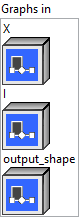
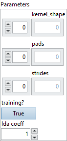

<h1>MaxUnPool</h1>

<h2>Description</h2>

MaxUnpool essentially computes the partial inverse of the <a href="../../../mono_input/multi-output-nodes-dl/maxpool/README.md">MaxPool</a> op.

The input information to this op is typically the output information from a MaxPool op. The first input tensor X is the tensor that needs to be unpooled, which is typically the pooled tensor (first output) from MaxPool. The second input tensor, I, contains the indices to the (locally maximal) elements corresponding to the elements in the first input tensor X. Input tensor I is typically the second output of the MaxPool op. The third (optional) input is a tensor that specifies the output size of the unpooling operation.

MaxUnpool is intended to do ‘partial’ inverse of the MaxPool op. ‘Partial’ because all the non-maximal values from the original input to MaxPool are set to zero in the output of the MaxUnpool op. Pooling the result of an unpooling operation should give back the original input to the unpooling op.

MaxUnpool can produce the same output size for several input sizes, which makes unpooling op ambiguous. The third input argument, output_size, is meant to disambiguate the op and produce output tensor of known/predictable size.

In addition to the inputs, MaxUnpool takes three attributes, namely kernel_shape, strides, and pads, which define the exact unpooling op. The attributes typically have the same values as the corresponding pooling op that the unpooling op is trying to invert.

<h3>Input parameters</h3>

<table>
  <tbody>
    <tr>
      <td width="64" valign="top"></td>
      <td valign="top"><strong><a href="../../../../../../more-deep-learning/nodes-parameters/specified_outputs_name/README.md">specified_outputs_name</a> : <em>array, </em></strong>this parameter lets you manually assign custom names to the output tensors of a node.</td>
    </tr>
  </tbody>
</table>

<table>
  <tbody>
    <tr>
      <td valign="top" width="70%"><table>
  <tbody>
    <tr>
      <td width="64" valign="top"></td>
      <td valign="top"><strong>Graphs in :</strong> <strong><em>cluster,</em></strong> ONNX model architecture.</td>
    </tr>
    <tr>
      <td></td>
      <td valign="top"><table>
  <tbody>
    <tr>
      <td width="64" valign="top"></td>
      <td valign="top"><strong>X</strong> <strong>(heterogeneous) –</strong> <strong>T1 :</strong> <em><strong>object,</strong></em> input data tensor that has to be unpooled. This tensor is typically the first output of the MaxPool op.Dimensions for image case are (N x C x H x W), where N is the batch size, C is the number of channels, and H and W are the height and the width of the data. For non-image case, the dimensions are in the form of (N x C x D1 x D2 … Dn), where N is the batch size. Optionally, if dimension denotation is in effect, the operation expects the input data tensor to arrive with the dimension denotation of [DATA_BATCH, DATA_CHANNEL, DATA_FEATURE, DATA_FEATURE …].</td>
    </tr>
    <tr>
      <td width="64" valign="top"></td>
      <td valign="top"><strong>I (heterogeneous) – T2 : <em>object, </em></strong>input data tensor containing the indices corresponding to elements in the first input tensor X.This tensor is typically the second output of the MaxPool op.Dimensions must be the same as input tensor X. The indices are linear, i.e. computed considering the tensor as flattened 1-D tensor, assuming row-major storage. Also, the linear indices should not consider padding. So the values in indices are in the range [0, N x C x D1 x … x Dn).</td>
    </tr>
    <tr>
      <td width="64" valign="top"></td>
      <td valign="top"><strong>output_shape</strong> <strong>(optional, heterogeneous) – T2 : <em>object, </em></strong>the shape of the output can be explicitly set which will cause pads values to be auto generated. If ‘output_shape’ is specified, ‘pads’ values are ignored.</td>
    </tr>
  </tbody>
</table></td>
    </tr>
  </tbody>
</table></td>
      <td valign="top" width="30%">

</td>
    </tr>
  </tbody>
</table>

<table>
  <tbody>
    <tr>
      <td valign="top" width="70%"><table>
  <tbody>
    <tr>
      <td width="64" valign="top"></td>
      <td valign="top"><strong>Parameters : <em>cluster,</em></strong></td>
    </tr>
    <tr>
      <td></td>
      <td valign="top"><table>
  <tbody>
    <tr>
      <td width="64" valign="top"></td>
      <td valign="top"><strong>kernel_shape : <em>array,</em></strong> the size of the kernel along each axis.</td>
    </tr>
    <tr>
      <td width="64" valign="top"></td>
      <td valign="top">Default value “empty”.</td>
    </tr>
    <tr>
      <td width="64" valign="top"></td>
      <td valign="top"><strong>pads : <em>array,</em></strong> padding for the beginning and ending along each spatial axis, it can take any value greater than or equal to 0. The value represent the number of pixels added to the beginning and end part of the corresponding axis. <code>pads</code> format should be as follow [x1_begin, x2_begin…x1_end, x2_end,…], where xi_begin the number of pixels added at the beginning of axis <code>i</code> and xi_end, the number of pixels added at the end of axis <code>i</code>. This attribute cannot be used simultaneously with auto_pad attribute. If not present, the padding defaults to 0 along start and end of each spatial axis.</td>
    </tr>
    <tr>
      <td width="64" valign="top"></td>
      <td valign="top">Default value “empty”.</td>
    </tr>
    <tr>
      <td width="64" valign="top"></td>
      <td valign="top"><strong>strides : <em>array,</em></strong> stride along each spatial axis. If not present, the stride defaults to 1 along each spatial axis.</td>
    </tr>
    <tr>
      <td width="64" valign="top"></td>
      <td valign="top">Default value “empty”.</td>
    </tr>
    <tr>
      <td width="64" valign="top"></td>
      <td valign="top"><strong>training? :</strong> <em><strong>boolean</strong></em>, whether the layer is in training mode (can store data for backward).</td>
    </tr>
    <tr>
      <td width="64" valign="top"></td>
      <td valign="top">Default value “True”.</td>
    </tr>
    <tr>
      <td width="64" valign="top"></td>
      <td valign="top"><strong>lda coeff :</strong> <em><strong>float</strong></em>, defines the coefficient by which the loss derivative will be multiplied before being sent to the previous layer (since during the backward run we go backwards).</td>
    </tr>
    <tr>
      <td width="64" valign="top"></td>
      <td valign="top">Default value “1”.</td>
    </tr>
  </tbody>
</table></td>
    </tr>
    <tr>
      <td width="64" valign="top"></td>
      <td valign="top"><strong>name (optional) :</strong> <em><strong>string,</strong></em> name of the node.</td>
    </tr>
  </tbody>
</table></td>
      <td valign="top" width="30%">

</td>
    </tr>
  </tbody>
</table>

<h3>Output parameters</h3>

<table>
  <tbody>
    <tr>
      <td width="64" valign="top"></td>
      <td valign="top"><strong>output (heterogeneous) – T1 :</strong> <em><strong>object,</strong></em> output data tensor that contains the result of the unpooling.</td>
    </tr>
  </tbody>
</table>

<h2>Type Constraints</h2>

T1

in (

tensor(double)

,

tensor(float)

,

tensor(float16)

) : Constrain input and output types to float tensors.

<strong>T2</strong> in (<code>tensor(int64)</code>) : Constrain index tensor to int64

<h2>Example</h2>

All these exemples are snippets PNG, you can drop these Snippet onto the block diagram and get the depicted code added to your VI (Do not forget to install Deep Learning library to run it).

