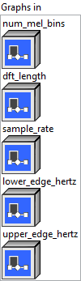
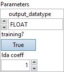

<h1>MelWeightMatrix</h1>

<h2>Description</h2>

Generate a MelWeightMatrix that can be used to re-weight a Tensor containing a linearly sampled frequency spectra (from DFT or STFT) into num_mel_bins frequency information based on the [lower_edge_hertz, upper_edge_hertz] range on the mel scale.

This function defines the mel scale in terms of a frequency in hertz according to the following formula : mel(f) = 2595 * log10(1 + f/700) In the returned matrix, all the triangles (filterbanks) have a peak value of 1.0.

The returned MelWeightMatrix can be used to right-multiply a spectrogram S of shape [frames, num_spectrogram_bins] of linear scale spectrum values (e.g. STFT magnitudes) to generate a “mel spectrogram” M of shape [frames, num_mel_bins].

<h3>Input parameters</h3>

<table>
  <tbody>
    <tr>
      <td width="64" valign="top"></td>
      <td valign="top"><strong><a href="../../../../../../more-deep-learning/nodes-parameters/specified_outputs_name/README.md">specified_outputs_name</a> : <em>array, </em></strong>this parameter lets you manually assign custom names to the output tensors of a node.</td>
    </tr>
  </tbody>
</table>

<table>
  <tbody>
    <tr>
      <td valign="top" width="70%"><table>
  <tbody>
    <tr>
      <td width="64" valign="top"></td>
      <td valign="top"><strong>Graphs in :</strong> <strong><em>cluster,</em></strong> ONNX model architecture.</td>
    </tr>
    <tr>
      <td></td>
      <td valign="top"><table>
  <tbody>
    <tr>
      <td width="64" valign="top"></td>
      <td valign="top"><strong>num_mel_bins (heterogeneous) – T1 : <em>object, </em></strong>the number of bands in the mel spectrum.</td>
    </tr>
    <tr>
      <td width="64" valign="top"></td>
      <td valign="top"><strong>dft_length (heterogeneous) – T1 : <em>object, </em></strong>the size of the original DFT. The size of the original DFT is used to infer the size of the onesided DFT, which is understood to be floor(dft_length/2) + 1, i.e. the spectrogram only contains the nonredundant DFT bins.</td>
    </tr>
    <tr>
      <td width="64" valign="top"></td>
      <td valign="top"><strong>sample_rate (heterogeneous) – T1 : <em>object, </em></strong>samples per second of the input signal used to create the spectrogram. Used to figure out the frequencies corresponding to each spectrogram bin, which dictates how they are mapped into the mel scale.</td>
    </tr>
    <tr>
      <td width="64" valign="top"></td>
      <td valign="top"><strong>lower_edge_hertz (heterogeneous) – T2 : <em>object, </em></strong>lower bound on the frequencies to be included in the mel spectrum. This corresponds to the lower edge of the lowest triangular band.</td>
    </tr>
    <tr>
      <td width="64" valign="top"></td>
      <td valign="top"><strong>upper_edge_hertz</strong> <strong>(heterogeneous) – T2 : <em>object, </em></strong>the desired top edge of the highest frequency band.</td>
    </tr>
  </tbody>
</table></td>
    </tr>
  </tbody>
</table></td>
      <td valign="top" width="30%">

</td>
    </tr>
  </tbody>
</table>

<table>
  <tbody>
    <tr>
      <td valign="top" width="70%"><table>
  <tbody>
    <tr>
      <td width="64" valign="top"></td>
      <td valign="top"><strong>Parameters : <em>cluster,</em></strong></td>
    </tr>
    <tr>
      <td></td>
      <td valign="top"><table>
  <tbody>
    <tr>
      <td width="64" valign="top"></td>
      <td valign="top"><strong>output_datatype :</strong> <em><strong>enum</strong></em>, the data type of the output tensor. Strictly must be one of the values from DataType enum in TensorProto whose values correspond to T3.</td>
    </tr>
    <tr>
      <td width="64" valign="top"></td>
      <td valign="top">Default value “FLOAT”.</td>
    </tr>
    <tr>
      <td width="64" valign="top"></td>
      <td valign="top"><strong>training? :</strong> <em><strong>boolean</strong></em>, whether the layer is in training mode (can store data for backward).</td>
    </tr>
    <tr>
      <td width="64" valign="top"></td>
      <td valign="top">Default value “True”.</td>
    </tr>
    <tr>
      <td width="64" valign="top"></td>
      <td valign="top"><strong>lda coeff :</strong> <em><strong>float</strong></em>, defines the coefficient by which the loss derivative will be multiplied before being sent to the previous layer (since during the backward run we go backwards).</td>
    </tr>
    <tr>
      <td width="64" valign="top"></td>
      <td valign="top">Default value “1”.</td>
    </tr>
  </tbody>
</table></td>
    </tr>
    <tr>
      <td width="64" valign="top"></td>
      <td valign="top"><strong>name (optional) :</strong> <em><strong>string,</strong></em> name of the node.</td>
    </tr>
  </tbody>
</table></td>
      <td valign="top" width="30%">

</td>
    </tr>
  </tbody>
</table>

<h3>Output parameters</h3>

<table>
  <tbody>
    <tr>
      <td width="64" valign="top"></td>
      <td valign="top"><strong>output (heterogeneous) – T3 : <em>object, </em></strong>the Mel Weight Matrix. The output has the shape: [floor(dft_length/2) + 1][num_mel_bins].</td>
    </tr>
  </tbody>
</table>

<h2>Type Constraints</h2>

<strong>T1</strong> in (<code>tensor(int32)</code>, <code>tensor(int64)</code>) : Constrain to integer tensors.

<strong>T2</strong> in (<code>tensor(bfloat16)</code>, <code>tensor(double)</code>, <code>tensor(float)</code>, <code>tensor(float16)</code>) : Constrain to float tensors

<strong>T3</strong> in (<code>tensor(bfloat16)</code>, <code>tensor(double)</code>, <code>tensor(float)</code>, <code>tensor(float16)</code>, <code>tensor(int16)</code>, <code>tensor(int32)</code>, <code>tensor(int64)</code>,  <code>tensor(int8)</code>, <code>tensor(uint16)</code>, <code>tensor(uint32)</code>, <code>tensor(uint64)</code>, <code>tensor(uint8)</code>) : Constrain to any numerical types.

<h2>Example</h2>

All these exemples are snippets PNG, you can drop these Snippet onto the block diagram and get the depicted code added to your VI (Do not forget to install Deep Learning library to run it).

