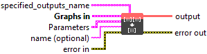
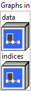

<h1>MicrosoftGatherND</h1>

<h2>Description</h2>

Given <code>data</code> tensor of rank r &gt;= 1, and <code>indices</code> tensor of rank q &gt;= 1, gather slices of <code>data</code> into an output tensor of rank q – 1 + r – indices[-1]. Example 1: data = [[0,1],[2,3]] indices = [[0,0],[1,1]] output = [0,3] Example 2: data = [[0,1],[2,3]] indices = [[1],[0]] output = [[2,3],[0,1]] Example 3: data = [[[0,1],[2,3]],[[4,5],[6,7]]] indices = [[0,1],[1,0]] output = [[2,3],[4,5]] Example 4: data = [[[0,1],[2,3]],[[4,5],[6,7]]] indices = [[[0,1]],[[1,0]]] output = [[[2,3]],[[4,5]]]

<h3></h3>

<h3>Input parameters</h3>

<table>
  <tbody>
    <tr>
      <td width="64" valign="top"></td>
      <td valign="top"><strong><a href="../../../../../../more-deep-learning/nodes-parameters/specified_outputs_name/README.md">specified_outputs_name</a> : <em>array, </em></strong>this parameter lets you manually assign custom names to the output tensors of a node.</td>
    </tr>
  </tbody>
</table>

<table>
  <tbody>
    <tr>
      <td valign="top" width="70%"><table>
  <tbody>
    <tr>
      <td width="64" valign="top"></td>
      <td valign="top"><strong>Graphs in :</strong> <strong><em>cluster,</em></strong> ONNX model architecture.</td>
    </tr>
    <tr>
      <td></td>
      <td valign="top"><table>
  <tbody>
    <tr>
      <td width="64" valign="top"></td>
      <td valign="top"><strong>data</strong> <strong>(heterogeneous) –</strong> <strong>T :</strong> <em><strong>object,</strong></em> tensor of rank r >= 1.</td>
    </tr>
    <tr>
      <td width="64" valign="top"></td>
      <td valign="top"><strong>indices (heterogeneous) – Tind : <em>object, </em></strong>tensor of rank q >= 1.</td>
    </tr>
  </tbody>
</table></td>
    </tr>
  </tbody>
</table></td>
      <td valign="top" width="30%">

</td>
    </tr>
  </tbody>
</table>

<table>
  <tbody>
    <tr>
      <td valign="top" width="70%"><table>
  <tbody>
    <tr>
      <td width="64" valign="top"></td>
      <td valign="top"><strong>Parameters : <em>cluster,</em></strong></td>
    </tr>
    <tr>
      <td></td>
      <td valign="top"><table>
  <tbody>
    <tr>
      <td width="64" valign="top"></td>
      <td valign="top"><strong>training? :</strong> <em><strong>boolean</strong></em>, whether the layer is in training mode (can store data for backward).</td>
    </tr>
    <tr>
      <td width="64" valign="top"></td>
      <td valign="top">Default value “True”.</td>
    </tr>
    <tr>
      <td width="64" valign="top"></td>
      <td valign="top"><strong>lda coeff :</strong> <em><strong>float</strong></em>, defines the coefficient by which the loss derivative will be multiplied before being sent to the previous layer (since during the backward run we go backwards).</td>
    </tr>
    <tr>
      <td width="64" valign="top"></td>
      <td valign="top">Default value “1”.</td>
    </tr>
  </tbody>
</table></td>
    </tr>
    <tr>
      <td width="64" valign="top"></td>
      <td valign="top"><strong>name (optional) :</strong> <em><strong>string,</strong></em> name of the node.</td>
    </tr>
  </tbody>
</table></td>
      <td valign="top" width="30%">

</td>
    </tr>
  </tbody>
</table>

<h3>Output parameters</h3>

<table>
  <tbody>
    <tr>
      <td width="64" valign="top"></td>
      <td valign="top"><strong>output</strong> <strong>(heterogeneous) –</strong> <strong>T : <em>object,</em></strong> tensor of rank q-1+r-indices[-1].</td>
    </tr>
  </tbody>
</table>

<h2>Type Constraints</h2>

<strong>T</strong> in (<code>tensor(uint8)</code>, <code>tensor(uint16)</code>, <code>tensor(uint32)</code>, <code>tensor(uint64)</code>, <code>tensor(int8)</code>, <code>tensor(int16)</code>, <code>tensor(int32)</code>, <code>tensor(int64)</code>, <code>tensor(float16)</code>, <code>tensor(float)</code>, <code>tensor(double)</code>, <code>tensor(string)</code>, <code>tensor(bool)</code>, <code>tensor(complex64)</code>, <code>tensor(complex128)</code>) : Constrain input and output types to any tensor type.

<strong>Tind</strong> in (<code>tensor(int32)</code>, <code>tensor(int64)</code>) : Constrain indice type to int32 or int64.

<h2>Example</h2>

All these exemples are snippets PNG, you can drop these Snippet onto the block diagram and get the depicted code added to your VI (Do not forget to install Deep Learning library to run it).

