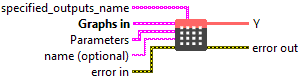
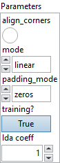

<h1>MicrosoftGridSample</h1>

<h2>Description</h2>

Given an <code>input</code> and a flow-field <code>grid</code>, computes the <code>output</code> using <code>input</code> values and pixel locations from <code>grid</code>. Currently, only spatial (4-D) inputs are supported. For <code>input</code> with shape (N, C, H, W) and <code>grid</code> with shape (N, H_out, W_out, 2), the <code>output</code> will have shape (N, C, H_out, W_out). For each output location <code>output[n, :, h, w]</code>, the size-2 vector <code>grid[n, h, w]</code> specifies <code>input</code> pixel locations <code>x</code> and <code>y</code>, which are used to interpolate the output value <code>output[n, :, h, w]</code>. The GridSample operator is often used in doing grid generator and sampler in the <a href="https://arxiv.org/abs/1506.02025">Spatial Transformer Networks</a>. See also in <a href="https://pytorch.org/docs/master/generated/torch.nn.functional.grid_sample.html#torch-nn-functional-grid-sample">torch.nn.functional.grid_sample</a>.

<h3>Input parameters</h3>

<table>
  <tbody>
    <tr>
      <td width="64" valign="top"></td>
      <td valign="top"><strong><a href="../../../../../../more-deep-learning/nodes-parameters/specified_outputs_name/README.md">specified_outputs_name</a> : <em>array, </em></strong>this parameter lets you manually assign custom names to the output tensors of a node.</td>
    </tr>
  </tbody>
</table>

<table>
  <tbody>
    <tr>
      <td valign="top" width="70%"><table>
  <tbody>
    <tr>
      <td width="64" valign="top"></td>
      <td valign="top"><strong>Graphs in :</strong> <strong><em>cluster,</em></strong> ONNX model architecture.</td>
    </tr>
    <tr>
      <td></td>
      <td valign="top"><table>
  <tbody>
    <tr>
      <td width="64" valign="top"></td>
      <td valign="top"><strong>X (heterogeneous) –</strong> <strong>T1 :</strong> <em><strong>object,</strong></em> 4-D tensor of shape (N, C, H, W), where N is the batch size, C is the numbers of channels, H and W are the height and width of the input data.</td>
    </tr>
    <tr>
      <td width="64" valign="top"></td>
      <td valign="top"><strong>grid (heterogeneous) – T1 : <em>object, </em></strong>input offset, 4-D tensor of shape (N, H_out, W_out, 2), where H_out and W_out are the height and width of grid and output, Grid specifies the sampling pixel locations normalized by the input spatial dimensions. Therefore, it should have most values in the range of [-1, 1]. If grid has values outside the range of [-1, 1], the corresponding outputs will be handled as defined by padding_mode.</td>
    </tr>
  </tbody>
</table></td>
    </tr>
  </tbody>
</table></td>
      <td valign="top" width="30%">

</td>
    </tr>
  </tbody>
</table>

<table>
  <tbody>
    <tr>
      <td valign="top" width="70%"><table>
  <tbody>
    <tr>
      <td width="64" valign="top"></td>
      <td valign="top"><strong>Parameters : <em>cluster,</em></strong></td>
    </tr>
    <tr>
      <td></td>
      <td valign="top"><table>
  <tbody>
    <tr>
      <td width="64" valign="top"></td>
      <td valign="top"><strong>align_corners :</strong> <em><strong>boolean</strong></em>, if align_corners=true, the extrema (-1 and 1) are considered as referring to the center points of the input’s corner pixels. If align_corners=false, they are instead considered as referring to the corner points of the input’s corner pixels, making the sampling more resolution agnostic.</td>
    </tr>
    <tr>
      <td width="64" valign="top"></td>
      <td valign="top">Default value “False”.</td>
    </tr>
    <tr>
      <td width="64" valign="top"></td>
      <td valign="top"><strong>mode</strong> <strong>: <em>enum,</em></strong> three interpolation modes.</td>
    </tr>
    <tr>
      <td width="64" valign="top"></td>
      <td valign="top">Default value “bilinear”.</td>
    </tr>
    <tr>
      <td width="64" valign="top"></td>
      <td valign="top"><strong>padding_mode : <em>enum,</em></strong> support padding modes for outside grid values. zeros: use 0 for out-of-bound grid locations, border: use border values for out-of-bound grid locations, reflection: use values at locations reflected by the border for out-of-bound grid locations.</td>
    </tr>
    <tr>
      <td width="64" valign="top"></td>
      <td valign="top">Default value “zeros”.</td>
    </tr>
    <tr>
      <td width="64" valign="top"></td>
      <td valign="top"><strong>training? :</strong> <em><strong>boolean</strong></em>, whether the layer is in training mode (can store data for backward).</td>
    </tr>
    <tr>
      <td width="64" valign="top"></td>
      <td valign="top">Default value “True”.</td>
    </tr>
    <tr>
      <td width="64" valign="top"></td>
      <td valign="top"><strong>lda coeff :</strong> <em><strong>float</strong></em>, defines the coefficient by which the loss derivative will be multiplied before being sent to the previous layer (since during the backward run we go backwards).</td>
    </tr>
    <tr>
      <td width="64" valign="top"></td>
      <td valign="top">Default value “1”.</td>
    </tr>
  </tbody>
</table></td>
    </tr>
    <tr>
      <td width="64" valign="top"></td>
      <td valign="top"><strong>name (optional) :</strong> <em><strong>string,</strong></em> name of the node.</td>
    </tr>
  </tbody>
</table></td>
      <td valign="top" width="30%">

</td>
    </tr>
  </tbody>
</table>

<h3>Output parameters</h3>

<table>
  <tbody>
    <tr>
      <td width="64" valign="top"></td>
      <td valign="top"><strong>Y (heterogeneous) – T2 : <em>object, </em></strong>4-D tensor of shape (N, C, H_out, W_out).</td>
    </tr>
  </tbody>
</table>

<h2>Type Constraints</h2>

<strong>T1</strong> in (<code>tensor(uint8)</code>, <code>tensor(uint16)</code>, <code>tensor(uint32)</code>, <code>tensor(uint64)</code>, <code>tensor(int8)</code>, <code>tensor(int16)</code>, <code>tensor(int32)</code>, <code>tensor(int64)</code>, <code>tensor(float16)</code>, <code>tensor(float)</code>, <code>tensor(double)</code>, <code>tensor(string)</code>, <code>tensor(bool)</code>, <code>tensor(complex64)</code>, <code>tensor(complex128)</code>) : Constrain input types to all tensor types.

<strong>T2</strong> in (<code>tensor(double)</code>, <code>tensor(float)</code>, <code>tensor(float16)</code>) : Constrain output types to float tensors.

<h2>Example</h2>

All these exemples are snippets PNG, you can drop these Snippet onto the block diagram and get the depicted code added to your VI (Do not forget to install Deep Learning library to run it).

