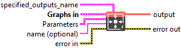
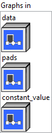
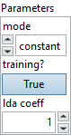

<h1>MicrosoftPad</h1>

<h2>Description</h2>

Given <code>data</code> tensor, pads, mode, and value. Example: Insert 0 pads to the beginning of the second dimension. data = [ [1.0, 1.2], [2.3, 3.4], [4.5, 5.7], ] pads = [0, 2, 0, 0] output = [ [ [0.0, 0.0, 1.0, 1.2], [0.0, 0.0, 2.3, 3.4], [0.0, 0.0, 4.5, 5.7], ], ].

<h3>Input parameters</h3>

<table>
  <tbody>
    <tr>
      <td width="64" valign="top"></td>
      <td valign="top"><strong><a href="../../../../../../more-deep-learning/nodes-parameters/specified_outputs_name/README.md">specified_outputs_name</a> : <em>array, </em></strong>this parameter lets you manually assign custom names to the output tensors of a node.</td>
    </tr>
  </tbody>
</table>

<table>
  <tbody>
    <tr>
      <td valign="top" width="70%"><table>
  <tbody>
    <tr>
      <td width="64" valign="top"></td>
      <td valign="top"><strong>Graphs in :</strong> <strong><em>cluster,</em></strong> ONNX model architecture.</td>
    </tr>
    <tr>
      <td></td>
      <td valign="top"><table>
  <tbody>
    <tr>
      <td width="64" valign="top"></td>
      <td valign="top"><strong>data (heterogeneous) – T</strong> <strong>:</strong> <em><strong>object,</strong></em> input tensor.</td>
    </tr>
    <tr>
      <td width="64" valign="top"></td>
      <td valign="top"><strong>pads (heterogeneous) – tensor(int64) : <em>object, </em></strong>tensor of integers indicating the number of padding elements to add or remove (if negative) at the beginning and end of each axis. For 2D input tensor, it is the number of pixels. `pads` should be a 1D tensor of shape [2 * input_rank] or a 2D tensor of shape [1, 2 * input_rank]. `pads` format (1D example) should be as follow [x1_begin, x2_begin,…,x1_end, x2_end,…], where xi_begin is the number of pixels added at the beginning of axis `i` and xi_end, the number of pixels added at the end of axis `i`.</td>
    </tr>
    <tr>
      <td width="64" valign="top"></td>
      <td valign="top"><strong>constant_value (optional, heterogeneous) – T : <em>object, </em></strong>a scalar or rank 1 tensor containing a single value to be filled if the mode chosen is `constant`.</td>
    </tr>
  </tbody>
</table></td>
    </tr>
  </tbody>
</table></td>
      <td valign="top" width="30%">

</td>
    </tr>
  </tbody>
</table>

<table>
  <tbody>
    <tr>
      <td valign="top" width="70%"><table>
  <tbody>
    <tr>
      <td width="64" valign="top"></td>
      <td valign="top"><strong>Parameters : <em>cluster,</em></strong></td>
    </tr>
    <tr>
      <td></td>
      <td valign="top"><table>
  <tbody>
    <tr>
      <td width="64" valign="top"></td>
      <td valign="top"><strong>mode :</strong> <em><strong>enum</strong><strong>,</strong></em> three modes : `constant`- pads with a given constant value, `reflect`- pads with the reflection of the vector mirrored on the first and last values of the vector along each axis, `edge`- pads with the edge values of array.</td>
    </tr>
    <tr>
      <td width="64" valign="top"></td>
      <td valign="top">Default value “constant”.</td>
    </tr>
    <tr>
      <td width="64" valign="top"></td>
      <td valign="top"><strong>training? :</strong> <em><strong>boolean</strong><strong>,</strong></em> whether the layer is in training mode (can store data for backward).</td>
    </tr>
    <tr>
      <td width="64" valign="top"></td>
      <td valign="top">Default value “True”.</td>
    </tr>
    <tr>
      <td width="64" valign="top"></td>
      <td valign="top"><strong>lda coeff :</strong> <em><strong>float</strong><strong>,</strong></em> defines the coefficient by which the loss derivative will be multiplied before being sent to the previous layer (since during the backward run we go backwards).</td>
    </tr>
    <tr>
      <td width="64" valign="top"></td>
      <td valign="top">Default value “1”.</td>
    </tr>
  </tbody>
</table></td>
    </tr>
    <tr>
      <td width="64" valign="top"></td>
      <td valign="top"><strong>name (optional) :</strong> <em><strong>string,</strong></em> name of the node.</td>
    </tr>
  </tbody>
</table></td>
      <td valign="top" width="30%">

</td>
    </tr>
  </tbody>
</table>

<h3>Output parameters</h3>

<table>
  <tbody>
    <tr>
      <td width="64" valign="top"></td>
      <td valign="top"><strong>output (heterogeneous) – T :</strong> <em><strong>object,</strong></em> tensor after padding.</td>
    </tr>
  </tbody>
</table>

<h2>Type Constraints</h2>

T

in (

tensor(double)

,

tensor(float)

,

tensor(float16)

) : Constrain input and output types to float tensors.

<h2>Example</h2>

All these exemples are snippets PNG, you can drop these Snippet onto the block diagram and get the depicted code added to your VI (Do not forget to install Deep Learning library to run it).

