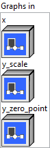

<h1>MicrosoftQuantizeLinear</h1>

<h2>Description</h2>

The linear quantization operator. It consumes a full precision data, a scale, a zero point to compute the low precision / quantized tensor. The quantization formula is y = saturate ((x / y_scale) + y_zero_point). For saturation, it saturates to [0, 255] if it’s uint8, [-128, 127] if it’s int8, [0, 65,535] if it’s uint16, and [-32,768, 32,767] if it’s int16. For (x / y_scale), it’s rounding to nearest ties to even. Refer to <a href="https://en.wikipedia.org/wiki/Rounding">https://en.wikipedia.org/wiki/Rounding</a> for details. Scale and zero point must have same shape. They must be either scalar (per tensor) or 1-D tensor (per ‘axis’).

<h3>Input parameters</h3>

<table>
  <tbody>
    <tr>
      <td width="64" valign="top"></td>
      <td valign="top"><strong><a href="../../../../../../more-deep-learning/nodes-parameters/specified_outputs_name/README.md">specified_outputs_name</a> : <em>array, </em></strong>this parameter lets you manually assign custom names to the output tensors of a node.</td>
    </tr>
  </tbody>
</table>

<table>
  <tbody>
    <tr>
      <td valign="top" width="70%"><table>
  <tbody>
    <tr>
      <td width="64" valign="top"></td>
      <td valign="top"><strong>Graphs in :</strong> <strong><em>cluster,</em></strong> ONNX model architecture.</td>
    </tr>
    <tr>
      <td></td>
      <td valign="top"><table>
  <tbody>
    <tr>
      <td width="64" valign="top"></td>
      <td valign="top"><strong>x (heterogeneous) –</strong> <strong>T1 :</strong> <em><strong>object,</strong></em> N-D full precision Input tensor to be quantized.</td>
    </tr>
    <tr>
      <td width="64" valign="top"></td>
      <td valign="top"><strong>y_scale (heterogeneous) –</strong> <strong>T1 :</strong> <em><strong>object,</strong></em> scale for doing quantization to get ‘y’. It can be a scalar, which means per-tensor/layer quantization, or a 1-D tensor for per-axis quantization.</td>
    </tr>
    <tr>
      <td width="64" valign="top"></td>
      <td valign="top"><strong>y_zero_point (optional, heterogeneous) – T2 : <em>object, </em></strong>zero point for doing quantization to get ‘y’. Shape must match y_scale. Default is uint8 with zero point of 0 if it’s not specified.</td>
    </tr>
  </tbody>
</table></td>
    </tr>
  </tbody>
</table></td>
      <td valign="top" width="30%">

</td>
    </tr>
  </tbody>
</table>

<table>
  <tbody>
    <tr>
      <td valign="top" width="70%"><table>
  <tbody>
    <tr>
      <td width="64" valign="top"></td>
      <td valign="top"><strong>Parameters : <em>cluster,</em></strong></td>
    </tr>
    <tr>
      <td></td>
      <td valign="top"><table>
  <tbody>
    <tr>
      <td width="64" valign="top"></td>
      <td valign="top"><strong>axis : <em>integer,</em></strong> the axis along which same quantization parameters are applied. It’s optional.If it’s not specified, it means per-tensor quantization and input ‘x_scale’ and ‘x_zero_point’ must be scalars.If it’s specified, it means per ‘axis’ quantization and input ‘x_scale’ and ‘x_zero_point’ must be 1-D tensors.</td>
    </tr>
    <tr>
      <td width="64" valign="top"></td>
      <td valign="top">Default value “0”.</td>
    </tr>
    <tr>
      <td width="64" valign="top"></td>
      <td valign="top"><strong>saturate :</strong> <em><strong>boolean</strong><strong>,</strong></em> the parameter defines how the conversion behaves if an input value is out of range of the destination type. It only applies for float 8 quantization (float8e4m3fn, float8e4m3fnuz, float8e5m2, float8e5m2fnuz). It is true by default. All cases are fully described in two tables inserted in the operator description.</td>
    </tr>
    <tr>
      <td width="64" valign="top"></td>
      <td valign="top">Default value “True”.</td>
    </tr>
    <tr>
      <td width="64" valign="top"></td>
      <td valign="top"><strong>training? :</strong> <em><strong>boolean</strong><strong>,</strong></em> whether the layer is in training mode (can store data for backward).</td>
    </tr>
    <tr>
      <td width="64" valign="top"></td>
      <td valign="top">Default value “True”.</td>
    </tr>
    <tr>
      <td width="64" valign="top"></td>
      <td valign="top"><strong>lda coeff :</strong> <em><strong>float</strong><strong>,</strong></em> defines the coefficient by which the loss derivative will be multiplied before being sent to the previous layer (since during the backward run we go backwards).</td>
    </tr>
    <tr>
      <td width="64" valign="top"></td>
      <td valign="top">Default value “1”.</td>
    </tr>
  </tbody>
</table></td>
    </tr>
    <tr>
      <td width="64" valign="top"></td>
      <td valign="top"><strong>name (optional) :</strong> <em><strong>string,</strong></em> name of the node.</td>
    </tr>
  </tbody>
</table></td>
      <td valign="top" width="30%">

</td>
    </tr>
  </tbody>
</table>

<h3>Output parameters</h3>

<table>
  <tbody>
    <tr>
      <td width="64" valign="top"></td>
      <td valign="top"><strong>y</strong> <strong>(heterogeneous) –</strong> <strong>T2 : <em>object,</em></strong> N-D quantized output tensor. It has same shape as input ‘x’.</td>
    </tr>
  </tbody>
</table>

<h2>Type Constraints</h2>

<strong>T1</strong> in (<code>tensor(float16)</code>, <code>tensor(float)</code>) : Constrain ‘x’, ‘y_scale’ to float tensors.

<strong>T2</strong> in (<code>tensor(int8)</code>, <code>tensor(uint8)</code>, <code>tensor(int16)</code>, <code>tensor(uint16)</code>, <code>tensor(int4)</code>, <code>tensor(uint4)</code>) : Constrain ‘y_zero_point’ and ‘y’ to 8-bit and 16-bit integer tensors.

<h2>Example</h2>

All these exemples are snippets PNG, you can drop these Snippet onto the block diagram and get the depicted code added to your VI (Do not forget to install Deep Learning library to run it).

