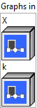
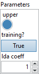

<h1>MicrosoftTrilu</h1>

<h2>Description</h2>

Returns the upper or lower triangular part of a 2-D matrix, or batches of 2-D matrices. If the attribute “upper” is set to true, the upper triangular matrix is retained. Lower triangular matrix is retained otherwise. Default value for upper is true. Trilu takes one input tensor of shape [*, N, M], where * is zero or more batch dimensions. The upper triangular part consists of the elements on and above the given diagonal (k). The lower triangular part consists of elements on and below the diagonal. All other elements in the matrix are set to zero. If k = 0, the triangular part on and above/below the main diagonal is retained. If upper is set to true, a positive k retains the upper triangular matrix excluding k diagonals above the main diagonal. A negative k value includes as many diagonals below the main diagonal. If upper is set to false, a positive k retains the lower triangular matrix including k diagonals above the main diagonal. A negative k value excludes as many diagonals below the main diagonal.

<h3>Input parameters</h3>

<table>
  <tbody>
    <tr>
      <td width="64" valign="top"></td>
      <td valign="top"><strong><a href="../../../../../../more-deep-learning/nodes-parameters/specified_outputs_name/README.md">specified_outputs_name</a> : <em>array, </em></strong>this parameter lets you manually assign custom names to the output tensors of a node.</td>
    </tr>
  </tbody>
</table>

<table>
  <tbody>
    <tr>
      <td valign="top" width="70%"><table>
  <tbody>
    <tr>
      <td width="64" valign="top"></td>
      <td valign="top"><strong>Graphs in :</strong> <strong><em>cluster,</em></strong> ONNX model architecture.</td>
    </tr>
    <tr>
      <td></td>
      <td valign="top"><table>
  <tbody>
    <tr>
      <td width="64" valign="top"></td>
      <td valign="top"><strong>X (heterogeneous) –</strong> <strong>T :</strong> <em><strong>object,</strong></em> input tensor of rank 2 or higher.</td>
    </tr>
    <tr>
      <td width="64" valign="top"></td>
      <td valign="top"><strong>k (optional, heterogeneous) –</strong> <strong>tensor(int64) :</strong> <em><strong>object,</strong></em> a 0-D tensor containing a single value corresponding to the number diagonals above or the main diagonal to exclude or include.Default value is 0 if it’s not specified.</td>
    </tr>
  </tbody>
</table></td>
    </tr>
  </tbody>
</table></td>
      <td valign="top" width="30%">

</td>
    </tr>
  </tbody>
</table>

<table>
  <tbody>
    <tr>
      <td valign="top" width="70%"><table>
  <tbody>
    <tr>
      <td width="64" valign="top"></td>
      <td valign="top"><strong>Parameters : <em>cluster,</em></strong></td>
    </tr>
    <tr>
      <td></td>
      <td valign="top"><table>
  <tbody>
    <tr>
      <td width="64" valign="top"></td>
      <td valign="top"><strong>upper :</strong> <em><strong>boolean</strong><strong>,</strong></em> indicates whether upper or lower part of matrix is retained.</td>
    </tr>
    <tr>
      <td width="64" valign="top"></td>
      <td valign="top">Default value “True”.</td>
    </tr>
    <tr>
      <td width="64" valign="top"></td>
      <td valign="top"><strong>training? :</strong> <em><strong>boolean</strong><strong>,</strong></em> whether the layer is in training mode (can store data for backward).</td>
    </tr>
    <tr>
      <td width="64" valign="top"></td>
      <td valign="top">Default value “True”.</td>
    </tr>
    <tr>
      <td width="64" valign="top"></td>
      <td valign="top"><strong>lda coeff :</strong> <em><strong>float</strong><strong>,</strong></em> defines the coefficient by which the loss derivative will be multiplied before being sent to the previous layer (since during the backward run we go backwards).</td>
    </tr>
    <tr>
      <td width="64" valign="top"></td>
      <td valign="top">Default value “1”.</td>
    </tr>
  </tbody>
</table></td>
    </tr>
    <tr>
      <td width="64" valign="top"></td>
      <td valign="top"><strong>name (optional) :</strong> <em><strong>string,</strong></em> name of the node.</td>
    </tr>
  </tbody>
</table></td>
      <td valign="top" width="30%">

</td>
    </tr>
  </tbody>
</table>

<h3>Output parameters</h3>

<table>
  <tbody>
    <tr>
      <td width="64" valign="top"></td>
      <td valign="top"><strong>Y (heterogeneous) –</strong> <strong>T : <em>object,</em></strong> output tensor of the same type and shape as the input tensor.</td>
    </tr>
  </tbody>
</table>

<h2>Type Constraints</h2>

<strong>T1</strong> in (<code>tensor(float16)</code>, <code>tensor(float)</code>, <code>tensor(double)</code>, <code>tensor(bfloat16)</code>, <code>tensor(uint8)</code>, <code>tensor(uint16)</code>, <code>tensor(uint32)</code>, <code>tensor(uint64)</code>, <code>tensor(int8)</code>, <code>tensor(int16)</code>, <code>tensor(int32)</code>, <code>tensor(int64)</code>, <code>tensor(bool)</code>) : Constrain input and output types to all numeric tensors and bool tensors.

<h2>Example</h2>

All these exemples are snippets PNG, you can drop these Snippet onto the block diagram and get the depicted code added to your VI (Do not forget to install Deep Learning library to run it).

