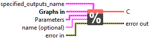
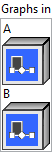
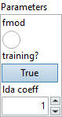

<h1>Mod</h1>

<h2>Description</h2>

Performs an element-wise binary modulo operation. 

The semantics and supported data types depend on the value of the <code>fmod</code> attribute which must be <code>0</code> (default), or <code>1</code>.

If the <code>fmod</code> attribute is set to <code>0</code>, <code>T</code> is constrained to integer data types and the semantics follow that of the Python <code>%</code>-operator. The sign of the result is that of the divisor.

If <code>fmod</code> is set to <code>1</code>, the behavior of this operator follows that of the <code>fmod</code> function in C and <code>T</code> is constrained to floating point data types. The result of this operator is the remainder of the division operation <code>x / y</code> where <code>x</code> and <code>y</code> are respective elements of <code>A</code> and <code>B</code>. The result is exactly the value <code>x - n * y</code>, where <code>n</code> is <code>x / y</code> with its fractional part truncated. The returned value has the same sign as <code>x</code> (except if <code>x</code> is <code>-0</code>) and is less or equal to <code>|y|</code> in magnitude. The following special cases apply when <code>fmod</code> is set to <code>1</code>:

<ul>
<li>

If <code>x</code> is <code>-0</code> and <code>y</code> is greater than zero, either <code>+0</code> or <code>-0</code> may be returned.

</li>
<li>

If <code>x</code> is <code>±∞</code> and <code>y</code> is not <code>NaN</code>, <code>NaN</code> is returned.

</li>
<li>

If <code>y</code> is <code>±0</code> and <code>x</code> is not <code>NaN</code>, <code>NaN</code> should be returned.

</li>
<li>

If <code>y</code> is <code>±∞</code> and <code>x</code> is finite, <code>x</code> is returned.

</li>
<li>

If either argument is <code>NaN</code>, <code>NaN</code> is returned.

</li>
</ul>

This operator supports <strong>multidirectional (i.e., NumPy-style) broadcasting</strong>; for more details please check <a href="https://github.com/onnx/onnx/blob/main/docs/Broadcasting.md">Broadcasting in ONNX</a>.

<h3>Input parameters</h3>

<table>
  <tbody>
    <tr>
      <td width="64" valign="top"></td>
      <td valign="top"><strong><a href="../../../../../../more-deep-learning/nodes-parameters/specified_outputs_name/README.md">specified_outputs_name</a> : <em>array, </em></strong>this parameter lets you manually assign custom names to the output tensors of a node.</td>
    </tr>
  </tbody>
</table>

<table>
  <tbody>
    <tr>
      <td valign="top" width="70%"><table>
  <tbody>
    <tr>
      <td width="64" valign="top"></td>
      <td valign="top"><strong>Graphs in :</strong> <strong><em>cluster,</em></strong> ONNX model architecture.</td>
    </tr>
    <tr>
      <td></td>
      <td valign="top"><table>
  <tbody>
    <tr>
      <td width="64" valign="top"></td>
      <td valign="top"><strong>A (heterogeneous) – T : <em>object, </em></strong>dividend tensor.</td>
    </tr>
    <tr>
      <td width="64" valign="top"></td>
      <td valign="top"><strong>B (heterogeneous) – T : <em>object, </em></strong>divisor tensor.</td>
    </tr>
  </tbody>
</table></td>
    </tr>
  </tbody>
</table></td>
      <td valign="top" width="30%">

</td>
    </tr>
  </tbody>
</table>

<table>
  <tbody>
    <tr>
      <td valign="top" width="70%"><table>
  <tbody>
    <tr>
      <td width="64" valign="top"></td>
      <td valign="top"><strong>Parameters : <em>cluster,</em></strong></td>
    </tr>
    <tr>
      <td></td>
      <td valign="top"><table>
  <tbody>
    <tr>
      <td width="64" valign="top"></td>
      <td valign="top"><strong>fmod :</strong> <em><strong>boolean</strong></em>, whether the operator should behave like fmod (false meaning it will do integer mods); Set this to true to force fmod treatment.</td>
    </tr>
    <tr>
      <td width="64" valign="top"></td>
      <td valign="top">Default value “False”.</td>
    </tr>
    <tr>
      <td width="64" valign="top"></td>
      <td valign="top"><strong>training? :</strong> <em><strong>boolean</strong></em>, whether the layer is in training mode (can store data for backward).</td>
    </tr>
    <tr>
      <td width="64" valign="top"></td>
      <td valign="top">Default value “True”.</td>
    </tr>
    <tr>
      <td width="64" valign="top"></td>
      <td valign="top"><strong>lda coeff :</strong> <em><strong>float</strong></em>, defines the coefficient by which the loss derivative will be multiplied before being sent to the previous layer (since during the backward run we go backwards).</td>
    </tr>
    <tr>
      <td width="64" valign="top"></td>
      <td valign="top">Default value “1”.</td>
    </tr>
  </tbody>
</table></td>
    </tr>
    <tr>
      <td width="64" valign="top"></td>
      <td valign="top"><strong>name (optional) :</strong> <em><strong>string,</strong></em> name of the node.</td>
    </tr>
  </tbody>
</table></td>
      <td valign="top" width="30%">

</td>
    </tr>
  </tbody>
</table>

<h3>Output parameters</h3>

<table>
  <tbody>
    <tr>
      <td width="64" valign="top"></td>
      <td valign="top"><strong>C (heterogeneous) – T : <em>object, </em></strong>remainder tensor.</td>
    </tr>
  </tbody>
</table>

<h2>Type Constraints</h2>

<strong>T</strong> in (<code>tensor(bfloat16)</code>, <code>tensor(double)</code>, <code>tensor(float)</code>, <code>tensor(float16)</code>, <code>tensor(int16)</code>, <code>tensor(int32)</code>, <code>tensor(int64)</code>,  <code>tensor(int8)</code>, <code>tensor(uint16)</code>, <code>tensor(uint32)</code>, <code>tensor(uint64)</code>, <code>tensor(uint8)</code>) : Constrain input and output types to high-precision numeric tensors.

<h2>Example</h2>

All these exemples are snippets PNG, you can drop these Snippet onto the block diagram and get the depicted code added to your VI (Do not forget to install Deep Learning library to run it).

