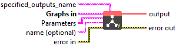
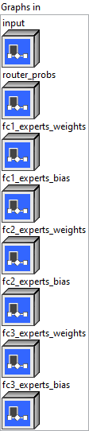
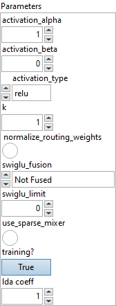

<h1>MoE</h1>

<h2>Description</h2>

Mixture of experts. Examples: Switch transformer(<a href="https://arxiv.org/pdf/2101.03961.pdf">https://arxiv.org/pdf/2101.03961.pdf</a>) use top 1, GLaM(<a href="https://arxiv.org/abs/2112.06905">https://arxiv.org/abs/2112.06905</a>) activates top 2 FFN, Vision MOE(<a href="https://arxiv.org/pdf/2106.05974.pdf">https://arxiv.org/pdf/2106.05974.pdf</a>) usually uses top 32 experts and Mixtral(<a href="https://huggingface.co/blog/mixtral">https://huggingface.co/blog/mixtral</a>).

<h3>Input parameters</h3>

<table>
  <tbody>
    <tr>
      <td width="64" valign="top"></td>
      <td valign="top"><strong><a href="../../../../../../more-deep-learning/nodes-parameters/specified_outputs_name/README.md">specified_outputs_name</a> : <em>array, </em></strong>this parameter lets you manually assign custom names to the output tensors of a node.</td>
    </tr>
  </tbody>
</table>

<table>
  <tbody>
    <tr>
      <td valign="top" width="70%"><table>
  <tbody>
    <tr>
      <td width="64" valign="top"></td>
      <td valign="top"><strong>Graphs in :</strong> <strong><em>cluster,</em></strong> ONNX model architecture.</td>
    </tr>
    <tr>
      <td></td>
      <td valign="top"><table>
  <tbody>
    <tr>
      <td width="64" valign="top"></td>
      <td valign="top"><strong>input (heterogeneous) – T : <em>object, </em></strong>2D input tensor with shape (num_tokens, hidden_size) or 3D input tensor with shape (batch_size, sequence_length, hidden_size).</td>
    </tr>
    <tr>
      <td width="64" valign="top"></td>
      <td valign="top"><strong>router_probs (heterogeneous) – T : <em>object, </em></strong>2D input tensor with shape (num_tokens, num_experts).</td>
    </tr>
    <tr>
      <td width="64" valign="top"></td>
      <td valign="top"><strong>fc1_experts_weights</strong> <strong>(heterogeneous) – T : <em>object, </em></strong>3D input tensor with shape (num_experts, fusion_size * inter_size, hidden_size), where fusion_size is 2 for fused swiglu, and 1 otherwise.</td>
    </tr>
    <tr>
      <td width="64" valign="top"></td>
      <td valign="top"><strong>fc1_experts_bias</strong> <strong>(optional, heterogeneous) – T : <em>object, </em></strong>2D optional input tensor with shape (num_experts, fusion_size * inter_size).</td>
    </tr>
    <tr>
      <td width="64" valign="top"></td>
      <td valign="top"><strong>fc2_experts_weights (heterogeneous) – T : <em>object, </em></strong>3D input tensor with shape (num_experts, hidden_size, inter_size).</td>
    </tr>
    <tr>
      <td width="64" valign="top"></td>
      <td valign="top"><strong>fc2_experts_bias (optional, heterogeneous) – T : <em>object, </em></strong>2D optional input tensor with shape (num_experts, hidden_size).</td>
    </tr>
    <tr>
      <td width="64" valign="top"></td>
      <td valign="top"><strong>fc3_experts_weights (optional, heterogeneous) – T : <em>object, </em></strong>3D optional input tensor with shape (num_experts, inter_size, hidden_size).</td>
    </tr>
    <tr>
      <td width="64" valign="top"></td>
      <td valign="top"><strong>fc3_experts_bias (optional, heterogeneous) – T : <em>object, </em></strong>2D optional input tensor with shape (num_experts, inter_size).</td>
    </tr>
  </tbody>
</table></td>
    </tr>
  </tbody>
</table></td>
      <td valign="top" width="30%">

</td>
    </tr>
  </tbody>
</table>

<table>
  <tbody>
    <tr>
      <td valign="top" width="70%"><table>
  <tbody>
    <tr>
      <td width="64" valign="top"></td>
      <td valign="top"><strong>Parameters : <em>cluster,</em></strong></td>
    </tr>
    <tr>
      <td></td>
      <td valign="top"><table>
  <tbody>
    <tr>
      <td width="64" valign="top"></td>
      <td valign="top"><strong>activation_alpha :</strong> <em><strong>float</strong></em>, alpha parameter used in activation function.</td>
    </tr>
    <tr>
      <td width="64" valign="top"></td>
      <td valign="top">Default value “1”.</td>
    </tr>
    <tr>
      <td width="64" valign="top"></td>
      <td valign="top"><strong>activation_beta :</strong> <em><strong>float</strong></em>, beta parameter used in activation function.</td>
    </tr>
    <tr>
      <td width="64" valign="top"></td>
      <td valign="top">Default value “0”.</td>
    </tr>
    <tr>
      <td width="64" valign="top"></td>
      <td valign="top"><strong>activation_type :</strong> <em><strong>enum</strong></em>, activation function to use. Choose from relu, gelu, silu, swiglu and identity.</td>
    </tr>
    <tr>
      <td width="64" valign="top"></td>
      <td valign="top">Default value “relu”.</td>
    </tr>
    <tr>
      <td width="64" valign="top"></td>
      <td valign="top"><strong>k :</strong> <em><strong>integer</strong></em>, number of top experts to select from expert pool.</td>
    </tr>
    <tr>
      <td width="64" valign="top"></td>
      <td valign="top">Default value “1”.</td>
    </tr>
    <tr>
      <td width="64" valign="top"></td>
      <td valign="top"><strong> normalize_routing_weights :</strong> <em><strong>boolean</strong></em>, whether to normalize routing weights.</td>
    </tr>
    <tr>
      <td width="64" valign="top"></td>
      <td valign="top">Default value “False”.</td>
    </tr>
    <tr>
      <td width="64" valign="top"></td>
      <td valign="top"><strong>swiglu_fusion :</strong> <em><strong>enum</strong></em>, 0: not fused, 1: fused and interleaved. 2: fused and not interleaved.</td>
    </tr>
    <tr>
      <td width="64" valign="top"></td>
      <td valign="top">Default value “Not Fused”.</td>
    </tr>
    <tr>
      <td width="64" valign="top"></td>
      <td valign="top"><strong>swiglu_limit :</strong> <em><strong>float</strong></em>, The limit used to clamp in SwiGLU. No clamp when limit is not provided.</td>
    </tr>
    <tr>
      <td width="64" valign="top"></td>
      <td valign="top">Default value “0”.</td>
    </tr>
    <tr>
      <td width="64" valign="top"></td>
      <td valign="top"><strong> use_sparse_mixer :</strong> <em><strong>boolean</strong></em>, whether to use sparse mixer.</td>
    </tr>
    <tr>
      <td width="64" valign="top"></td>
      <td valign="top">Default value “False”.</td>
    </tr>
    <tr>
      <td width="64" valign="top"></td>
      <td valign="top"><strong>training? :</strong> <em><strong>boolean</strong></em>, whether the layer is in training mode (can store data for backward).</td>
    </tr>
    <tr>
      <td width="64" valign="top"></td>
      <td valign="top">Default value “True”.</td>
    </tr>
    <tr>
      <td width="64" valign="top"></td>
      <td valign="top"><strong>lda coeff :</strong> <em><strong>float</strong></em>, defines the coefficient by which the loss derivative will be multiplied before being sent to the previous layer (since during the backward run we go backwards).</td>
    </tr>
    <tr>
      <td width="64" valign="top"></td>
      <td valign="top">Default value “1”.</td>
    </tr>
  </tbody>
</table></td>
    </tr>
    <tr>
      <td width="64" valign="top"></td>
      <td valign="top"><strong>name (optional) :</strong> <em><strong>string,</strong></em> name of the node.</td>
    </tr>
  </tbody>
</table></td>
      <td valign="top" width="30%">

</td>
    </tr>
  </tbody>
</table>

<h3>Output parameters</h3>

<table>
  <tbody>
    <tr>
      <td width="64" valign="top"></td>
      <td valign="top"><strong>output (heterogeneous) – T : <em>object, </em></strong>2D input tensor with shape (num_tokens, hidden_size) or 3D input tensor with shape (batch_size, sequence_length, hidden_size).</td>
    </tr>
  </tbody>
</table>

<h2>Type Constraints</h2>

<strong>T</strong> in (<code>tensor(bfloat16)</code>, <code>tensor(float)</code>, <code>tensor(float16)</code>) : Constrain input and output types to float tensors.

<h2>Example</h2>

All these exemples are snippets PNG, you can drop these Snippet onto the block diagram and get the depicted code added to your VI (Do not forget to install Deep Learning library to run it).

