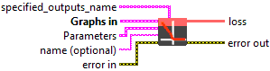
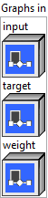

<h1>NegativeLogLikelihoodLoss</h1>

<h2>Description</h2>

A NegativeLogLikelihoodLoss operator computes (weighted) negative log likelihood loss.

Its “input” tensor has the shape of (N, C, d1, d2, …, dk) where k &gt;= 0. The “input” tensor contains log-probabilities for input[n, :, d_1, d_2,…, d_k] being in a class of [0, C). The operator’s “target” input tensor has the shape of (N, d1, d2, …, dk). It encodes class labels (one of C classes) or it may contain a special value (indicated by an attribute ignore_index) for N x d1 x d2 x … x dk samples. The loss value for input[n, :, d_1, d_2,…d_k] being classified as class c = target[n][d_1][d_2]…[d_k] is computed as : loss[n][d_1][d_2]…[d_k] = –input[n][c][d_1][d_2]…[d_k].

When an optional “weight” is provided, the sample loss is calculated as : loss[n][d_1][d_2]…[d_k] = –input[n][c][d_1][d_2]…[d_k] * weight[c].

loss is zero for the case when target-value equals ignore_index.

loss

[

n

][

d_1

][

d_2

]

...

[

d_k

]

=

0

,

when

target

[

n

][

d_1

][

d_2

]

...

[

d_k

]

=

ignore_index

If “reduction” attribute is set to “none”, the operator’s output will be the above loss with shape (N, d1, d2, …, dk). If “reduction” attribute is set to “mean” (the default attribute value), the output loss is (weight) averaged : mean(loss), if “weight” is not provided,

or if weight is provided, sum(loss) / sum(weight[target[n][d_1][d_2]…[d_k]]]), for all samples.

If “reduction” attribute is set to “sum”, the output is a scalar: <code>sum(loss)</code>.

See also <a href="https://pytorch.org/docs/stable/nn.html#torch.nn.NLLLoss">https://pytorch.org/docs/stable/nn.html#torch.nn.NLLLoss</a>.

<h3>Input parameters</h3>

<table>
  <tbody>
    <tr>
      <td width="64" valign="top"></td>
      <td valign="top"><strong><a href="../../../../../../more-deep-learning/nodes-parameters/specified_outputs_name/README.md">specified_outputs_name</a> : <em>array, </em></strong>this parameter lets you manually assign custom names to the output tensors of a node.</td>
    </tr>
  </tbody>
</table>

<table>
  <tbody>
    <tr>
      <td valign="top" width="70%"><table>
  <tbody>
    <tr>
      <td width="64" valign="top"></td>
      <td valign="top"><strong>Graphs in :</strong> <strong><em>cluster,</em></strong> ONNX model architecture.</td>
    </tr>
    <tr>
      <td></td>
      <td valign="top"><table>
  <tbody>
    <tr>
      <td width="64" valign="top"></td>
      <td valign="top"><strong>input (heterogeneous) – T</strong> <strong>:</strong> <em><strong>object,</strong></em> input tensor of shape (N, C) or (N, C, d1, d2, …, dk).</td>
    </tr>
    <tr>
      <td width="64" valign="top"></td>
      <td valign="top"><strong>target (heterogeneous) – Tind : <em>object, </em></strong>target tensor of shape (N) or (N, d1, d2, …, dk). Target element value shall be in range of [0, C). If ignore_index is specified, it may have a value outside [0, C) and the target values should either be in the range [0, C) or have the value ignore_index.</td>
    </tr>
    <tr>
      <td width="64" valign="top"></td>
      <td valign="top"><strong>weight (optional, heterogeneous) – T : <em>object, </em></strong>optional rescaling weight tensor. If given, it has to be a tensor of size C. Otherwise, it is treated as if having all ones.</td>
    </tr>
  </tbody>
</table></td>
    </tr>
  </tbody>
</table></td>
      <td valign="top" width="30%">

</td>
    </tr>
  </tbody>
</table>

<table>
  <tbody>
    <tr>
      <td valign="top" width="70%"><table>
  <tbody>
    <tr>
      <td width="64" valign="top"></td>
      <td valign="top"><strong>Parameters : <em>cluster,</em></strong></td>
    </tr>
    <tr>
      <td></td>
      <td valign="top"><table>
  <tbody>
    <tr>
      <td width="64" valign="top"></td>
      <td valign="top"><strong>ignore_index :</strong> <em><strong>integer</strong><strong>,</strong></em> specifies a target value that is ignored and does not contribute to the input gradient. It’s an optional value.</td>
    </tr>
    <tr>
      <td width="64" valign="top"></td>
      <td valign="top">Default value “0”.</td>
    </tr>
    <tr>
      <td width="64" valign="top"></td>
      <td valign="top"><strong>reduction : <em>enum, </em></strong>type of reduction to apply to loss: none, sum, mean (default). ‘none’: the output is the loss for each sample. ‘sum’: the output will be summed. ‘mean’: the sum of the output will be divided by the sum of applied weights.</td>
    </tr>
    <tr>
      <td width="64" valign="top"></td>
      <td valign="top">Default value “mean”.</td>
    </tr>
    <tr>
      <td width="64" valign="top"></td>
      <td valign="top"><strong>training? :</strong> <em><strong>boolean</strong><strong>,</strong></em> whether the layer is in training mode (can store data for backward).</td>
    </tr>
    <tr>
      <td width="64" valign="top"></td>
      <td valign="top">Default value “True”.</td>
    </tr>
    <tr>
      <td width="64" valign="top"></td>
      <td valign="top"><strong>lda coeff :</strong> <em><strong>float</strong><strong>,</strong></em> defines the coefficient by which the loss derivative will be multiplied before being sent to the previous layer (since during the backward run we go backwards).</td>
    </tr>
    <tr>
      <td width="64" valign="top"></td>
      <td valign="top">Default value “1”.</td>
    </tr>
  </tbody>
</table></td>
    </tr>
    <tr>
      <td width="64" valign="top"></td>
      <td valign="top"><strong>name (optional) :</strong> <em><strong>string,</strong></em> name of the node.</td>
    </tr>
  </tbody>
</table></td>
      <td valign="top" width="30%">

</td>
    </tr>
  </tbody>
</table>

<h3>Output parameters</h3>

<table>
  <tbody>
    <tr>
      <td width="64" valign="top"></td>
      <td valign="top"><strong>loss (heterogeneous) – T :</strong> <em><strong>object,</strong></em> the negative log likelihood loss.</td>
    </tr>
  </tbody>
</table>

<h2>Type Constraints</h2>

<strong>T</strong> in (<code>tensor(double)</code>, <code>tensor(float)</code>, <code>tensor(float16)</code>) : Constrain input, weight, and output types to floating-point tensors.

<strong>Tind</strong> in (<code>tensor(int32)</code>, <code>tensor(int64)</code>) : Constrain target to integer types.

<h2>Example</h2>

All these exemples are snippets PNG, you can drop these Snippet onto the block diagram and get the depicted code added to your VI (Do not forget to install Deep Learning library to run it).

