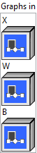
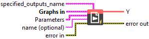
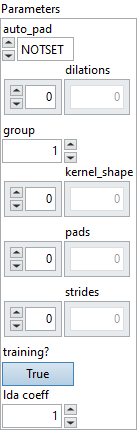

<h1>NhwcConv</h1>

<h2>Description</h2>

NhwcConv is a version of the standard convolution, optimized for data with channels in the last dimension (NHWC) instead of the second (NCHW).

<h3>Input parameters</h3>

<table>
  <tbody>
    <tr>
      <td width="64" valign="top"></td>
      <td valign="top"><strong><a href="../../../../../../more-deep-learning/nodes-parameters/specified_outputs_name/README.md">specified_outputs_name</a> : <em>array, </em></strong>this parameter lets you manually assign custom names to the output tensors of a node.</td>
    </tr>
  </tbody>
</table>

<table>
  <tbody>
    <tr>
      <td valign="top" width="70%"><table>
  <tbody>
    <tr>
      <td width="64" valign="top"></td>
      <td valign="top"><strong>Graphs in :</strong> <strong><em>cluster,</em></strong> ONNX model architecture.</td>
    </tr>
    <tr>
      <td></td>
      <td valign="top"><table>
  <tbody>
    <tr>
      <td width="64" valign="top"></td>
      <td valign="top"><strong>X</strong> <strong>(heterogeneous) –</strong> <strong>T :</strong> <em><strong>object,</strong></em> input data tensor from previous layer; has size (N x C x H x W), where N is the batch size, C is the number of channels, and H and W are the height and width. Note that this is for the 2D image. Otherwise the size is (N x C x D1 x D2 … x Dn). Optionally, if dimension denotation is in effect, the operation expects input data tensor to arrive with the dimension denotation of [DATA_BATCH, DATA_CHANNEL, DATA_FEATURE, DATA_FEATURE …].</td>
    </tr>
    <tr>
      <td width="64" valign="top"></td>
      <td valign="top"><strong>W (heterogeneous) – T : <em>object, </em></strong>the weight tensor that will be used in the convolutions; has size (M x C/group x kH x kW), where C is the number of channels, and kH and kW are the height and width of the kernel, and M is the number of feature maps. For more than 2 dimensions, the kernel shape will be (M x C/group x k1 x k2 x … x kn), where (k1 x k2 x … kn) is the dimension of the kernel. Optionally, if dimension denotation is in effect, the operation expects the weight tensor to arrive with the dimension denotation of [FILTER_OUT_CHANNEL, FILTER_IN_CHANNEL, FILTER_SPATIAL, FILTER_SPATIAL …]. Assuming zero based indices for the shape array, X.shape[1] == (W.shape[1] * group) == C and W.shape[0] mod G == 0. Or in other words FILTER_IN_CHANNEL multiplied by the number of groups should be equal to DATA_CHANNEL and the number of feature maps M should be a multiple of the number of groups G.</td>
    </tr>
    <tr>
      <td width="64" valign="top"></td>
      <td valign="top"><strong>B (optional, heterogeneous) – T : <em>object, </em></strong>optional 1D bias to be added to the convolution, has size of M.</td>
    </tr>
  </tbody>
</table></td>
    </tr>
  </tbody>
</table></td>
      <td valign="top" width="30%">

</td>
    </tr>
  </tbody>
</table>

<table>
  <tbody>
    <tr>
      <td valign="top" width="70%"><table>
  <tbody>
    <tr>
      <td width="64" valign="top"></td>
      <td valign="top"><strong>Parameters : <em>cluster,</em></strong></td>
    </tr>
    <tr>
      <td></td>
      <td valign="top"><table>
  <tbody>
    <tr>
      <td width="64" valign="top"></td>
      <td valign="top"><strong>auto_pad : <em>enum, </em></strong>auto_pad must be either NOTSET, SAME_UPPER, SAME_LOWER or VALID. Where default value is NOTSET, which means explicit padding is used. SAME_UPPER or SAME_LOWER mean pad the input so that <code>output_shape = ceil(input_shape / strides)</code> for each axis <code>i</code>. The padding is split between the two sides equally or almost equally (depending on whether it is even or odd). In case the padding is an odd number, the extra padding is added at the end for SAME_UPPER and at the beginning for SAME_LOWER.</td>
    </tr>
    <tr>
      <td width="64" valign="top"></td>
      <td valign="top">Default value “NOTSET”.</td>
    </tr>
    <tr>
      <td width="64" valign="top"></td>
      <td valign="top"><strong>dilations : <em>array,</em></strong> dilation value along each spatial axis of the filter. If not present, the dilation defaults to 1 along each axis.</td>
    </tr>
    <tr>
      <td width="64" valign="top"></td>
      <td valign="top">Default value “empty”.</td>
    </tr>
    <tr>
      <td width="64" valign="top"></td>
      <td valign="top"><strong>group : <em>integer,</em></strong> number of groups input channels and output channels are divided into.</td>
    </tr>
    <tr>
      <td width="64" valign="top"></td>
      <td valign="top">Default value “1”.</td>
    </tr>
    <tr>
      <td width="64" valign="top"></td>
      <td valign="top"><strong>kernel_shape</strong> <strong>: <em>array,</em></strong> the shape of the convolution kernel. If not present, should be inferred from input ‘w’.</td>
    </tr>
    <tr>
      <td width="64" valign="top"></td>
      <td valign="top">Default value “empty”.</td>
    </tr>
    <tr>
      <td width="64" valign="top"></td>
      <td valign="top"><strong>pads : <em>array,</em></strong> padding for the beginning and ending along each spatial axis, it can take any value greater than or equal to 0.The value represent the number of pixels added to the beginning and end part of the corresponding axis.<code>pads</code> format should be as follow [x1_begin, x2_begin…x1_end, x2_end,…], where xi_begin the number ofpixels added at the beginning of axis <code>i</code> and xi_end, the number of pixels added at the end of axis <code>i</code>.This attribute cannot be used simultaneously with auto_pad attribute. If not present, the padding defaultsto 0 along start and end of each spatial axis.</td>
    </tr>
    <tr>
      <td width="64" valign="top"></td>
      <td valign="top">Default value “empty”.</td>
    </tr>
    <tr>
      <td width="64" valign="top"></td>
      <td valign="top"><strong>strides</strong> <strong>: <em>array,</em></strong> stride along each spatial axis. If not present, the stride defaults to 1 along each axis.</td>
    </tr>
    <tr>
      <td width="64" valign="top"></td>
      <td valign="top">Default value “empty”.</td>
    </tr>
    <tr>
      <td width="64" valign="top"></td>
      <td valign="top"><strong>training? :</strong> <em><strong>boolean</strong><strong>,</strong></em> whether the layer is in training mode (can store data for backward).</td>
    </tr>
    <tr>
      <td width="64" valign="top"></td>
      <td valign="top">Default value “True”.</td>
    </tr>
    <tr>
      <td width="64" valign="top"></td>
      <td valign="top"><strong>lda coeff :</strong> <em><strong>float</strong><strong>,</strong></em> defines the coefficient by which the loss derivative will be multiplied before being sent to the previous layer (since during the backward run we go backwards).</td>
    </tr>
    <tr>
      <td width="64" valign="top"></td>
      <td valign="top">Default value “1”.</td>
    </tr>
  </tbody>
</table></td>
    </tr>
    <tr>
      <td width="64" valign="top"></td>
      <td valign="top"><strong>name (optional) :</strong> <em><strong>string,</strong></em> name of the node.</td>
    </tr>
  </tbody>
</table></td>
      <td valign="top" width="30%">

</td>
    </tr>
  </tbody>
</table>

<h3>Output parameters</h3>

<table>
  <tbody>
    <tr>
      <td width="64" valign="top"></td>
      <td valign="top"><strong>Y</strong> <strong>(heterogeneous) –</strong> <strong>T : <em>object,</em></strong> output data tensor that contains the result of the convolution. The output dimensions are functions of the kernel size, stride size, and pad lengths.</td>
    </tr>
  </tbody>
</table>

<h2>Type Constraints</h2>

T

in (

tensor(float16)

,

tensor(float)

,

tensor(double)

) : Constrain input and output types to float tensors.

<h2>Example</h2>

All these exemples are snippets PNG, you can drop these Snippet onto the block diagram and get the depicted code added to your VI (Do not forget to install Deep Learning library to run it).

