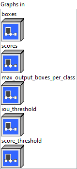
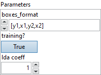

<h1>NonMaxSuppression</h1>

<h2>Description</h2>

Filter out boxes that have high intersection-over-union (IOU) overlap with previously selected boxes. Bounding boxes with score less than score_threshold are removed. Bounding box format is indicated by attribute center_point_box. Note that this algorithm is agnostic to where the origin is in the coordinate system and more generally is invariant to orthogonal transformations and translations of the coordinate system; thus translating or reflections of the coordinate system result in the same boxes being selected by the algorithm. The selected_indices output is a set of integers indexing into the input collection of bounding boxes representing the selected boxes. The bounding box coordinates corresponding to the selected indices can then be obtained using the Gather or GatherND operation.

<h3>Input parameters</h3>

<table>
  <tbody>
    <tr>
      <td width="64" valign="top"></td>
      <td valign="top"><strong><a href="../../../../../../more-deep-learning/nodes-parameters/specified_outputs_name/README.md">specified_outputs_name</a> : <em>array, </em></strong>this parameter lets you manually assign custom names to the output tensors of a node.</td>
    </tr>
  </tbody>
</table>

<table>
  <tbody>
    <tr>
      <td valign="top" width="70%"><table>
  <tbody>
    <tr>
      <td width="64" valign="top"></td>
      <td valign="top"><strong>Graphs in :</strong> <strong><em>cluster,</em></strong> ONNX model architecture.</td>
    </tr>
    <tr>
      <td></td>
      <td valign="top"><table>
  <tbody>
    <tr>
      <td width="64" valign="top"></td>
      <td valign="top"><strong>boxes (heterogeneous) –</strong> <strong>tensor(float)</strong><strong> :</strong> <em><strong>object,</strong></em> an input tensor with shape [num_batches, spatial_dimension, 4]. The single box data format is indicated by center_point_box.</td>
    </tr>
    <tr>
      <td width="64" valign="top"></td>
      <td valign="top"><strong>scores (heterogeneous) – tensor(float) : <em>object, </em></strong>an input tensor with shape [num_batches, num_classes, spatial_dimension].</td>
    </tr>
    <tr>
      <td width="64" valign="top"></td>
      <td valign="top"><strong>max_output_boxes_per_class (optional, heterogeneous) – tensor(int64) : <em>object, </em></strong>integer representing the maximum number of boxes to be selected per batch per class. It is a scalar. Default to 0, which means no output.</td>
    </tr>
    <tr>
      <td width="64" valign="top"></td>
      <td valign="top"><strong>iou_threshold (optional, heterogeneous) – tensor(float) : <em>object, </em></strong>representing the threshold for deciding whether boxes overlap too much with respect to IOU. It is scalar. Value range [0, 1]. Default to 0.</td>
    </tr>
    <tr>
      <td width="64" valign="top"></td>
      <td valign="top"><strong>score_threshold (optional, heterogeneous) – tensor(float) : <em>object, </em></strong>representing the threshold for deciding when to remove boxes based on score. It is a scalar.</td>
    </tr>
  </tbody>
</table></td>
    </tr>
  </tbody>
</table></td>
      <td valign="top" width="30%">

</td>
    </tr>
  </tbody>
</table>

<table>
  <tbody>
    <tr>
      <td valign="top" width="70%"><table>
  <tbody>
    <tr>
      <td width="64" valign="top"></td>
      <td valign="top"><strong>Parameters : <em>cluster,</em></strong></td>
    </tr>
    <tr>
      <td></td>
      <td valign="top"><table>
  <tbody>
    <tr>
      <td width="64" valign="top"></td>
      <td valign="top"><strong>boxes_format : <em>enum, </em></strong>integer indicate the format of the box data. The box data is supplied as [y1, x1, y2, x2] where (y1, x1) and (y2, x2) are the coordinates of any diagonal pair of box corners and the coordinates can be provided as normalized (i.e., lying in the interval [0, 1]) or absolute. Mostly used for TF models. The box data is supplied as [x_center, y_center, width, height]. Mostly used for Pytorch models.</td>
    </tr>
    <tr>
      <td width="64" valign="top"></td>
      <td valign="top">Default value “[y1,x1,y2,x2]”.</td>
    </tr>
    <tr>
      <td width="64" valign="top"></td>
      <td valign="top"><strong>training? :</strong> <em><strong>boolean</strong></em>, whether the layer is in training mode (can store data for backward).</td>
    </tr>
    <tr>
      <td width="64" valign="top"></td>
      <td valign="top">Default value “True”.</td>
    </tr>
    <tr>
      <td width="64" valign="top"></td>
      <td valign="top"><strong>lda coeff :</strong> <em><strong>float</strong></em>, defines the coefficient by which the loss derivative will be multiplied before being sent to the previous layer (since during the backward run we go backwards).</td>
    </tr>
    <tr>
      <td width="64" valign="top"></td>
      <td valign="top">Default value “1”.</td>
    </tr>
  </tbody>
</table></td>
    </tr>
    <tr>
      <td width="64" valign="top"></td>
      <td valign="top"><strong>name (optional) :</strong> <em><strong>string,</strong></em> name of the node.</td>
    </tr>
  </tbody>
</table></td>
      <td valign="top" width="30%">

</td>
    </tr>
  </tbody>
</table>

<h3>Output parameters</h3>

<table>
  <tbody>
    <tr>
      <td width="64" valign="top"></td>
      <td valign="top"><strong>selected_indices (heterogeneous) –</strong> <strong>tensor(int64) </strong><strong>: <em>object,</em></strong> selected indices from the boxes tensor. [num_selected_indices, 3], the selected index format is [batch_index, class_index, box_index].</td>
    </tr>
  </tbody>
</table>

<h2>Example</h2>

All these exemples are snippets PNG, you can drop these Snippet onto the block diagram and get the depicted code added to your VI (Do not forget to install Deep Learning library to run it).

