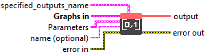
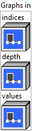
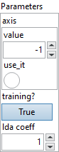

<h1>OneHot</h1>

<h2>Description</h2>

Produces a one-hot tensor based on inputs. The locations represented by the index values in the ‘indices’ input tensor will have ‘on_value’ and the other locations will have ‘off_value’ in the output tensor, where ‘on_value’ and ‘off_value’ are specified as part of required input argument ‘values’, which is a two-element tensor of format [off_value, on_value]. The rank of the output tensor will be one greater than the rank of the input tensor. The additional dimension is for one-hot representation. The additional dimension will be inserted at the position specified by ‘axis’. If ‘axis’ is not specified then then additional dimension will be inserted as the innermost dimension, i.e. axis=-1. The size of the additional dimension is specified by required scalar input ‘depth’. The type of the output tensor is the same as the type of the ‘values’ input. Any entries in the ‘indices’ input tensor with values outside the range [-depth, depth-1] will result in one-hot representation with all ‘off_value’ values in the output tensor.

when axis = 0: output[input[i, j, k], i, j, k] = 1 for all i, j, k and 0 otherwise.

when axis = -1: output[i, j, k, input[i, j, k]] = 1 for all i, j, k and 0 otherwise.

<h3>Input parameters</h3>

<table>
  <tbody>
    <tr>
      <td width="64" valign="top"></td>
      <td valign="top"><strong><a href="../../../../../../more-deep-learning/nodes-parameters/specified_outputs_name/README.md">specified_outputs_name</a> : <em>array, </em></strong>this parameter lets you manually assign custom names to the output tensors of a node.</td>
    </tr>
  </tbody>
</table>

<table>
  <tbody>
    <tr>
      <td valign="top" width="70%"><table>
  <tbody>
    <tr>
      <td width="64" valign="top"></td>
      <td valign="top"><strong>Graphs in :</strong> <strong><em>cluster,</em></strong> ONNX model architecture.</td>
    </tr>
    <tr>
      <td></td>
      <td valign="top"><table>
  <tbody>
    <tr>
      <td width="64" valign="top"></td>
      <td valign="top"><strong>indices (heterogeneous) – T1</strong> <strong>:</strong> <em><strong>object,</strong></em> input tensor containing indices. Any entries in the ‘indices’ input tensor with values outside the range [-depth, depth-1] will result in one-hot representation with all ‘off_value’ values in the output <a href="http://tensor.in/">tensor.In</a> case ‘indices’ is of non-integer type, the values will be casted to int64 before use.</td>
    </tr>
    <tr>
      <td width="64" valign="top"></td>
      <td valign="top"><strong>depth (heterogeneous) – T2 : <em>object, </em></strong>scalar or Rank 1 tensor containing exactly one element, specifying the number of classes in one-hot tensor. This is also the size of the one-hot dimension (specified by ‘axis’ attribute) added on in the output tensor. The values in the ‘indices’ input tensor are expected to be in the range [-depth, depth-1]. In case ‘depth’ is of non-integer type, it will be casted to int64 before use.</td>
    </tr>
    <tr>
      <td width="64" valign="top"></td>
      <td valign="top"><strong>values (heterogeneous) – T3 : <em>object, </em></strong>rank 1 tensor containing exactly two elements, in the format [off_value, on_value], where ‘on_value’ is the value used for filling locations specified in ‘indices’ input tensor, and ‘off_value’ is the value used for filling locations other than those specified in ‘indices’ input tensor.</td>
    </tr>
  </tbody>
</table></td>
    </tr>
  </tbody>
</table></td>
      <td valign="top" width="30%">

</td>
    </tr>
  </tbody>
</table>

<table>
  <tbody>
    <tr>
      <td valign="top" width="70%"><table>
  <tbody>
    <tr>
      <td width="64" valign="top"></td>
      <td valign="top"><strong>Parameters : <em>cluster,</em></strong></td>
    </tr>
    <tr>
      <td></td>
      <td valign="top"><table>
  <tbody>
    <tr>
      <td width="64" valign="top"></td>
      <td valign="top"><strong>axis :</strong> <em><strong>boolean</strong><strong>,</strong></em> axis along which one-hot representation in added. Default: axis=-1. axis=-1 means that the additional dimension will be inserted as the innermost/last dimension in the output tensor. Negative value means counting dimensions from the back. Accepted range is [-r-1, r] where r = rank(indices).</td>
    </tr>
    <tr>
      <td width="64" valign="top"></td>
      <td valign="top">Default value “-1”.</td>
    </tr>
    <tr>
      <td width="64" valign="top"></td>
      <td valign="top"><strong>training? :</strong> <em><strong>boolean</strong><strong>,</strong></em> whether the layer is in training mode (can store data for backward).</td>
    </tr>
    <tr>
      <td width="64" valign="top"></td>
      <td valign="top">Default value “True”.</td>
    </tr>
    <tr>
      <td width="64" valign="top"></td>
      <td valign="top"><strong>lda coeff :</strong> <em><strong>float</strong><strong>,</strong></em> defines the coefficient by which the loss derivative will be multiplied before being sent to the previous layer (since during the backward run we go backwards).</td>
    </tr>
    <tr>
      <td width="64" valign="top"></td>
      <td valign="top">Default value “1”.</td>
    </tr>
  </tbody>
</table></td>
    </tr>
    <tr>
      <td width="64" valign="top"></td>
      <td valign="top"><strong>name (optional) :</strong> <em><strong>string,</strong></em> name of the node.</td>
    </tr>
  </tbody>
</table></td>
      <td valign="top" width="30%">

</td>
    </tr>
  </tbody>
</table>

<h3>Output parameters</h3>

<table>
  <tbody>
    <tr>
      <td width="64" valign="top"></td>
      <td valign="top"><strong>output (heterogeneous) – T3 :</strong> <em><strong>object,</strong></em> tensor of rank one greater than input tensor ‘indices’, i.e. rank(output) = rank(indices) + 1. The data type for the elements of the output tensor is the same as the type of input ‘values’ is used.</td>
    </tr>
  </tbody>
</table>

<h2>Type Constraints</h2>

T1

in (

tensor(double)

,

tensor(float)

,

tensor(float16)

,

tensor(int16)

,

tensor(int32)

,

tensor(int64)

,

tensor(int8)

,

tensor(uint16)

,

tensor(uint32)

,

tensor(uint64)

,

tensor(uint8)

) : Constrain input to only numeric types.

<strong>T2</strong> in (<code>tensor(double)</code>, <code>tensor(float)</code>, <code>tensor(float16)</code>, <code>tensor(int16)</code>, <code>tensor(int32)</code>, <code>tensor(int64)</code>, <code>tensor(int8)</code>, 
<code>tensor(uint16)</code>, <code>tensor(uint32)</code>, <code>tensor(uint64)</code>, <code>tensor(uint8)</code>) : Constrain input to only numeric types.

<strong>T3</strong> in (<code>tensor(bool)</code>, <code>tensor(complex128)</code>, <code>tensor(complex64)</code>, <code>tensor(double)</code>, <code>tensor(float)</code>, <code>tensor(float16)</code>, <code>tensor(int16)</code>, 
<code>tensor(int32)</code>, <code>tensor(int64)</code>, <code>tensor(int8)</code>, <code>tensor(string)</code>, <code>tensor(uint16)</code>, <code>tensor(uint32)</code>, <code>tensor(uint64)</code>, <code>tensor(uint8)</code>) : Constrain to any tensor type.

<h2>Example</h2>

All these exemples are snippets PNG, you can drop these Snippet onto the block diagram and get the depicted code added to your VI (Do not forget to install Deep Learning library to run it).

