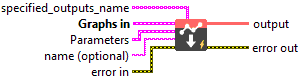
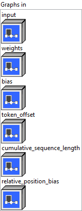
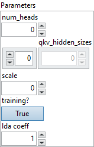

<h1>PackedAttention</h1>

<h2>Description</h2>

This is the packed version of Attention.

Sequences in one batch usually don’t have same length and they are padded to have same length, e.g., below is a batch with 3 sequences and tokens* are padded. Sequence_0: 0, 1*, 2*, 3* Sequence_1: 4, 5, 6*, 7* Sequence_2: 8, 9, 10, 11

PackedAttention is designed to takes in packed input, i.e., only the real tokens without padding. An input as above will be packed into 3 tensors like below:

<ul>
<li>input ([h0, h4, h5, h8, h9, h10, h11])</li>
<li>token_offset: 0, 4, 5, 8, 9, 10, 11, 1*, 2*, 3*, 6*, 7*</li>
<li>cumulated_token_count: 0, 1, 1+2, 1+2+4</li>
</ul>

Input tensors contains the hidden embedding of real tokens. Token_offset records the offset of token in the unpacked input. cumulated_token_count records cumulated length of each sequence length.

The operator only supports BERT like model with padding on right now.

<h3>Input parameters</h3>

<table>
  <tbody>
    <tr>
      <td width="64" valign="top"></td>
      <td valign="top"><strong><a href="../../../../../../more-deep-learning/nodes-parameters/specified_outputs_name/README.md">specified_outputs_name</a> : <em>array, </em></strong>this parameter lets you manually assign custom names to the output tensors of a node.</td>
    </tr>
  </tbody>
</table>

<table>
  <tbody>
    <tr>
      <td valign="top" width="70%"><table>
  <tbody>
    <tr>
      <td width="64" valign="top"></td>
      <td valign="top"><strong>Graphs in :</strong> <strong><em>cluster,</em></strong> ONNX model architecture.</td>
    </tr>
    <tr>
      <td></td>
      <td valign="top"><table>
  <tbody>
    <tr>
      <td width="64" valign="top"></td>
      <td valign="top"><strong>input (heterogeneous) – T : <em>object, </em></strong>input tensor with shape (token_count, input_hidden_size).</td>
    </tr>
    <tr>
      <td width="64" valign="top"></td>
      <td valign="top"><strong>weights (heterogeneous) – T : <em>object, </em></strong>merged Q/K/V weights with shape (input_hidden_size, hidden_size + hidden_size + v_hidden_size).</td>
    </tr>
    <tr>
      <td width="64" valign="top"></td>
      <td valign="top"><strong>bias (heterogeneous) – T : <em>object, </em></strong>bias tensor with shape (hidden_size + hidden_size + v_hidden_size) for input projection.</td>
    </tr>
    <tr>
      <td width="64" valign="top"></td>
      <td valign="top"><strong>token_offset (heterogeneous) – M : <em>object, </em></strong>in packing mode, it specifies the offset of each token(batch_size, sequence_length).</td>
    </tr>
    <tr>
      <td width="64" valign="top"></td>
      <td valign="top"><strong>cumulative_sequence_length (heterogeneous) – M : <em>object, </em></strong>a tensor with shape (batch_size + 1). It specifies the cumulative sequence length.</td>
    </tr>
    <tr>
      <td width="64" valign="top"></td>
      <td valign="top"><strong>relative_position_bias</strong> <strong>(optional, heterogeneous) </strong><strong>– T : <em>object, </em></strong>a tensor with shape (batch_size or 1, num_heads or 1, sequence_length, sequence_length).It specifies the additional bias to QxK’</td>
    </tr>
  </tbody>
</table></td>
    </tr>
  </tbody>
</table></td>
      <td valign="top" width="30%">

</td>
    </tr>
  </tbody>
</table>

<table>
  <tbody>
    <tr>
      <td valign="top" width="70%"><table>
  <tbody>
    <tr>
      <td width="64" valign="top"></td>
      <td valign="top"><strong>Parameters : <em>cluster,</em></strong></td>
    </tr>
    <tr>
      <td></td>
      <td valign="top"><table>
  <tbody>
    <tr>
      <td width="64" valign="top"></td>
      <td valign="top"><strong>num heads : <em>integer,</em></strong> number of attention heads.</td>
    </tr>
    <tr>
      <td width="64" valign="top"></td>
      <td valign="top">Default value “0”.</td>
    </tr>
    <tr>
      <td width="64" valign="top"></td>
      <td valign="top"><strong>qkv hidden sizes : <em>array,</em></strong> hidden dimension of Q, K, V: hidden_size, hidden_size and v_hidden_size.</td>
    </tr>
    <tr>
      <td width="64" valign="top"></td>
      <td valign="top">Default value “empty”.</td>
    </tr>
    <tr>
      <td width="64" valign="top"></td>
      <td valign="top"><strong>scale : <em>float,</em></strong> custom scale will be used if specified.</td>
    </tr>
    <tr>
      <td width="64" valign="top"></td>
      <td valign="top">Default value “0”.</td>
    </tr>
    <tr>
      <td width="64" valign="top"></td>
      <td valign="top"><strong>training? :</strong> <em><strong>boolean</strong></em>, whether the layer is in training mode (can store data for backward).</td>
    </tr>
    <tr>
      <td width="64" valign="top"></td>
      <td valign="top">Default value “True”.</td>
    </tr>
    <tr>
      <td width="64" valign="top"></td>
      <td valign="top"><strong>lda coeff :</strong> <em><strong>float</strong></em>, defines the coefficient by which the loss derivative will be multiplied before being sent to the previous layer (since during the backward run we go backwards).</td>
    </tr>
    <tr>
      <td width="64" valign="top"></td>
      <td valign="top">Default value “1”.</td>
    </tr>
  </tbody>
</table></td>
    </tr>
    <tr>
      <td width="64" valign="top"></td>
      <td valign="top"><strong>name (optional) :</strong> <em><strong>string,</strong></em> name of the node.</td>
    </tr>
  </tbody>
</table></td>
      <td valign="top" width="30%">

</td>
    </tr>
  </tbody>
</table>

<h3>Output parameters</h3>

<table>
  <tbody>
    <tr>
      <td width="64" valign="top"></td>
      <td valign="top"><strong>output (heterogeneous) – T : <em>object, </em></strong>2D output tensor with shape (token_count, v_hidden_size).</td>
    </tr>
  </tbody>
</table>

<h2>Type Constraints</h2>

<strong>T</strong> in (<code>tensor(float)</code>, <code>tensor(float16)</code>) : Constrain input and output types to float tensors.

<strong>M</strong> in (<code>tensor(int32)</code>) : Constrain mask index to integer types.

<h2>Example</h2>

All these exemples are snippets PNG, you can drop these Snippet onto the block diagram and get the depicted code added to your VI (Do not forget to install Deep Learning library to run it).

