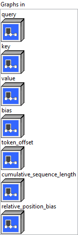
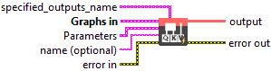
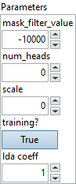

<h1>PackedMultiHeadAttention</h1>

<h2>Description</h2>

This is the packed version of MultiHeadAttention.

Sequences in one batch usually don’t have same length and they are padded to have same length, e.g., below is a batch with 3 sequences and * is padding token. Sequence_0: 0, 1*, 2*, 3* Sequence_1: 4, 5, 6*, 7* Sequence_2: 8, 9, 10, 11

PackedMultiHeadAttention is designed to takes in packed input, i.e., only the real tokens without padding. An input as above will be packed into 3 tensors like below:

<ul>
<li>
<ul>
<li>query ([q0, q4, q5, q8, q9, q10, q11])</li>
<li>key ([k0, k4, k5, k8, k9, k10, k11])</li>
<li>value ([v0, v4, v5, v8, v9, v10, v11])</li>
<li>token_offset: 0, 4, 5, 8, 9, 10, 11, 1*, 2*, 3*, 6*, 7*</li>
<li>cumulative_sequence_length: 0, 1, 1+2, 1+2+4</li>
</ul>
</li>
</ul>

The query, key and value tensors contain result of hidden embedding of real tokens after input projections. Token_offset records the offset of token in the unpacked input. cumulative_sequence_length records cumulated length of each sequence length.

The operator only supports BERT like model with padding on right now.

<h3>Input parameters</h3>

<table>
  <tbody>
    <tr>
      <td width="64" valign="top"></td>
      <td valign="top"><strong><a href="../../../../../../more-deep-learning/nodes-parameters/specified_outputs_name/README.md">specified_outputs_name</a> : <em>array, </em></strong>this parameter lets you manually assign custom names to the output tensors of a node.</td>
    </tr>
  </tbody>
</table>

<table>
  <tbody>
    <tr>
      <td valign="top" width="70%"><table>
  <tbody>
    <tr>
      <td width="64" valign="top"></td>
      <td valign="top"><strong>Graphs in :</strong> <strong><em>cluster,</em></strong> ONNX model architecture.</td>
    </tr>
    <tr>
      <td></td>
      <td valign="top"><table>
  <tbody>
    <tr>
      <td width="64" valign="top"></td>
      <td valign="top"><strong>query (heterogeneous) – T : <em>object, </em></strong>query with shape (token_count, hidden_size) or packed qkv with shape (token_count, num_heads, 3, head_size).</td>
    </tr>
    <tr>
      <td width="64" valign="top"></td>
      <td valign="top"><strong>key (optional, heterogeneous) – T : <em>object, </em></strong>key with shape (token_count, hidden_size).</td>
    </tr>
    <tr>
      <td width="64" valign="top"></td>
      <td valign="top"><strong>value (optional, heterogeneous) – T : <em>object, </em></strong>value with shape (token_count, v_hidden_size).</td>
    </tr>
    <tr>
      <td width="64" valign="top"></td>
      <td valign="top"><strong>bias (optional, heterogeneous) – T : <em>object, </em></strong>bias tensor with shape (hidden_size + hidden_size + v_hidden_size) from input projection.</td>
    </tr>
    <tr>
      <td width="64" valign="top"></td>
      <td valign="top"><strong>token_offset (heterogeneous) – M : <em>object, </em></strong>offset of each token before packing, with shape (batch_size, sequence_length).</td>
    </tr>
    <tr>
      <td width="64" valign="top"></td>
      <td valign="top"><strong>cumulative_sequence_length (heterogeneous) – M : <em>object, </em></strong>a tensor with shape (batch_size + 1). It specifies the cumulative sequence length.</td>
    </tr>
    <tr>
      <td width="64" valign="top"></td>
      <td valign="top"><strong>relative_position_bias (optional, heterogeneous)</strong> <strong>– T : <em>object, </em></strong>it specifies the additional bias to QxK’. The shape is (batch_size or 1, num_heads or 1, sequence_length, sequence_length).</td>
    </tr>
  </tbody>
</table></td>
    </tr>
  </tbody>
</table></td>
      <td valign="top" width="30%">

</td>
    </tr>
  </tbody>
</table>

<table>
  <tbody>
    <tr>
      <td valign="top" width="70%"><table>
  <tbody>
    <tr>
      <td width="64" valign="top"></td>
      <td valign="top"><strong>Parameters : <em>cluster,</em></strong></td>
    </tr>
    <tr>
      <td></td>
      <td valign="top"><table>
  <tbody>
    <tr>
      <td width="64" valign="top"></td>
      <td valign="top"><strong>mask_filter_value</strong> <strong>: <em>float,</em></strong> the value to be filled in the attention mask.</td>
    </tr>
    <tr>
      <td width="64" valign="top"></td>
      <td valign="top">Default value “-10000”.</td>
    </tr>
    <tr>
      <td width="64" valign="top"></td>
      <td valign="top"><strong>num_heads :</strong> <em><strong>integer</strong></em>, number of attention heads.</td>
    </tr>
    <tr>
      <td width="64" valign="top"></td>
      <td valign="top">Default value “0”.</td>
    </tr>
    <tr>
      <td width="64" valign="top"></td>
      <td valign="top"><strong>scale : <em>float,</em></strong> custom scale will be used if specified.</td>
    </tr>
    <tr>
      <td width="64" valign="top"></td>
      <td valign="top">Default value “0”.</td>
    </tr>
    <tr>
      <td width="64" valign="top"></td>
      <td valign="top"><strong>training? :</strong> <em><strong>boolean</strong></em>, whether the layer is in training mode (can store data for backward).</td>
    </tr>
    <tr>
      <td width="64" valign="top"></td>
      <td valign="top">Default value “True”.</td>
    </tr>
    <tr>
      <td width="64" valign="top"></td>
      <td valign="top"><strong>lda coeff :</strong> <em><strong>float</strong></em>, defines the coefficient by which the loss derivative will be multiplied before being sent to the previous layer (since during the backward run we go backwards).</td>
    </tr>
    <tr>
      <td width="64" valign="top"></td>
      <td valign="top">Default value “1”.</td>
    </tr>
  </tbody>
</table></td>
    </tr>
    <tr>
      <td width="64" valign="top"></td>
      <td valign="top"><strong>name (optional) :</strong> <em><strong>string,</strong></em> name of the node.</td>
    </tr>
  </tbody>
</table></td>
      <td valign="top" width="30%">

</td>
    </tr>
  </tbody>
</table>

<h3>Output parameters</h3>

<table>
  <tbody>
    <tr>
      <td width="64" valign="top"></td>
      <td valign="top"><strong>output (heterogeneous) – T : <em>object, </em></strong>output tensor with shape (token_count, v_hidden_size).</td>
    </tr>
  </tbody>
</table>

<h2>Type Constraints</h2>

<strong>T</strong> in (<code>tensor(float)</code>, <code>tensor(float16)</code>) : Constrain input and output to float tensors.

<strong>M</strong> in (<code>tensor(int32)</code>) : Constrain mask, offset and sequence length to integer types.

<h2>Example</h2>

All these exemples are snippets PNG, you can drop these Snippet onto the block diagram and get the depicted code added to your VI (Do not forget to install Deep Learning library to run it).

