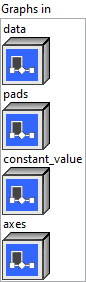

<h1>Pad</h1>

<h2>Description</h2>

Given a tensor containing the data to be padded (<code>data</code>), a tensor containing the number of start and end pad values for axis (<code>pads</code>), (optionally) a <code>mode</code>, and (optionally) <code>constant_value</code>, a padded tensor (<code>output</code>) is generated.

The three supported <code>modes</code> are (similar to corresponding modes supported by <code>numpy.pad</code>):

<ol>
<li><code>constant</code>(default) – pads with a given constant value as specified by <code>constant_value</code> (which defaults to 0, empty string, or False)</li>
<li><code>reflect</code> – pads with the reflection of the vector mirrored on the first and last values of the vector along each axis</li>
<li><code>edge</code> – pads with the edge values of array</li>
<li><code>wrap</code> – wrap-around padding as if the data tensor forms a torus</li>
</ol>

<h3>Input parameters</h3>

<table>
  <tbody>
    <tr>
      <td width="64" valign="top"></td>
      <td valign="top"><strong><a href="../../../../../../more-deep-learning/nodes-parameters/specified_outputs_name/README.md">specified_outputs_name</a> : <em>array, </em></strong>this parameter lets you manually assign custom names to the output tensors of a node.</td>
    </tr>
  </tbody>
</table>

<table>
  <tbody>
    <tr>
      <td valign="top" width="70%"><table>
  <tbody>
    <tr>
      <td width="64" valign="top"></td>
      <td valign="top"><strong>Graphs in :</strong> <strong><em>cluster,</em></strong> ONNX model architecture.</td>
    </tr>
    <tr>
      <td></td>
      <td valign="top"><table>
  <tbody>
    <tr>
      <td width="64" valign="top"></td>
      <td valign="top"><strong>data (heterogeneous) – T</strong> <strong>:</strong> <em><strong>object,</strong></em> input tensor.</td>
    </tr>
    <tr>
      <td width="64" valign="top"></td>
      <td valign="top"><strong>pads (heterogeneous) – tensor(int64) : <em>object, </em></strong>tensor of integers indicating the number of padding elements to add or remove (if negative) at the beginning and end of each axis. For 2D input tensor, it is the number of pixels. <code>pads</code> should be a 1D tensor of shape [2 * num_axes] where <code>num_axes</code> refers to the number of elements in the <code>axes</code> input or the input rank if <code>axes</code> are not provided explicitly. <code>pads</code> format should be: [x1_begin, x2_begin, …, x1_end, x2_end,…], where xi_begin is the number of pad values added at the beginning of axis <code>axes</code> and xi_end, the number of pad values added at the end of axis <code>axes</code>.</td>
    </tr>
    <tr>
      <td width="64" valign="top"></td>
      <td valign="top"><strong>constant_value (optional, heterogeneous) – T : <em>object, </em></strong>a scalar value to be used if the mode chosen is <code>constant</code> (by default it is 0, empty string or False).</td>
    </tr>
    <tr>
      <td width="64" valign="top"></td>
      <td valign="top"><strong>axes (optional, heterogeneous) – Tind : <em>object, </em></strong>1-D tensor of axes that <code>pads</code> apply to. Negative value means counting dimensions from the back. Accepted range is [-r, r-1] where r = rank(data). Behavior is undefined if an axis is repeated. If not provided, all axes are assumed (<code>[0, 1, ..., input_rank-1]</code>).</td>
    </tr>
  </tbody>
</table></td>
    </tr>
  </tbody>
</table></td>
      <td valign="top" width="30%">

</td>
    </tr>
  </tbody>
</table>

<table>
  <tbody>
    <tr>
      <td valign="top" width="70%"><table>
  <tbody>
    <tr>
      <td width="64" valign="top"></td>
      <td valign="top"><strong>Parameters : <em>cluster,</em></strong></td>
    </tr>
    <tr>
      <td></td>
      <td valign="top"><table>
  <tbody>
    <tr>
      <td width="64" valign="top"></td>
      <td valign="top"><strong>mode :</strong> <em><strong>enum</strong><strong>,</strong></em> three modes : `constant`- pads with a given constant value, `reflect`- pads with the reflection of the vector mirrored on the first and last values of the vector along each axis, `edge`- pads with the edge values of array.</td>
    </tr>
    <tr>
      <td width="64" valign="top"></td>
      <td valign="top">Default value “constant”.</td>
    </tr>
    <tr>
      <td width="64" valign="top"></td>
      <td valign="top"><strong>training? :</strong> <em><strong>boolean</strong><strong>,</strong></em> whether the layer is in training mode (can store data for backward).</td>
    </tr>
    <tr>
      <td width="64" valign="top"></td>
      <td valign="top">Default value “True”.</td>
    </tr>
    <tr>
      <td width="64" valign="top"></td>
      <td valign="top"><strong>lda coeff :</strong> <em><strong>float</strong><strong>,</strong></em> defines the coefficient by which the loss derivative will be multiplied before being sent to the previous layer (since during the backward run we go backwards).</td>
    </tr>
    <tr>
      <td width="64" valign="top"></td>
      <td valign="top">Default value “1”.</td>
    </tr>
  </tbody>
</table></td>
    </tr>
    <tr>
      <td width="64" valign="top"></td>
      <td valign="top"><strong>name (optional) :</strong> <em><strong>string,</strong></em> name of the node.</td>
    </tr>
  </tbody>
</table></td>
      <td valign="top" width="30%">

</td>
    </tr>
  </tbody>
</table>

<h3>Output parameters</h3>

<table>
  <tbody>
    <tr>
      <td width="64" valign="top"></td>
      <td valign="top"><strong>output (heterogeneous) – T :</strong> <em><strong>object,</strong></em> tensor after padding.</td>
    </tr>
  </tbody>
</table>

<h2>Type Constraints</h2>

T

in (

tensor(bfloat16)

,

tensor(bool)

,

tensor(complex128)

,

tensor(complex64)

,

tensor(double)

,

tensor(float)

,

tensor(float16)

,

tensor(int16)

,

tensor(int32)

,

tensor(int64)

,

tensor(int8)

,

tensor(string)

,

tensor(uint16)

,

tensor(uint32)

,

tensor(uint64)

,

tensor(uint8)

) : Constrain input and output types to all tensor types.

<strong>Tind</strong> in (<code>tensor(int32)</code>, <code>tensor(int64)</code>) : Constrain indices to integer types.

<h2>Example</h2>

All these exemples are snippets PNG, you can drop these Snippet onto the block diagram and get the depicted code added to your VI (Do not forget to install Deep Learning library to run it).

