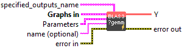
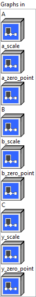
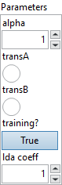

<h1>QGemm</h1>

<h2>Description</h2>

Quantized Gemm.

<h3>Input parameters</h3>

<table>
  <tbody>
    <tr>
      <td width="64" valign="top"></td>
      <td valign="top"><strong><a href="../../../../../../more-deep-learning/nodes-parameters/specified_outputs_name/README.md">specified_outputs_name</a> : <em>array, </em></strong>this parameter lets you manually assign custom names to the output tensors of a node.</td>
    </tr>
  </tbody>
</table>

<table>
  <tbody>
    <tr>
      <td valign="top" width="70%"><table>
  <tbody>
    <tr>
      <td width="64" valign="top"></td>
      <td valign="top"><strong>Graphs in :</strong> <strong><em>cluster,</em></strong> ONNX model architecture.</td>
    </tr>
    <tr>
      <td></td>
      <td valign="top"><table>
  <tbody>
    <tr>
      <td width="64" valign="top"></td>
      <td valign="top"><strong>A</strong> <strong>(heterogeneous) –</strong> <strong>TA :</strong> <em><strong>object,</strong></em> input tensor A. The shape of A should be (M, K) if transA is 0, or (K, M) if transA is non-zero.</td>
    </tr>
    <tr>
      <td width="64" valign="top"></td>
      <td valign="top"><strong>a_scale (heterogeneous) – T : <em>object, </em></strong>scale of quantized input ‘A’. It is a scalar,which means a per-tensor quantization.</td>
    </tr>
    <tr>
      <td width="64" valign="top"></td>
      <td valign="top"><strong>a_zero_point (heterogeneous) – TA : <em>object, </em></strong>zero point tensor for input ‘A’. It is a scalar.</td>
    </tr>
    <tr>
      <td width="64" valign="top"></td>
      <td valign="top"><strong>B</strong> <strong>(heterogeneous) –</strong> <strong>TB :</strong> <em><strong>object,</strong></em> input tensor B. The shape of B should be (K, N) if transB is 0, or (N, K) if transB is non-zero.</td>
    </tr>
    <tr>
      <td width="64" valign="top"></td>
      <td valign="top"><strong>b_scale (heterogeneous) – T : <em>object, </em></strong>scale of quantized input ‘B’. It could be a scalar or a 1-D tensor, which means a per-tensor or per-column quantization. If it’s a 1-D tensor, its number of elements should be equal to the number of columns of input ‘B’.</td>
    </tr>
    <tr>
      <td width="64" valign="top"></td>
      <td valign="top"><strong>b_zero_point (heterogeneous) – TB : <em>object, </em></strong>zero point tensor for input ‘B’. It’s optional and default value is 0. It could be a scalar or a 1-D tensor, which means a per-tensor or per-column quantization. If it’s a 1-D tensor, its number of elements should be equal to the number of columns of input ‘B’.</td>
    </tr>
    <tr>
      <td width="64" valign="top"></td>
      <td valign="top"><strong>C</strong> <strong>(optional, heterogeneous) –</strong> <strong>TC :</strong> <em><strong>object,</strong></em> optional input tensor C. If not specified, the computation is done as if C is a scalar 0. The shape of C should be unidirectional broadcastable to (M, N). Its type is int32_t and must be quantized with zero_point = 0 and scale = alpha / beta * a_scale * b_scale.</td>
    </tr>
    <tr>
      <td width="64" valign="top"></td>
      <td valign="top"><strong>y_scale (optional, heterogeneous) – T : <em>object, </em></strong>scale of output ‘Y’. It is a scalar, which means a per-tensor quantization. It is optional. The output is full precision(float32) if it is not provided. Or the output is quantized.</td>
    </tr>
    <tr>
      <td width="64" valign="top"></td>
      <td valign="top"><strong>y_zero_point (optional, heterogeneous) – TYZ : <em>object, </em></strong>zero point tensor for output ‘Y’. It is a scalar, which means a per-tensor quantization. It is optional. The output is full precision(float32) if it is not provided. Or the output is quantized.</td>
    </tr>
  </tbody>
</table></td>
    </tr>
  </tbody>
</table></td>
      <td valign="top" width="30%">

</td>
    </tr>
  </tbody>
</table>

<table>
  <tbody>
    <tr>
      <td valign="top" width="70%"><table>
  <tbody>
    <tr>
      <td width="64" valign="top"></td>
      <td valign="top"><strong>Parameters : <em>cluster,</em></strong></td>
    </tr>
    <tr>
      <td></td>
      <td valign="top"><table>
  <tbody>
    <tr>
      <td width="64" valign="top"></td>
      <td valign="top"><strong>alpha</strong> <strong>: <em>float, </em></strong>scalar multiplier for the product of input tensors A * B.</td>
    </tr>
    <tr>
      <td width="64" valign="top"></td>
      <td valign="top">Default value “1”.</td>
    </tr>
    <tr>
      <td width="64" valign="top"></td>
      <td valign="top"><strong>transA :</strong> <em><strong>boolean</strong></em>, whether A should be transposed.</td>
    </tr>
    <tr>
      <td width="64" valign="top"></td>
      <td valign="top">Default value “False”.</td>
    </tr>
    <tr>
      <td width="64" valign="top"></td>
      <td valign="top"><strong>transB</strong><strong> :</strong> <em><strong>boolean</strong></em>, whether B should be transposed.</td>
    </tr>
    <tr>
      <td width="64" valign="top"></td>
      <td valign="top">Default value “False”.</td>
    </tr>
    <tr>
      <td width="64" valign="top"></td>
      <td valign="top"><strong>training? :</strong> <em><strong>boolean</strong></em>, whether the layer is in training mode (can store data for backward).</td>
    </tr>
    <tr>
      <td width="64" valign="top"></td>
      <td valign="top">Default value “True”.</td>
    </tr>
    <tr>
      <td width="64" valign="top"></td>
      <td valign="top"><strong>lda coeff :</strong> <em><strong>float</strong></em>, defines the coefficient by which the loss derivative will be multiplied before being sent to the previous layer (since during the backward run we go backwards).</td>
    </tr>
    <tr>
      <td width="64" valign="top"></td>
      <td valign="top">Default value “1”.</td>
    </tr>
  </tbody>
</table></td>
    </tr>
    <tr>
      <td width="64" valign="top"></td>
      <td valign="top"><strong>name (optional) :</strong> <em><strong>string,</strong></em> name of the node.</td>
    </tr>
  </tbody>
</table></td>
      <td valign="top" width="30%">

</td>
    </tr>
  </tbody>
</table>

<h3>Output parameters</h3>

<table>
  <tbody>
    <tr>
      <td width="64" valign="top"></td>
      <td valign="top"><strong>Y</strong> <strong>(heterogeneous) –</strong> <strong>TY : <em>object,</em></strong> output tensor of shape (M, N).</td>
    </tr>
  </tbody>
</table>

<h2>Type Constraints</h2>

<strong>T</strong> in (<code>tensor(float)</code>) : Constrain scale types to float tensors.

<strong>TA</strong> in (<code>tensor(uint8)</code>, <code>tensor(int8)</code>) : Constrain input A and its zero point types to 8 bit tensors.

<strong>TB</strong> in (<code>tensor(uint8)</code>, <code>tensor(int8)</code>) : Constrain input B and its zero point types to 8 bit tensors.

<strong>TC</strong> in (<code>tensor(int32)</code>) : Constrain input C to 32 bit integer tensors.

<strong>TYZ</strong> in (<code>tensor(uint8)</code>, <code>tensor(int8)</code>) : Constrain output zero point types to 8 bit tensors.

<strong>TY</strong> in (<code>tensor(float)</code>, <code>tensor(uint8)</code>, <code>tensor(int8)</code>) : Constrain output type to float32 or 8 bit tensors.

<h2>Example</h2>

All these exemples are snippets PNG, you can drop these Snippet onto the block diagram and get the depicted code added to your VI (Do not forget to install Deep Learning library to run it).

