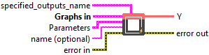
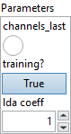

<h1>QLinearGlobalAveragePool</h1>

<h2>Description</h2>

QLinearGlobalAveragePool consumes an input tensor X and applies Average pooling across the values in the same channel. This is equivalent to AveragePool with kernel size equal to the spatial dimension of input tensor. Input is of type uint8_t or int8_t.

<h3>Input parameters</h3>

<table>
  <tbody>
    <tr>
      <td width="64" valign="top"></td>
      <td valign="top"><strong><a href="../../../../../../more-deep-learning/nodes-parameters/specified_outputs_name/README.md">specified_outputs_name</a> : <em>array, </em></strong>this parameter lets you manually assign custom names to the output tensors of a node.</td>
    </tr>
  </tbody>
</table>

<table>
  <tbody>
    <tr>
      <td valign="top" width="70%"><table>
  <tbody>
    <tr>
      <td width="64" valign="top"></td>
      <td valign="top"><strong>Graphs in :</strong> <strong><em>cluster,</em></strong> ONNX model architecture.</td>
    </tr>
    <tr>
      <td></td>
      <td valign="top"><table>
  <tbody>
    <tr>
      <td width="64" valign="top"></td>
      <td valign="top"><strong>X</strong> <strong>(heterogeneous) –</strong> <strong>T :</strong> <em><strong>object,</strong></em> input data tensor from the previous operator; According to channels_last, dimensions for image case are (N x C x H x W), or (N x H x W x C) where N is the batch size, C is the number of channels, and H and W are the height and the width of the data. For non image case, the dimensions are in the form of (N x C x D1 x D2 … Dn), or (N x D1 X D2 … Dn x C) where N is the batch size.</td>
    </tr>
    <tr>
      <td width="64" valign="top"></td>
      <td valign="top"><strong>x_scale</strong> <strong>(heterogeneous) – tensor(float) : <em>object, </em></strong>scale of quantized input ‘X’. It must be a scalar.</td>
    </tr>
    <tr>
      <td width="64" valign="top"></td>
      <td valign="top"><strong>x_zero_point (heterogeneous) – T : <em>object, </em></strong>zero point tensor for input ‘X’. It must be a scalar.</td>
    </tr>
    <tr>
      <td width="64" valign="top"></td>
      <td valign="top"><strong>y_scale (heterogeneous) –</strong> <strong>tensor(float) :</strong> <em><strong>object,</strong></em> scale of quantized output ‘Y’. It must be a scalar.</td>
    </tr>
    <tr>
      <td width="64" valign="top"></td>
      <td valign="top"><strong>y_zero_point (heterogeneous) – T : <em>object, </em></strong>zero point tensor for output ‘Y’. It must be a scalar.</td>
    </tr>
  </tbody>
</table></td>
    </tr>
  </tbody>
</table></td>
      <td valign="top" width="30%">

</td>
    </tr>
  </tbody>
</table>

<table>
  <tbody>
    <tr>
      <td valign="top" width="70%"><table>
  <tbody>
    <tr>
      <td width="64" valign="top"></td>
      <td valign="top"><strong>Parameters : <em>cluster,</em></strong></td>
    </tr>
    <tr>
      <td></td>
      <td valign="top"><table>
  <tbody>
    <tr>
      <td width="64" valign="top"></td>
      <td valign="top"><strong>channels_last</strong> <strong>:</strong> <em><strong>boolean</strong></em>, works on NHWC layout or not ?</td>
    </tr>
    <tr>
      <td width="64" valign="top"></td>
      <td valign="top">Default value “False”.</td>
    </tr>
    <tr>
      <td width="64" valign="top"></td>
      <td valign="top"><strong>training? :</strong> <em><strong>boolean</strong></em>, whether the layer is in training mode (can store data for backward).</td>
    </tr>
    <tr>
      <td width="64" valign="top"></td>
      <td valign="top">Default value “True”.</td>
    </tr>
    <tr>
      <td width="64" valign="top"></td>
      <td valign="top"><strong>lda coeff :</strong> <em><strong>float</strong></em>, defines the coefficient by which the loss derivative will be multiplied before being sent to the previous layer (since during the backward run we go backwards).</td>
    </tr>
    <tr>
      <td width="64" valign="top"></td>
      <td valign="top">Default value “1”.</td>
    </tr>
  </tbody>
</table></td>
    </tr>
    <tr>
      <td width="64" valign="top"></td>
      <td valign="top"><strong>name (optional) :</strong> <em><strong>string,</strong></em> name of the node.</td>
    </tr>
  </tbody>
</table></td>
      <td valign="top" width="30%">

</td>
    </tr>
  </tbody>
</table>

<h3>Output parameters</h3>

<table>
  <tbody>
    <tr>
      <td width="64" valign="top"></td>
      <td valign="top"><strong>Y</strong> <strong>(heterogeneous) –</strong> <strong>T : <em>object,</em></strong> output data tensor from pooling across the input tensor. The output tensor has the same rank as the input. with the N and C value keep it value, while the otherdimensions are all 1.</td>
    </tr>
  </tbody>
</table>

<h2>Type Constraints</h2>

<strong>T</strong> in (<code>tensor(uint8)</code>, <code>tensor(int8)</code>) : Constrain input and output types to signed/unsigned int8 tensors.

<h2>Example</h2>

All these exemples are snippets PNG, you can drop these Snippet onto the block diagram and get the depicted code added to your VI (Do not forget to install Deep Learning library to run it).

