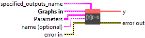
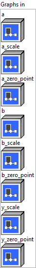

<h1>QLinearMatMul</h1>

<h2>Description</h2>

Matrix product that behaves like <a href="https://numpy.org/doc/stable/reference/generated/numpy.matmul.html">numpy.matmul</a>. It consumes two quantized input tensors, their scales and zero points, scale and zero point of output, and computes the quantized output. The quantization formula is y = saturate((x / y_scale) + y_zero_point). For (x / y_scale), it is rounding to nearest ties to even. Refer to <a href="https://en.wikipedia.org/wiki/Rounding">https://en.wikipedia.org/wiki/Rounding</a> for details. Scale and zero point must have same shape. They must be either scalar (per tensor) or N-D tensor (per row for ‘a’ and per column for ‘b’). Scalar refers to per tensor quantization whereas N-D refers to per row or per column quantization. If the input is 2D of shape [M, K] then zero point and scale tensor may be an M element vector [v_1, v_2, …, v_M] for per row quantization and K element vector of shape [v_1, v_2, …, v_K] for per column quantization. If the input is N-D tensor with shape [D1, D2, M, K] then zero point and scale tensor may have shape [D1, D2, M, 1] for per row quantization and shape [D1, D2, 1, K] for per column quantization. Production must never overflow, and accumulation may overflow if and only if in 32 bits.

<h3>Input parameters</h3>

<table>
  <tbody>
    <tr>
      <td width="64" valign="top"></td>
      <td valign="top"><strong><a href="../../../../../../more-deep-learning/nodes-parameters/specified_outputs_name/README.md">specified_outputs_name</a> : <em>array, </em></strong>this parameter lets you manually assign custom names to the output tensors of a node.</td>
    </tr>
  </tbody>
</table>

<table>
  <tbody>
    <tr>
      <td valign="top" width="70%"><table>
  <tbody>
    <tr>
      <td width="64" valign="top"></td>
      <td valign="top"><strong>Graphs in :</strong> <strong><em>cluster,</em></strong> ONNX model architecture.</td>
    </tr>
    <tr>
      <td></td>
      <td valign="top"><table>
  <tbody>
    <tr>
      <td width="64" valign="top"></td>
      <td valign="top"><strong>a</strong> <strong>(heterogeneous) –</strong> <strong>T1 :</strong> <em><strong>object,</strong></em> N-dimensional quantized matrix a.</td>
    </tr>
    <tr>
      <td width="64" valign="top"></td>
      <td valign="top"><strong>a_scale (heterogeneous) – tensor(float) : <em>object, </em></strong>scale of quantized input a.</td>
    </tr>
    <tr>
      <td width="64" valign="top"></td>
      <td valign="top"><strong>a_zero_point (heterogeneous) – T1 : <em>object, </em></strong>zero point of quantized input a.</td>
    </tr>
    <tr>
      <td width="64" valign="top"></td>
      <td valign="top"><strong>b (heterogeneous) –</strong> <strong>T2 :</strong> <em><strong>object,</strong></em> N-dimensional quantized matrix b.</td>
    </tr>
    <tr>
      <td width="64" valign="top"></td>
      <td valign="top"><strong>b_scale (heterogeneous) – tensor(float) : <em>object, </em></strong>scale of quantized input b.</td>
    </tr>
    <tr>
      <td width="64" valign="top"></td>
      <td valign="top"><strong>b_zero_point (heterogeneous) – T2 : <em>object, </em></strong>zero point of quantized input b.</td>
    </tr>
    <tr>
      <td width="64" valign="top"></td>
      <td valign="top"><strong>y_scale</strong> <strong>(heterogeneous) –</strong> <strong>tensor(float) :</strong> <em><strong>object,</strong></em> scale of quantized output y.</td>
    </tr>
    <tr>
      <td width="64" valign="top"></td>
      <td valign="top"><strong>y_zero_point</strong> <strong>(heterogeneous) – T3 : <em>object, </em></strong>zero point of quantized output y.</td>
    </tr>
  </tbody>
</table></td>
    </tr>
  </tbody>
</table></td>
      <td valign="top" width="30%">

</td>
    </tr>
  </tbody>
</table>

<table>
  <tbody>
    <tr>
      <td valign="top" width="70%"><table>
  <tbody>
    <tr>
      <td width="64" valign="top"></td>
      <td valign="top"><strong>Parameters : <em>cluster,</em></strong></td>
    </tr>
    <tr>
      <td></td>
      <td valign="top"><table>
  <tbody>
    <tr>
      <td width="64" valign="top"></td>
      <td valign="top"><strong>training? :</strong> <em><strong>boolean</strong></em>, whether the layer is in training mode (can store data for backward).</td>
    </tr>
    <tr>
      <td width="64" valign="top"></td>
      <td valign="top">Default value “True”.</td>
    </tr>
    <tr>
      <td width="64" valign="top"></td>
      <td valign="top"><strong>lda coeff :</strong> <em><strong>float</strong></em>, defines the coefficient by which the loss derivative will be multiplied before being sent to the previous layer (since during the backward run we go backwards).</td>
    </tr>
    <tr>
      <td width="64" valign="top"></td>
      <td valign="top">Default value “1”.</td>
    </tr>
  </tbody>
</table></td>
    </tr>
    <tr>
      <td width="64" valign="top"></td>
      <td valign="top"><strong>name (optional) :</strong> <em><strong>string,</strong></em> name of the node.</td>
    </tr>
  </tbody>
</table></td>
      <td valign="top" width="30%">

</td>
    </tr>
  </tbody>
</table>

<h3>Output parameters</h3>

<table>
  <tbody>
    <tr>
      <td width="64" valign="top"></td>
      <td valign="top"><strong>y (heterogeneous) –</strong> <strong>T3 : <em>object,</em></strong> quantized matrix multiply results from a * b.</td>
    </tr>
  </tbody>
</table>

<h2>Type Constraints</h2>

<strong>T1</strong> in (<code>tensor(int8)</code>, <code>tensor(uint8)</code>) : Constrain input a and its zero point data type to 8-bit integer tensor.

<strong>T2</strong> in (<code>tensor(int8)</code>, <code>tensor(uint8)</code>) : Constrain input b and its zero point data type to 8-bit integer tensor.

<strong>T3</strong> in (<code>tensor(int8)</code>, <code>tensor(uint8)</code>) : Constrain output y and its zero point data type to 8-bit integer tensor.

<h2>Example</h2>

All these exemples are snippets PNG, you can drop these Snippet onto the block diagram and get the depicted code added to your VI (Do not forget to install Deep Learning library to run it).

