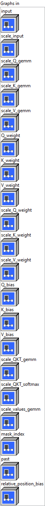
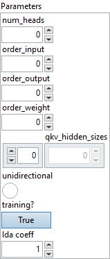

<h1>QOrderedAttention</h1>

<h2>Description</h2>

Quantized version of simplified Multi-Head Self Attention(using int8 with specific matrix Layout). Multi-Head Self Attention that can be either unidirectional (like GPT-2) or bidirectional (like BERT). The mask_index input is optional. Besides raw attention mask with shape (batch_size, past_sequence_length + sequence_length) or (batch_size, sequence_length, past_sequence_length + sequence_length) with value 0 for masked and 1 otherwise, we also support other two formats: When input has right-side padding, mask_index is one dimension with shape (batch_size), where value of each element is the end position, or valid length of actual sequence excluding padding. When input has left-side padding, mask_index has shape (2 * batch_size), where the values are the exclusive end positions followed by the inclusive start positions. When unidirectional is 1, and each token only attend to previous tokens. For GPT-2, both past and present state are optional. Present state could appear in output even when past state is not in input. Current version does not support past/present, attention_bias and qkv_hidden_sizes.

<h3>Input parameters</h3>

<table>
  <tbody>
    <tr>
      <td width="64" valign="top"></td>
      <td valign="top"><strong><a href="../../../../../../more-deep-learning/nodes-parameters/specified_outputs_name/README.md">specified_outputs_name</a> : <em>array, </em></strong>this parameter lets you manually assign custom names to the output tensors of a node.</td>
    </tr>
  </tbody>
</table>

<table>
  <tbody>
    <tr>
      <td valign="top" width="70%"><table>
  <tbody>
    <tr>
      <td width="64" valign="top"></td>
      <td valign="top"><strong>Graphs in :</strong> <strong><em>cluster,</em></strong> ONNX model architecture.</td>
    </tr>
    <tr>
      <td></td>
      <td valign="top"><table>
  <tbody>
    <tr>
      <td width="64" valign="top"></td>
      <td valign="top"><strong>input (heterogeneous) – Q : <em>object, </em></strong>3D input tensor with shape (batch_size, sequence_length, input_hidden_size).</td>
    </tr>
    <tr>
      <td width="64" valign="top"></td>
      <td valign="top"><strong>scale_input</strong> <strong>(heterogeneous) – S : <em>object, </em></strong>scale of the input, scalar value (per tensor) currently.</td>
    </tr>
    <tr>
      <td width="64" valign="top"></td>
      <td valign="top"><strong>scale_Q_gemm</strong> <strong>(heterogeneous) – S : <em>object, </em></strong>scale of the gemm – scalar (per-tensor quantization).</td>
    </tr>
    <tr>
      <td width="64" valign="top"></td>
      <td valign="top"><strong>scale_K_gemm (heterogeneous) – S : <em>object, </em></strong>scale of the gemm – scalar (per-tensor quantization).</td>
    </tr>
    <tr>
      <td width="64" valign="top"></td>
      <td valign="top"><strong>scale_V_gemm (heterogeneous) – S : <em>object, </em></strong>scale of the gemm – scalar (per-tensor quantization).</td>
    </tr>
    <tr>
      <td width="64" valign="top"></td>
      <td valign="top"><strong>Q_weight (heterogeneous) – Q : <em>object, </em></strong>2D input tensor with shape (input_hidden_size, hidden_size), where hidden_size = num_heads * head_size.</td>
    </tr>
    <tr>
      <td width="64" valign="top"></td>
      <td valign="top"><strong>K_weight (heterogeneous) – Q : <em>object, </em></strong>2D input tensor with shape (input_hidden_size, hidden_size), where hidden_size = num_heads * head_size.</td>
    </tr>
    <tr>
      <td width="64" valign="top"></td>
      <td valign="top"><strong>V_weight (heterogeneous) – Q : <em>object, </em></strong>2D input tensor with shape (input_hidden_size, hidden_size), where hidden_size = num_heads * head_size.</td>
    </tr>
    <tr>
      <td width="64" valign="top"></td>
      <td valign="top"><strong>scale_Q_weight (heterogeneous) – S : <em>object, </em></strong>scale of the weight (scalar for per-tensor quantization or 1-D of dims [hidden_size] for per-channel quantization).</td>
    </tr>
    <tr>
      <td width="64" valign="top"></td>
      <td valign="top"><strong>scale_K_weight (heterogeneous) – S : <em>object, </em></strong>scale of the weight (scalar for per-tensor quantization or 1-D of dims [hidden_size] for per-channel quantization).</td>
    </tr>
    <tr>
      <td width="64" valign="top"></td>
      <td valign="top"><strong>scale_V_weight (heterogeneous) – S : <em>object, </em></strong>scale of the weight (scalar for per-tensor quantization or 1-D of dims [hidden_size] for per-channel quantization).</td>
    </tr>
    <tr>
      <td width="64" valign="top"></td>
      <td valign="top"><strong>Q_bias (heterogeneous) – S : <em>object, </em></strong>1D input tensor with shape (hidden_size).</td>
    </tr>
    <tr>
      <td width="64" valign="top"></td>
      <td valign="top"><strong>K_bias (heterogeneous) – S : <em>object, </em></strong>1D input tensor with shape (hidden_size).</td>
    </tr>
    <tr>
      <td width="64" valign="top"></td>
      <td valign="top"><strong>V_bias (heterogeneous) – S : <em>object, </em></strong>1D input tensor with shape (hidden_size).</td>
    </tr>
    <tr>
      <td width="64" valign="top"></td>
      <td valign="top"><strong>scale_QKT_gemm</strong> <strong>(optional, heterogeneous) – S : <em>object, </em></strong>scale of the gemm – scalar (per-tensor quantization).</td>
    </tr>
    <tr>
      <td width="64" valign="top"></td>
      <td valign="top"><strong>scale_QKT_softmax (optional, heterogeneous) – S : <em>object, </em></strong>scale of the softmax result – scalar (per-tensor quantization).</td>
    </tr>
    <tr>
      <td width="64" valign="top"></td>
      <td valign="top"><strong>scale_values_gemm</strong> <strong>(heterogeneous) – S : <em>object, </em></strong>scale of the gemm – scalar (per-tensor quantization). Also this is the output scale for the operator.</td>
    </tr>
    <tr>
      <td width="64" valign="top"></td>
      <td valign="top"><strong>mask_index (optional, heterogeneous) – G : <em>object, </em></strong>attention mask with shape (batch_size, 1, max_sequence_length, max_sequence_length), (batch_size, past_sequence_length + sequence_length)or (batch_size, sequence_length, past_sequence_length + sequence_length), or index with shape (batch_size) or (2 * batch_size).</td>
    </tr>
    <tr>
      <td width="64" valign="top"></td>
      <td valign="top"><strong>past</strong> <strong>(optional, heterogeneous) – Q : <em>object, </em></strong>past state for key and value with shape (2, batch_size, num_heads, past_sequence_length, head_size).</td>
    </tr>
    <tr>
      <td width="64" valign="top"></td>
      <td valign="top"><strong>relative_position_bias (optional, heterogeneous) – S : <em>object, </em></strong>additional add to QxK’ with shape (batch_size or 1, num_heads or 1, sequence_length, total_sequence_length).</td>
    </tr>
  </tbody>
</table></td>
    </tr>
  </tbody>
</table></td>
      <td valign="top" width="30%">

</td>
    </tr>
  </tbody>
</table>

<table>
  <tbody>
    <tr>
      <td valign="top" width="70%"><table>
  <tbody>
    <tr>
      <td width="64" valign="top"></td>
      <td valign="top"><strong>Parameters : <em>cluster,</em></strong></td>
    </tr>
    <tr>
      <td></td>
      <td valign="top"><table>
  <tbody>
    <tr>
      <td width="64" valign="top"></td>
      <td valign="top"><strong>num_heads :</strong> <em><strong>integer</strong></em>, number of attention heads.</td>
    </tr>
    <tr>
      <td width="64" valign="top"></td>
      <td valign="top">Default value “0”.</td>
    </tr>
    <tr>
      <td width="64" valign="top"></td>
      <td valign="top"><strong>order_input :</strong> <em><strong>integer</strong></em>, cublasLt order of input matrix. See the schema of QuantizeWithOrder for order definition.</td>
    </tr>
    <tr>
      <td width="64" valign="top"></td>
      <td valign="top">Default value “0”.</td>
    </tr>
    <tr>
      <td width="64" valign="top"></td>
      <td valign="top"><strong>order_output</strong> <strong>:</strong> <em><strong>integer</strong></em>, cublasLt order of global bias.</td>
    </tr>
    <tr>
      <td width="64" valign="top"></td>
      <td valign="top">Default value “0”.</td>
    </tr>
    <tr>
      <td width="64" valign="top"></td>
      <td valign="top"><strong>order_weight</strong> <strong>:</strong> <em><strong>integer</strong></em>, cublasLt order of weight matrix.</td>
    </tr>
    <tr>
      <td width="64" valign="top"></td>
      <td valign="top">Default value “0”.</td>
    </tr>
    <tr>
      <td width="64" valign="top"></td>
      <td valign="top"><strong>qkv_hidden_sizes :</strong> <em><strong>array</strong></em>, hidden layer sizes of Q, K, V paths in Attention.</td>
    </tr>
    <tr>
      <td width="64" valign="top"></td>
      <td valign="top">Default value “empty”.</td>
    </tr>
    <tr>
      <td width="64" valign="top"></td>
      <td valign="top"><strong> unidirectional :</strong> <em><strong>boolean</strong></em>, whether every token can only attend to previous tokens.</td>
    </tr>
    <tr>
      <td width="64" valign="top"></td>
      <td valign="top">Default value “False”.</td>
    </tr>
    <tr>
      <td width="64" valign="top"></td>
      <td valign="top"><strong>training? :</strong> <em><strong>boolean</strong></em>, whether the layer is in training mode (can store data for backward).</td>
    </tr>
    <tr>
      <td width="64" valign="top"></td>
      <td valign="top">Default value “True”.</td>
    </tr>
    <tr>
      <td width="64" valign="top"></td>
      <td valign="top"><strong>lda coeff :</strong> <em><strong>float</strong></em>, defines the coefficient by which the loss derivative will be multiplied before being sent to the previous layer (since during the backward run we go backwards).</td>
    </tr>
    <tr>
      <td width="64" valign="top"></td>
      <td valign="top">Default value “1”.</td>
    </tr>
  </tbody>
</table></td>
    </tr>
    <tr>
      <td width="64" valign="top"></td>
      <td valign="top"><strong>name (optional) :</strong> <em><strong>string,</strong></em> name of the node.</td>
    </tr>
  </tbody>
</table></td>
      <td valign="top" width="30%">

</td>
    </tr>
  </tbody>
</table>

<h3>Output parameters</h3>

<table>
  <tbody>
    <tr>
      <td width="64" valign="top"></td>
      <td valign="top"><strong>output (heterogeneous) – Q : <em>object, </em></strong>3D output tensor with shape (batch_size, sequence_length, hidden_size).</td>
    </tr>
  </tbody>
</table>

<h2>Type Constraints</h2>

<strong>Q</strong> in (<code>tensor(int8)</code>) : Constrain input and output types to int8 tensors.

<b>S </b>in (<code>tensor(float)</code>) : Constrain scales to float32 tensors.

<b>G </b>in (<code>tensor(int32)</code>) : Constrain to integer types.

<h2>Example</h2>

All these exemples are snippets PNG, you can drop these Snippet onto the block diagram and get the depicted code added to your VI (Do not forget to install Deep Learning library to run it).

