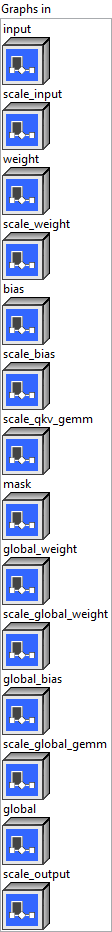

<h1>QOrderedLongformerAttention</h1>

<h2>Description</h2>

Quantized version of Longformer Self Attention (using int8 with specific matrix Layout).

<h3>Input parameters</h3>

<table>
  <tbody>
    <tr>
      <td width="64" valign="top"></td>
      <td valign="top"><strong><a href="../../../../../../more-deep-learning/nodes-parameters/specified_outputs_name/README.md">specified_outputs_name</a> : <em>array, </em></strong>this parameter lets you manually assign custom names to the output tensors of a node.</td>
    </tr>
  </tbody>
</table>

<table>
  <tbody>
    <tr>
      <td valign="top" width="70%"><table>
  <tbody>
    <tr>
      <td width="64" valign="top"></td>
      <td valign="top"><strong>Graphs in :</strong> <strong><em>cluster,</em></strong> ONNX model architecture.</td>
    </tr>
    <tr>
      <td></td>
      <td valign="top"><table>
  <tbody>
    <tr>
      <td width="64" valign="top"></td>
      <td valign="top"><strong>input (heterogeneous) – Q : <em>object, </em></strong>3D input tensor with shape (batch_size, sequence_length, hidden_size), hidden_size = num_heads * head_size.</td>
    </tr>
    <tr>
      <td width="64" valign="top"></td>
      <td valign="top"><strong>scale_input</strong> <strong>(heterogeneous) – S : <em>object, </em></strong>scale of the input.</td>
    </tr>
    <tr>
      <td width="64" valign="top"></td>
      <td valign="top"><strong>weight (heterogeneous) – Q : <em>object, </em></strong>2D input tensor with shape (hidden_size, 3 * hidden_size).</td>
    </tr>
    <tr>
      <td width="64" valign="top"></td>
      <td valign="top"><strong>scale_weight (heterogeneous) – S : <em>object, </em></strong>scale of the weight.</td>
    </tr>
    <tr>
      <td width="64" valign="top"></td>
      <td valign="top"><strong>bias (heterogeneous) – S : <em>object, </em></strong>1D input tensor with shape (3 * hidden_size), fp32 only currently.</td>
    </tr>
    <tr>
      <td width="64" valign="top"></td>
      <td valign="top"><strong>scale_bias (heterogeneous) – S : <em>object, </em></strong>reserved. (not used as add bias need float value in cublasLt for normal order).</td>
    </tr>
    <tr>
      <td width="64" valign="top"></td>
      <td valign="top"><strong>scale_qkv_gemm (heterogeneous) – S : <em>object, </em></strong>scale of the output for fused kqv gemm.</td>
    </tr>
    <tr>
      <td width="64" valign="top"></td>
      <td valign="top"><strong>mask (heterogeneous) – F : <em>object, </em></strong>attention mask with shape (batch_size, sequence_length).</td>
    </tr>
    <tr>
      <td width="64" valign="top"></td>
      <td valign="top"><strong>global_weight (heterogeneous) – Q : <em>object, </em></strong>2D input tensor with shape (hidden_size, 3 * hidden_size).</td>
    </tr>
    <tr>
      <td width="64" valign="top"></td>
      <td valign="top"><strong>scale_global_weight (heterogeneous) – S : <em>object, </em></strong>scale of the global_weight.</td>
    </tr>
    <tr>
      <td width="64" valign="top"></td>
      <td valign="top"><strong>global_bias (heterogeneous) – S : <em>object, </em></strong>scale of the weight (scalar for per-tensor quantization or 1-D of dims [hidden_size] for per-channel quantization).</td>
    </tr>
    <tr>
      <td width="64" valign="top"></td>
      <td valign="top"><strong>scale_global_gemm (heterogeneous) – S : <em>object, </em></strong>1D input tensor with shape (3 * hidden_size).</td>
    </tr>
    <tr>
      <td width="64" valign="top"></td>
      <td valign="top"><strong>global (heterogeneous) – G : <em>object, </em></strong>global attention flags with shape (batch_size, sequence_length).</td>
    </tr>
    <tr>
      <td width="64" valign="top"></td>
      <td valign="top"><strong>scale_output (heterogeneous) – S : <em>object, </em></strong>scale of the output.</td>
    </tr>
  </tbody>
</table></td>
    </tr>
  </tbody>
</table></td>
      <td valign="top" width="30%">

</td>
    </tr>
  </tbody>
</table>

<table>
  <tbody>
    <tr>
      <td valign="top" width="70%"><table>
  <tbody>
    <tr>
      <td width="64" valign="top"></td>
      <td valign="top"><strong>Parameters : <em>cluster,</em></strong></td>
    </tr>
    <tr>
      <td></td>
      <td valign="top"><table>
  <tbody>
    <tr>
      <td width="64" valign="top"></td>
      <td valign="top"><strong>num_heads :</strong> <em><strong>integer</strong></em>, number of attention heads.</td>
    </tr>
    <tr>
      <td width="64" valign="top"></td>
      <td valign="top">Default value “0”.</td>
    </tr>
    <tr>
      <td width="64" valign="top"></td>
      <td valign="top"><strong>order_global_weight :</strong> <em><strong>integer</strong></em>, cublasLt order of weight matrix.</td>
    </tr>
    <tr>
      <td width="64" valign="top"></td>
      <td valign="top">Default value “0”.</td>
    </tr>
    <tr>
      <td width="64" valign="top"></td>
      <td valign="top"><strong>order_input :</strong> <em><strong>integer</strong></em>, cublasLt order of input matrix. See the schema of QuantizeWithOrder for order definition.</td>
    </tr>
    <tr>
      <td width="64" valign="top"></td>
      <td valign="top">Default value “0”.</td>
    </tr>
    <tr>
      <td width="64" valign="top"></td>
      <td valign="top"><strong>order_output :</strong> <em><strong>integer</strong></em>, cublasLt order of global bias.</td>
    </tr>
    <tr>
      <td width="64" valign="top"></td>
      <td valign="top">Default value “0”.</td>
    </tr>
    <tr>
      <td width="64" valign="top"></td>
      <td valign="top"><strong>order_weight :</strong> <em><strong>integer</strong></em>, cublasLt order of weight matrix.</td>
    </tr>
    <tr>
      <td width="64" valign="top"></td>
      <td valign="top">Default value “0”.</td>
    </tr>
    <tr>
      <td width="64" valign="top"></td>
      <td valign="top"><strong>window :</strong> <em><strong>integer</strong></em>, one sided attention windows length W, or half of total window length.</td>
    </tr>
    <tr>
      <td width="64" valign="top"></td>
      <td valign="top">Default value “0”.</td>
    </tr>
    <tr>
      <td width="64" valign="top"></td>
      <td valign="top"><strong>training? :</strong> <em><strong>boolean</strong></em>, whether the layer is in training mode (can store data for backward).</td>
    </tr>
    <tr>
      <td width="64" valign="top"></td>
      <td valign="top">Default value “True”.</td>
    </tr>
    <tr>
      <td width="64" valign="top"></td>
      <td valign="top"><strong>lda coeff :</strong> <em><strong>float</strong></em>, defines the coefficient by which the loss derivative will be multiplied before being sent to the previous layer (since during the backward run we go backwards).</td>
    </tr>
    <tr>
      <td width="64" valign="top"></td>
      <td valign="top">Default value “1”.</td>
    </tr>
  </tbody>
</table></td>
    </tr>
    <tr>
      <td width="64" valign="top"></td>
      <td valign="top"><strong>name (optional) :</strong> <em><strong>string,</strong></em> name of the node.</td>
    </tr>
  </tbody>
</table></td>
      <td valign="top" width="30%">

</td>
    </tr>
  </tbody>
</table>

<h3>Output parameters</h3>

<table>
  <tbody>
    <tr>
      <td width="64" valign="top"></td>
      <td valign="top"><strong>output (heterogeneous) – Q : <em>object, </em></strong>3D output tensor with shape (batch_size, sequence_length, hidden_size).</td>
    </tr>
  </tbody>
</table>

<h2>Type Constraints</h2>

<strong>Q</strong> in (<code>tensor(int8)</code>) : Constrain input and output types to int8 tensors.

<b>S </b>in (<code>tensor(float)</code>) : Constrain scales to float32 tensors.

<b>G </b>in (<code>tensor(int32)</code>) : Constrain to integer types.

<b>F </b>in (<code>tensor(float16)</code>) : Be compatible with float version.

<h2>Example</h2>

All these exemples are snippets PNG, you can drop these Snippet onto the block diagram and get the depicted code added to your VI (Do not forget to install Deep Learning library to run it).

