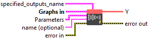
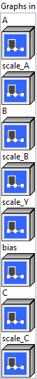
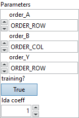

<h1>QOrderedMatMul</h1>

<h2>Description</h2>

Quantize (Int8) MatMul with order. Implement Y = alpha * A * B + bias + beta * C. Matrix A, B, C, Y are all int8 matrix. Two type of order combination supported: *) When order_B is ORDER_COL, order_A must be ORDER_ROW. bias is vector of {#cols of Y} of float32, C should be batch 1/batch_A. B could be of batch 1 or batch_A. Note B is reorder to ORDER_COL, or Transposed. Not Transposed first and then Reordered here. *) When order_B is specify ORDER_COL4_4R2_8C or ORDER_COL32_2R_4R4, orderA must be ORDER_COL32. MatMul will be implemented using alpha(A * B) + beta * C =&gt; Y. bias is not supported here. B in fact is transposed first then reordered into ORDER_COL4_4R2_8C or ORDER_COL32_2R_4R4 here. order_Y and order_C will be same as order_A. Support per column quantized weight, ie, scale_B is 1-D vector of size [#cols of matrix B].

<h3>Input parameters</h3>

<table>
  <tbody>
    <tr>
      <td width="64" valign="top"></td>
      <td valign="top"><strong><a href="../../../../../../more-deep-learning/nodes-parameters/specified_outputs_name/README.md">specified_outputs_name</a> : <em>array, </em></strong>this parameter lets you manually assign custom names to the output tensors of a node.</td>
    </tr>
  </tbody>
</table>

<table>
  <tbody>
    <tr>
      <td valign="top" width="70%"><table>
  <tbody>
    <tr>
      <td width="64" valign="top"></td>
      <td valign="top"><strong>Graphs in :</strong> <strong><em>cluster,</em></strong> ONNX model architecture.</td>
    </tr>
    <tr>
      <td></td>
      <td valign="top"><table>
  <tbody>
    <tr>
      <td width="64" valign="top"></td>
      <td valign="top"><strong>A (heterogeneous) – Q : <em>object, </em></strong>3-dimensional matrix A.</td>
    </tr>
    <tr>
      <td width="64" valign="top"></td>
      <td valign="top"><strong>scale_A</strong> <strong>(heterogeneous) – S : <em>object, </em></strong>scale of the input A.</td>
    </tr>
    <tr>
      <td width="64" valign="top"></td>
      <td valign="top"><strong>B (heterogeneous) – Q : <em>object, </em></strong>2-dimensional matrix B. Transposed if order_B is ORDER_COL.</td>
    </tr>
    <tr>
      <td width="64" valign="top"></td>
      <td valign="top"><strong>scale_B (heterogeneous) – S : <em>object, </em></strong>scale of the input B. Scalar or 1-D float32.</td>
    </tr>
    <tr>
      <td width="64" valign="top"></td>
      <td valign="top"><strong>scale_Y (heterogeneous) – S : <em>object, </em></strong>scale of the output Y.</td>
    </tr>
    <tr>
      <td width="64" valign="top"></td>
      <td valign="top"><strong>bias (optional, heterogeneous) – S : <em>object, </em></strong>1d bias, not scaled with scale_Y.</td>
    </tr>
    <tr>
      <td width="64" valign="top"></td>
      <td valign="top"><strong>C (optional, heterogeneous) – Q : <em>object, </em></strong>3d or 2d matrix C. if 2d expand to 3d first. Shape[0] should be 1 or same as A.shape[0].</td>
    </tr>
    <tr>
      <td width="64" valign="top"></td>
      <td valign="top"><strong>scale_C (optional, heterogeneous) – S : <em>object, </em></strong>scale of the input A.</td>
    </tr>
  </tbody>
</table></td>
    </tr>
  </tbody>
</table></td>
      <td valign="top" width="30%">

</td>
    </tr>
  </tbody>
</table>

<table>
  <tbody>
    <tr>
      <td valign="top" width="70%"><table>
  <tbody>
    <tr>
      <td width="64" valign="top"></td>
      <td valign="top"><strong>Parameters : <em>cluster,</em></strong></td>
    </tr>
    <tr>
      <td></td>
      <td valign="top"><table>
  <tbody>
    <tr>
      <td width="64" valign="top"></td>
      <td valign="top"><strong>order_A :</strong> <em><strong>enum</strong></em>, cublasLt order of matrix A. See the schema of QuantizeWithOrder for order definition.</td>
    </tr>
    <tr>
      <td width="64" valign="top"></td>
      <td valign="top">Default value “ORDER_ROW”.</td>
    </tr>
    <tr>
      <td width="64" valign="top"></td>
      <td valign="top"><strong>order_B :</strong> <em><strong>enum</strong></em>, cublasLt order of matrix B.</td>
    </tr>
    <tr>
      <td width="64" valign="top"></td>
      <td valign="top">Default value “ORDER_COL”.</td>
    </tr>
    <tr>
      <td width="64" valign="top"></td>
      <td valign="top"><strong>order_Y :</strong> <em><strong>enum</strong></em>, cublasLt order of matrix Y and optional matrix C.</td>
    </tr>
    <tr>
      <td width="64" valign="top"></td>
      <td valign="top">Default value “ORDER_ROW”.</td>
    </tr>
    <tr>
      <td width="64" valign="top"></td>
      <td valign="top"><strong>training? :</strong> <em><strong>boolean</strong></em>, whether the layer is in training mode (can store data for backward).</td>
    </tr>
    <tr>
      <td width="64" valign="top"></td>
      <td valign="top">Default value “True”.</td>
    </tr>
    <tr>
      <td width="64" valign="top"></td>
      <td valign="top"><strong>lda coeff :</strong> <em><strong>float</strong></em>, defines the coefficient by which the loss derivative will be multiplied before being sent to the previous layer (since during the backward run we go backwards).</td>
    </tr>
    <tr>
      <td width="64" valign="top"></td>
      <td valign="top">Default value “1”.</td>
    </tr>
  </tbody>
</table></td>
    </tr>
    <tr>
      <td width="64" valign="top"></td>
      <td valign="top"><strong>name (optional) :</strong> <em><strong>string,</strong></em> name of the node.</td>
    </tr>
  </tbody>
</table></td>
      <td valign="top" width="30%">

</td>
    </tr>
  </tbody>
</table>

<h3>Output parameters</h3>

<table>
  <tbody>
    <tr>
      <td width="64" valign="top"></td>
      <td valign="top"><strong>Y (heterogeneous) – Q : <em>object, </em></strong>matrix multiply results from A * B.</td>
    </tr>
  </tbody>
</table>

<h2>Type Constraints</h2>

<strong>Q</strong> in (<code>tensor(int8)</code>) : Constrain input and output types to int8 tensors.

<b>S </b>in (<code>tensor(float)</code>) : Constrain bias and scales to float32.

<h2>Example</h2>

All these exemples are snippets PNG, you can drop these Snippet onto the block diagram and get the depicted code added to your VI (Do not forget to install Deep Learning library to run it).

