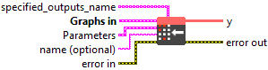
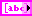
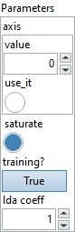

<h1>QuantizeLinear</h1>

<h2>Description</h2>

The linear quantization operator consumes a high-precision tensor, a scale, and a zero point to compute the low-precision/quantized tensor. The scale factor and zero point must have the same shape, determining the quantization granularity. The quantization formula is <code>y = saturate((x / y_scale) + y_zero_point)</code>.

Saturation is done according to:

<ul>
<li>
<ul>
<li>uint16: [0, 65535]</li>
<li>int16: [-32768, 32767]</li>
<li>uint8: [0, 255]</li>
<li>int8: [-128, 127]</li>
<li>uint4: [0, 15]</li>
<li>int4: [-8, 7]</li>
</ul>
</li>
</ul>

For <code>(x / y_scale)</code>, it rounds to the nearest even. Refer to <a href="https://en.wikipedia.org/wiki/Rounding">https://en.wikipedia.org/wiki/Rounding</a> for details.

<code>y_zero_point</code> and <code>y</code> must have the same type. <code>y_zero_point</code> is usually not used for quantization to float8 and 4bit types, but the quantization formula remains the same for consistency, and the type of the attribute <code>y_zero_point</code> still determines the quantization type. <code>x</code> and <code>y_scale</code> are allowed to have different types. The type of <code>y_scale</code> determines the precision of the division operation between <code>x</code> and <code>y_scale</code>, unless the <code>precision</code> attribute is specified.

There are three supported quantization granularities, determined by the shape of <code>y_scale</code>. In all cases, <code>y_zero_point</code> must have the same shape as <code>y_scale</code>.

<ul>
<li>
<ul>
<li>Per-tensor (per-layer) quantization: <code>y_scale</code> is a scalar.</li>
<li>Per-axis quantization: The scale must be a 1-D tensor, with the length of the quantization axis. For an input shape <code>(D0, ..., Di, ..., Dn)</code> and <code>axis=i</code>, <code>y_scale</code> is a 1-D tensor of length <code>Di</code>.</li>
<li>Blocked quantization: The scale’s shape is identical to the input’s shape, except for one dimension, in which blocking is performed. Given <code>x</code> shape <code>(D0, ..., Di, ..., Dn)</code>, <code>axis=i</code>, and block size <code>B</code>: <code>y_scale</code> shape is <code>(D0, ..., ceil(Di/B), ..., Dn)</code>.</li>
</ul>
</li>
</ul>

<h3>Input parameters</h3>

<table>
  <tbody>
    <tr>
      <td width="64" valign="top"></td>
      <td valign="top"><strong><a href="../../../../../../more-deep-learning/nodes-parameters/specified_outputs_name/README.md">specified_outputs_name</a> : <em>array, </em></strong>this parameter lets you manually assign custom names to the output tensors of a node.</td>
    </tr>
  </tbody>
</table>

<table>
  <tbody>
    <tr>
      <td valign="top" width="70%"><table>
  <tbody>
    <tr>
      <td width="64" valign="top"></td>
      <td valign="top"><strong>Graphs in :</strong> <strong><em>cluster,</em></strong> ONNX model architecture.</td>
    </tr>
    <tr>
      <td></td>
      <td valign="top"><table>
  <tbody>
    <tr>
      <td width="64" valign="top"></td>
      <td valign="top"><strong>x (heterogeneous) –</strong> <strong>T1 :</strong> <em><strong>object,</strong></em> N-D full precision Input tensor to be quantized.</td>
    </tr>
    <tr>
      <td width="64" valign="top"></td>
      <td valign="top"><strong>y_scale (heterogeneous) –</strong> <strong>T2 :</strong> <em><strong>object,</strong></em> scale for doing quantization to get <code>y</code>. For per-tensor/layer quantization the scale is a scalar, for per-axis quantization it is a 1-D Tensor and for blocked quantization it has the same shape as the input, except for one dimension in which blocking is performed.</td>
    </tr>
    <tr>
      <td width="64" valign="top"></td>
      <td valign="top"><strong>y_zero_point (optional, heterogeneous) – T3 : <em>object, </em></strong>zero point for doing quantization to get <code>y</code>. Shape must match <code>y_scale</code>. Default is uint8 with zero point of 0 if it’s not specified.</td>
    </tr>
  </tbody>
</table></td>
    </tr>
  </tbody>
</table></td>
      <td valign="top" width="30%">

</td>
    </tr>
  </tbody>
</table>

<table>
  <tbody>
    <tr>
      <td valign="top" width="70%"><table>
  <tbody>
    <tr>
      <td width="64" valign="top"></td>
      <td valign="top"><strong>Parameters : <em>cluster,</em></strong></td>
    </tr>
    <tr>
      <td></td>
      <td valign="top"><table>
  <tbody>
    <tr>
      <td width="64" valign="top"></td>
      <td valign="top"><strong>axis : <em>integer,</em></strong> the axis of the dequantizing dimension of the input tensor. Used only for per-axis and blocked quantization. Negative value means counting dimensions from the back. Accepted range is <code>[-r, r-1]</code> where <code>r = rank(input)</code>. When the rank of the input is 1, per-tensor quantization is applied, rendering the axis unnecessary in this scenario.</td>
    </tr>
    <tr>
      <td width="64" valign="top"></td>
      <td valign="top">Default value “0”.</td>
    </tr>
    <tr>
      <td width="64" valign="top"></td>
      <td valign="top"><strong>saturate :</strong> <em><strong>boolean</strong><strong>,</strong></em> the parameter defines how the conversion behaves if an input value is out of range of the destination type. It only applies for float 8 quantization (float8e4m3fn, float8e4m3fnuz, float8e5m2, float8e5m2fnuz). It is true by default. All cases are fully described in two tables inserted in the operator description.</td>
    </tr>
    <tr>
      <td width="64" valign="top"></td>
      <td valign="top">Default value “True”.</td>
    </tr>
    <tr>
      <td width="64" valign="top"></td>
      <td valign="top"><strong>training? :</strong> <em><strong>boolean</strong><strong>,</strong></em> whether the layer is in training mode (can store data for backward).</td>
    </tr>
    <tr>
      <td width="64" valign="top"></td>
      <td valign="top">Default value “True”.</td>
    </tr>
    <tr>
      <td width="64" valign="top"></td>
      <td valign="top"><strong>lda coeff :</strong> <em><strong>float</strong><strong>,</strong></em> defines the coefficient by which the loss derivative will be multiplied before being sent to the previous layer (since during the backward run we go backwards).</td>
    </tr>
    <tr>
      <td width="64" valign="top"></td>
      <td valign="top">Default value “1”.</td>
    </tr>
  </tbody>
</table></td>
    </tr>
    <tr>
      <td width="64" valign="top"></td>
      <td valign="top"><strong>name (optional) :</strong> <em><strong>string,</strong></em> name of the node.</td>
    </tr>
  </tbody>
</table></td>
      <td valign="top" width="30%">

</td>
    </tr>
  </tbody>
</table>

<h3>Output parameters</h3>

<table>
  <tbody>
    <tr>
      <td width="64" valign="top"></td>
      <td valign="top"><strong>y</strong> <strong>(heterogeneous) –</strong> <strong>T3 : <em>object,</em></strong> N-D quantized output tensor. It has same shape as input <code>x</code>.</td>
    </tr>
  </tbody>
</table>

<h2>Type Constraints</h2>

<strong>T1</strong> in (<code>tensor(bfloat16)</code>, <code>tensor(float)</code>, <code>tensor(float16)</code>, <code>tensor(int32)</code>) : The type of the input ‘x’.

<strong>T2</strong> in (<code>tensor(bfloat16)</code>, <code>tensor(float)</code>, <code>tensor(float16)</code>, <code>tensor(float8e8m0)</code>, <code>tensor(int32)</code>) : The type of the input ‘y_scale’.

<strong>T3</strong> in (<code>tensor(float4e2m1)</code>, <code>tensor(float8e4m3fn)</code>, <code>tensor(float8e4m3fnuz)</code>, <code>tensor(float8e5m2)</code>, <code>tensor(float8e5m2fnuz)</code>,  <code>tensor(int16)</code>, <code>tensor(int4)</code>, <code>tensor(int8)</code>, <code>tensor(uint16)</code>, <code>tensor(uint4)</code>, <code>tensor(uint8)</code>) : The type of the input <code>y_zero_point</code> and the output <code>y</code>.

<h2>Example</h2>

All these exemples are snippets PNG, you can drop these Snippet onto the block diagram and get the depicted code added to your VI (Do not forget to install Deep Learning library to run it).

