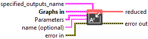
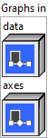
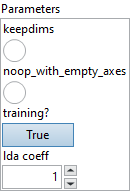

<h1>ReduceSumSquare</h1>

<h2>Description</h2>

Computes the sum square of the input tensor’s elements along the provided axes. The resulting tensor has the same rank as the input if <code>keepdims</code> equals 1. If <code>keepdims</code> equals 0, then the resulting tensor has the reduced dimension pruned. Input tensors of rank zero are valid. Reduction over an empty set of values yields 0. The above behavior is similar to numpy, with the exception that numpy defaults <code>keepdims</code> to <code>False</code> instead of <code>True</code>.

<h3>Input parameters</h3>

<table>
  <tbody>
    <tr>
      <td width="64" valign="top"></td>
      <td valign="top"><strong><a href="../../../../../../more-deep-learning/nodes-parameters/specified_outputs_name/README.md">specified_outputs_name</a> : <em>array, </em></strong>this parameter lets you manually assign custom names to the output tensors of a node.</td>
    </tr>
  </tbody>
</table>

<table>
  <tbody>
    <tr>
      <td valign="top" width="70%">
<strong>Graphs in :</strong><strong><em>cluster,</em></strong> ONNX model architecture.

<table>
  <tbody>
    <tr>
      <td width="64" valign="top"></td>
      <td valign="top"><strong>data (heterogeneous) –</strong> <strong>T :</strong> <em><strong>object,</strong></em> an input tensor.</td>
    </tr>
    <tr>
      <td width="64" valign="top"></td>
      <td valign="top"><strong>axes (optional, heterogeneous) – tensor(int64)</strong><strong> :</strong> <em><strong>object,</strong></em> optional input list of integers, along which to reduce. The default is to reduce over empty axes. When axes is empty (either not provided or explicitly empty), behavior depends on ‘noop_with_empty_axes’: reduction over all axes if ‘noop_with_empty_axes’ is false, or no reduction is applied if ‘noop_with_empty_axes’ is true (but other operations will be performed). Accepted range is [-r, r-1] where r = rank(data).</td>
    </tr>
  </tbody>
</table></td>
      <td valign="top" width="30%">

</td>
    </tr>
  </tbody>
</table>

<table>
  <tbody>
    <tr>
      <td valign="top" width="70%">
<strong>Parameters : <em>cluster,</em></strong>

<table>
  <tbody>
    <tr>
      <td width="64" valign="top"></td>
      <td valign="top"><strong>keepdims :</strong> <em><strong>boolean</strong><strong>,</strong></em> keep the reduced dimension or not, true means keep reduced dimension.</td>
    </tr>
    <tr>
      <td width="64" valign="top"></td>
      <td valign="top">Default value “False”.</td>
    </tr>
    <tr>
      <td width="64" valign="top"></td>
      <td valign="top"><strong>noop_with_empty_axes :</strong> <em><strong>boolean</strong><strong>,</strong></em> defines behavior when axes is not provided or is empty. If false, reduction happens over all axes. If true, no reduction is applied, but other operations will be performed. For example, ReduceSumSquare acts as a vanilla Square.</td>
    </tr>
    <tr>
      <td width="64" valign="top"></td>
      <td valign="top">Default value “False”.</td>
    </tr>
    <tr>
      <td width="64" valign="top"></td>
      <td valign="top"><strong>training? :</strong> <em><strong>boolean</strong><strong>,</strong></em> whether the layer is in training mode (can store data for backward).</td>
    </tr>
    <tr>
      <td width="64" valign="top"></td>
      <td valign="top">Default value “True”.</td>
    </tr>
    <tr>
      <td width="64" valign="top"></td>
      <td valign="top"><strong>lda coeff :</strong> <em><strong>float</strong><strong>,</strong></em> defines the coefficient by which the loss derivative will be multiplied before being sent to the previous layer (since during the backward run we go backwards).</td>
    </tr>
    <tr>
      <td width="64" valign="top"></td>
      <td valign="top">Default value “1”.</td>
    </tr>
    <tr>
      <td width="64" valign="top"></td>
      <td valign="top"><strong>name (optional) :</strong> <em><strong>string,</strong></em> name of the node.</td>
    </tr>
  </tbody>
</table></td>
      <td valign="top" width="30%">

</td>
    </tr>
  </tbody>
</table>

<h3>Output parameters</h3>

<table>
  <tbody>
    <tr>
      <td width="64" valign="top"></td>
      <td valign="top"><strong>reduced (heterogeneous) –</strong> <strong>T : <em>object,</em></strong> reduced output tensor.</td>
    </tr>
  </tbody>
</table>

<h2>Type Constraints</h2>

<strong>T</strong> in (<code>tensor(bfloat16)</code>, <code>tensor(double)</code>, <code>tensor(float)</code>, <code>tensor(float16)</code>, <code>tensor(int32)</code>, <code>tensor(int64)</code>, <code>tensor(uint32)</code>,  <code>tensor(uint64)</code>) : Constrain input and output types to numeric tensors.

<h2>Example</h2>

All these exemples are snippets PNG, you can drop these Snippet onto the block diagram and get the depicted code added to your VI (Do not forget to install Deep Learning library to run it).

