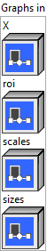
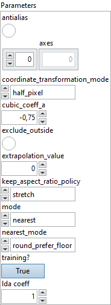

<h1>Resize</h1>

<h2>Description</h2>

Resize the input tensor. In general, it calculates every value in the output tensor as a weighted average of neighborhood (a.k.a. sampling locations) in the input tensor. Each dimension value of the output tensor is : output_dimension = floor(input_dimension * (roi_end – roi_start) * scale), if input “sizes” is not specified.

<h3>Input parameters</h3>

<table>
  <tbody>
    <tr>
      <td width="64" valign="top"></td>
      <td valign="top"><strong><a href="../../../../../../more-deep-learning/nodes-parameters/specified_outputs_name/README.md">specified_outputs_name</a> : <em>array, </em></strong>this parameter lets you manually assign custom names to the output tensors of a node.</td>
    </tr>
  </tbody>
</table>

<table>
  <tbody>
    <tr>
      <td valign="top" width="70%"><table>
  <tbody>
    <tr>
      <td width="64" valign="top"></td>
      <td valign="top"><strong>Graphs in :</strong> <strong><em>cluster,</em></strong> ONNX model architecture.</td>
    </tr>
    <tr>
      <td></td>
      <td valign="top"><table>
  <tbody>
    <tr>
      <td width="64" valign="top"></td>
      <td valign="top"><strong>X (heterogeneous) –</strong> <strong>T1 :</strong> <em><strong>object,</strong></em> N-D tensor.</td>
    </tr>
    <tr>
      <td width="64" valign="top"></td>
      <td valign="top"><strong>roi (optional, heterogeneous) – T2</strong><strong> :</strong> <em><strong>object,</strong></em> 1-D tensor given as [start1, …, startN, end1, …, endN], where N is the rank of X or the length of axes, if provided. The RoIs’ coordinates are normalized in the coordinate system of the input image. It only takes effect when coordinate_transformation_mode is “tf_crop_and_resize”.</td>
    </tr>
    <tr>
      <td width="64" valign="top"></td>
      <td valign="top"><strong>scales (optional, heterogeneous) – tensor(float)</strong><strong> :</strong> <em><strong>object,</strong></em> the scale array along each dimension. It takes value greater than 0. If it’s less than 1, it’s sampling down, otherwise, it’s upsampling. The number of elements of ‘scales’ should be the same as the rank of input ‘X’ or the length of ‘axes’, if provided. One of ‘scales’ and ‘sizes’ MUST be specified and it is an error if both are specified. If ‘sizes’ is needed, the user can use an empty string as the name of ‘scales’ in this operator’s input list.</td>
    </tr>
    <tr>
      <td width="64" valign="top"></td>
      <td valign="top"><strong>sizes (optional, heterogeneous) – tensor(int64)</strong><strong> :</strong> <em><strong>object,</strong></em> target size of the output tensor. Its interpretation depends on the ‘keep_aspect_ratio_policy’ value.The number of elements of ‘sizes’ should be the same as the rank of input ‘X’, or the length of ‘axes’, if provided. Only one of ‘scales’ and ‘sizes’ can be specified.</td>
    </tr>
  </tbody>
</table></td>
    </tr>
  </tbody>
</table></td>
      <td valign="top" width="30%">

</td>
    </tr>
  </tbody>
</table>

<table>
  <tbody>
    <tr>
      <td valign="top" width="70%"><table>
  <tbody>
    <tr>
      <td width="64" valign="top"></td>
      <td valign="top"><strong>Parameters : <em>cluster,</em></strong></td>
    </tr>
    <tr>
      <td></td>
      <td valign="top"><table>
  <tbody>
    <tr>
      <td width="64" valign="top"></td>
      <td valign="top"><strong>antialias :</strong> <em><strong>boolean</strong><strong>,</strong></em> if set to true, “linear” and “cubic” interpolation modes will use an antialiasing filter when downscaling. Antialiasing is achieved by stretching the resampling filter by a factor max(1, 1 / scale), which means that when downsampling, more input pixels contribute to an output pixel.</td>
    </tr>
    <tr>
      <td width="64" valign="top"></td>
      <td valign="top">Default value “False”.</td>
    </tr>
    <tr>
      <td width="64" valign="top"></td>
      <td valign="top"><strong>axes : <em>array,</em></strong> if provided, it specifies a subset of axes that ‘roi’, ‘scales’ and ‘sizes’ refer to. If not provided, all axes are assumed [0, 1, …, r-1], where r = rank(data). Non-specified dimensions are interpreted as non-resizable. Negative value means counting dimensions from the back. Accepted range is [-r, r-1], where r = rank(data). Behavior is undefined if an axis is repeated.</td>
    </tr>
    <tr>
      <td width="64" valign="top"></td>
      <td valign="top">Default value “empty”.</td>
    </tr>
    <tr>
      <td width="64" valign="top"></td>
      <td valign="top"><strong><a href="../../../../../../more-deep-learning/nodes-parameters/coordinate_transformation_mode/README.md">coordinate_transformation_mode</a> : <em>enum,</em></strong> this attribute describes how to transform the coordinate in the resized tensor to the coordinate in the original tensor.</td>
    </tr>
    <tr>
      <td width="64" valign="top"></td>
      <td valign="top">Default value “half_pixel”.</td>
    </tr>
    <tr>
      <td width="64" valign="top"></td>
      <td valign="top"><strong>cubic_coeff_a : <em>float,</em></strong> the coefficient ‘a’ used in cubic interpolation. Two common choice are -0.5 (in some cases of TensorFlow) and -0.75 (in PyTorch). Check out Equation (4) in <a href="https://ieeexplore.ieee.org/document/1163711">https://ieeexplore.ieee.org/document/1163711</a> for the details. This attribute is valid only if mode is “cubic”.</td>
    </tr>
    <tr>
      <td width="64" valign="top"></td>
      <td valign="top">Default value “-0.75”.</td>
    </tr>
    <tr>
      <td width="64" valign="top"></td>
      <td valign="top"><strong>exclude_outside :</strong> <em><strong>boolean</strong><strong>,</strong></em> if set to true, the weight of sampling locations outside the tensor will be set to 0 and the weight will be renormalized so that their sum is 1.0.</td>
    </tr>
    <tr>
      <td width="64" valign="top"></td>
      <td valign="top">Default value “False”.</td>
    </tr>
    <tr>
      <td width="64" valign="top"></td>
      <td valign="top"><strong>extrapolation_value : <em>float,</em></strong> when coordinate_transformation_mode is “tf_crop_and_resize” and x_original is outside the range [0, length_original – 1], this value is used as the corresponding output value.</td>
    </tr>
    <tr>
      <td width="64" valign="top"></td>
      <td valign="top">Default value “0”.</td>
    </tr>
    <tr>
      <td width="64" valign="top"></td>
      <td valign="top"><strong><a href="../../../../../../more-deep-learning/nodes-parameters/keep_aspect_ratio_policy/README.md">keep_aspect_ratio_policy</a> : <em>enum,</em></strong> this attribute describes how to interpret the <code>sizes</code> input with regard to keeping the original aspect ratio of the input, and it is not applicable when the <code>scales</code> input is used.</td>
    </tr>
    <tr>
      <td width="64" valign="top"></td>
      <td valign="top">Default value “stretch”.</td>
    </tr>
    <tr>
      <td width="64" valign="top"></td>
      <td valign="top"><strong>mode : <em>enum,</em></strong> three interpolation modes: “nearest” (default), “linear” and “cubic”. The “linear” mode includes linear interpolation for 1D tensor and N-linear interpolation for N-D tensor (for example, bilinear interpolation for 2D tensor). The “cubic” mode includes cubic interpolation for 1D tensor and N-cubic interpolation for N-D tensor (for example, bicubic interpolation for 2D tensor).</td>
    </tr>
    <tr>
      <td width="64" valign="top"></td>
      <td valign="top">Default value “nearest”.</td>
    </tr>
    <tr>
      <td width="64" valign="top"></td>
      <td valign="top"><strong>nearest_mode : <em>enum,</em></strong> four modes: “round_prefer_floor” (default, as known as round half down), “round_prefer_ceil” (as known as round half up), “floor”, “ceil”. Only used by nearest interpolation. It indicates how to get “nearest” pixel in input tensor from x_original, so this attribute is valid only if “mode” is “nearest”.</td>
    </tr>
    <tr>
      <td width="64" valign="top"></td>
      <td valign="top">Default value “round_prefer_floor”.</td>
    </tr>
    <tr>
      <td width="64" valign="top"></td>
      <td valign="top"><strong>training? :</strong> <em><strong>boolean</strong><strong>,</strong></em> whether the layer is in training mode (can store data for backward).</td>
    </tr>
    <tr>
      <td width="64" valign="top"></td>
      <td valign="top">Default value “True”.</td>
    </tr>
    <tr>
      <td width="64" valign="top"></td>
      <td valign="top"><strong>lda coeff :</strong> <em><strong>float</strong><strong>,</strong></em> defines the coefficient by which the loss derivative will be multiplied before being sent to the previous layer (since during the backward run we go backwards).</td>
    </tr>
    <tr>
      <td width="64" valign="top"></td>
      <td valign="top">Default value “1”.</td>
    </tr>
  </tbody>
</table></td>
    </tr>
    <tr>
      <td width="64" valign="top"></td>
      <td valign="top"><strong>name (optional) :</strong> <em><strong>string,</strong></em> name of the node.</td>
    </tr>
  </tbody>
</table></td>
      <td valign="top" width="30%">

</td>
    </tr>
  </tbody>
</table>

<h3>Output parameters</h3>

<table>
  <tbody>
    <tr>
      <td width="64" valign="top"></td>
      <td valign="top"><strong>Y (heterogeneous) –</strong> <strong>T1 : <em>object,</em></strong> N-D tensor after resizing.</td>
    </tr>
  </tbody>
</table>

<h2>Type Constraints</h2>

<strong>T1</strong> in (<code>tensor(bfloat16)</code>, <code>tensor(bool)</code>, <code>tensor(complex128)</code>, <code>tensor(complex64)</code>, <code>tensor(double)</code>, <code>tensor(float)</code>, <code>tensor(float16)</code>,  <code>tensor(int16)</code>, <code>tensor(int32)</code>, <code>tensor(int64)</code>, <code>tensor(int8)</code>, <code>tensor(string)</code>, <code>tensor(uint16)</code>, <code>tensor(uint32)</code>, <code>tensor(uint64)</code>, <code>tensor(uint8)</code>) : Constrain input ‘X’ and output ‘Y’ to all tensor types.

<strong>T2</strong> in (<code>tensor(double)</code>, <code>tensor(float)</code>, <code>tensor(float16)</code>) : Constrain roi type to float or double.

<h2>Example</h2>

All these exemples are snippets PNG, you can drop these Snippet onto the block diagram and get the depicted code added to your VI (Do not forget to install Deep Learning library to run it).

