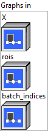
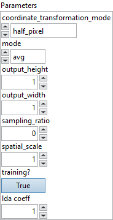

<h1>RoiAlign</h1>

<h2>Description</h2>

Region of Interest (RoI) align operation described in the <a href="https://arxiv.org/abs/1703.06870">Mask R-CNN paper</a>. RoiAlign consumes an input tensor X and region of interests (rois) to apply pooling across each RoI; it produces a 4-D tensor of shape (num_rois, C, output_height, output_width). RoiAlign is proposed to avoid the misalignment by removing quantizations while converting from original image into feature map and from feature map into RoI feature; in each ROI bin, the value of the sampled locations are computed directly through bilinear interpolation.

<h3>Input parameters</h3>

<table>
  <tbody>
    <tr>
      <td width="64" valign="top"></td>
      <td valign="top"><strong><a href="../../../../../../more-deep-learning/nodes-parameters/specified_outputs_name/README.md">specified_outputs_name</a> : <em>array, </em></strong>this parameter lets you manually assign custom names to the output tensors of a node.</td>
    </tr>
  </tbody>
</table>

<table>
  <tbody>
    <tr>
      <td valign="top" width="70%"><table>
  <tbody>
    <tr>
      <td width="64" valign="top"></td>
      <td valign="top"><strong>Graphs in :</strong> <strong><em>cluster,</em></strong> ONNX model architecture.</td>
    </tr>
    <tr>
      <td></td>
      <td valign="top"><table>
  <tbody>
    <tr>
      <td width="64" valign="top"></td>
      <td valign="top"><strong>X (heterogeneous) – T1 : <em>object, </em></strong>input data tensor from the previous operator; 4-D feature map of shape (N, C, H, W), where N is the batch size, C is the number of channels, and H and W are the height and the width of the data.</td>
    </tr>
    <tr>
      <td width="64" valign="top"></td>
      <td valign="top"><strong>rois</strong> <strong>(heterogeneous) – T1 : <em>object, </em></strong>RoIs (Regions of Interest) to pool over; rois is 2-D input of shape (num_rois, 4) given as [[x1, y1, x2, y2], …]. The RoIs’ coordinates are in the coordinate system of the input image. Each coordinate set has a 1:1 correspondence with the ‘batch_indices’ input.</td>
    </tr>
    <tr>
      <td width="64" valign="top"></td>
      <td valign="top"><strong>batch_indices</strong> <strong>(heterogeneous) – T2 : <em>object, </em></strong>1-D tensor of shape (num_rois,) with each element denoting the index of the corresponding image in the batch.</td>
    </tr>
  </tbody>
</table></td>
    </tr>
  </tbody>
</table></td>
      <td valign="top" width="30%">

</td>
    </tr>
  </tbody>
</table>

<table>
  <tbody>
    <tr>
      <td valign="top" width="70%"><table>
  <tbody>
    <tr>
      <td width="64" valign="top"></td>
      <td valign="top"><strong>Parameters : <em>cluster,</em></strong></td>
    </tr>
    <tr>
      <td></td>
      <td valign="top"><table>
  <tbody>
    <tr>
      <td width="64" valign="top"></td>
      <td valign="top"><strong><a href="../../../../../../more-deep-learning/nodes-parameters/coordinate_transformation_mode/README.md">coordinate_transformation_mode</a> : <em>enum,</em></strong> allowed values are ‘half_pixel’ and ‘output_half_pixel’. Use the value ‘half_pixel’ to pixel shift the input coordinates by -0.5 (the recommended behavior). Use the value ‘output_half_pixel’ to omit the pixel shift for the input (use this for a backward-compatible behavior).</td>
    </tr>
    <tr>
      <td width="64" valign="top"></td>
      <td valign="top">Default value “half_pixel”.</td>
    </tr>
    <tr>
      <td width="64" valign="top"></td>
      <td valign="top"><strong>mode : <em>enum,</em></strong> the pooling method. Two modes are supported: ‘avg’ and ‘max’.</td>
    </tr>
    <tr>
      <td width="64" valign="top"></td>
      <td valign="top">Default value “avg”.</td>
    </tr>
    <tr>
      <td width="64" valign="top"></td>
      <td valign="top"><strong>output_height : <em>integer,</em></strong> pooled output Y’s height.</td>
    </tr>
    <tr>
      <td width="64" valign="top"></td>
      <td valign="top">Default value “1”.</td>
    </tr>
    <tr>
      <td width="64" valign="top"></td>
      <td valign="top"><strong>output_width : <em>integer,</em></strong> pooled output Y’s width.</td>
    </tr>
    <tr>
      <td width="64" valign="top"></td>
      <td valign="top">Default value “1”.</td>
    </tr>
    <tr>
      <td width="64" valign="top"></td>
      <td valign="top"><strong>sampling_ratio : <em>integer,</em></strong> number of sampling points in the interpolation grid used to compute the output value of each pooled output bin. If > 0, then exactly sampling_ratio x sampling_ratio grid points are used. If == 0, then an adaptive number of grid points are used (computed as ceil(roi_width / output_width), and likewise for height).</td>
    </tr>
    <tr>
      <td width="64" valign="top"></td>
      <td valign="top">Default value “0”.</td>
    </tr>
    <tr>
      <td width="64" valign="top"></td>
      <td valign="top"><strong>spatial_scale : <em>float,</em></strong> multiplicative spatial scale factor to translate ROI coordinates from their input spatial scale to the scale used when pooling, i.e., spatial scale of the input feature map X relative to the input image.</td>
    </tr>
    <tr>
      <td width="64" valign="top"></td>
      <td valign="top">Default value “0”.</td>
    </tr>
    <tr>
      <td width="64" valign="top"></td>
      <td valign="top"><strong>training? :</strong> <em><strong>boolean</strong></em>, whether the layer is in training mode (can store data for backward).</td>
    </tr>
    <tr>
      <td width="64" valign="top"></td>
      <td valign="top">Default value “True”.</td>
    </tr>
    <tr>
      <td width="64" valign="top"></td>
      <td valign="top"><strong>lda coeff :</strong> <em><strong>float</strong></em>, defines the coefficient by which the loss derivative will be multiplied before being sent to the previous layer (since during the backward run we go backwards).</td>
    </tr>
    <tr>
      <td width="64" valign="top"></td>
      <td valign="top">Default value “1”.</td>
    </tr>
  </tbody>
</table></td>
    </tr>
    <tr>
      <td width="64" valign="top"></td>
      <td valign="top"><strong>name (optional) :</strong> <em><strong>string,</strong></em> name of the node.</td>
    </tr>
  </tbody>
</table></td>
      <td valign="top" width="30%">

</td>
    </tr>
  </tbody>
</table>

<h3>Output parameters</h3>

<table>
  <tbody>
    <tr>
      <td width="64" valign="top"></td>
      <td valign="top"><strong>Y (heterogeneous) – T1 : <em>object, </em></strong>RoI pooled output, 4-D tensor of shape (num_rois, C, output_height, output_width). The r-th batch element Y[r-1] is a pooled feature map corresponding to the r-th RoI X[r-1].</td>
    </tr>
  </tbody>
</table>

<h2>Type Constraints</h2>

<strong>T1</strong> in (<code>tensor(bfloat16)</code>, <code>tensor(double)</code>, <code>tensor(float)</code>, <code>tensor(float16)</code>) : Constrain types to float tensors.

<strong>T2</strong> in (<code>tensor(int64)</code>) : Constrain types to int tensors.

<h2>Example</h2>

All these exemples are snippets PNG, you can drop these Snippet onto the block diagram and get the depicted code added to your VI (Do not forget to install Deep Learning library to run it).

