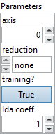

<h1>ScatterElements</h1>

<h2>Description</h2>

ScatterElements takes three inputs <code>data</code>, <code>updates</code>, and <code>indices</code> of the same rank r &gt;= 1 and an optional attribute axis that identifies an axis of <code>data</code> (by default, the outer-most axis, that is axis 0). The output of the operation is produced by creating a copy of the input <code>data</code>, and then updating its value to values specified by <code>updates</code> at specific index positions specified by <code>indices</code>. Its output shape is the same as the shape of <code>data</code>.

For each entry in <code>updates</code>, the target index in <code>data</code> is obtained by combining the corresponding entry in <code>indices</code> with the index of the entry itself: the index-value for dimension = axis is obtained from the value of the corresponding entry in <code>indices</code> and the index-value for dimension != axis is obtained from the index of the entry itself.

<code>reduction</code> allows specification of an optional reduction operation, which is applied to all values in <code>updates</code> tensor into <code>output</code> at the specified <code>indices</code>. In cases where <code>reduction</code> is set to “none”, indices should not have duplicate entries: that is, if idx1 != idx2, then indices[idx1] != indices[idx2]. For instance, in a 2-D tensor case, the update corresponding to the [j] entry is performed as below:

output

[

indices

[

i

][

j

]][

j

]

=

updates

[

i

][

j

]

if

axis

=

0

,

output

[

i

][

indices

[

i

][

j

]]

=

updates

[

i

][

j

]

if

axis

=

1

,

When <code>reduction</code> is set to some reduction function <code>f</code>, the update corresponding to the [j] entry is performed as below:

output

[

indices

[

i

][

j

]][

j

]

=

f

(

output

[

indices

[

i

][

j

]][

j

],

updates

[

i

][

j

])

if

axis

=

0

,

output

[

i

][

indices

[

i

][

j

]]

=

f

(

output

[

i

][

indices

[

i

][

j

]],

updates

[

i

][

j

])

if

axis

=

1

,

where the <code>f</code> is <code>+</code>, <code>*</code>, <code>max</code> or <code>min</code> as specified.

This operator is the inverse of GatherElements. It is similar to Torch’s Scatter operation.

<h3>Input parameters</h3>

<table>
  <tbody>
    <tr>
      <td width="64" valign="top"></td>
      <td valign="top"><strong><a href="../../../../../../more-deep-learning/nodes-parameters/specified_outputs_name/README.md">specified_outputs_name</a> : <em>array, </em></strong>this parameter lets you manually assign custom names to the output tensors of a node.</td>
    </tr>
  </tbody>
</table>

<table>
  <tbody>
    <tr>
      <td valign="top" width="70%"><table>
  <tbody>
    <tr>
      <td width="64" valign="top"></td>
      <td valign="top"><strong>Graphs in :</strong> <strong><em>cluster,</em></strong> ONNX model architecture.</td>
    </tr>
    <tr>
      <td></td>
      <td valign="top"><table>
  <tbody>
    <tr>
      <td width="64" valign="top"></td>
      <td valign="top"><strong>data (heterogeneous) – T : <em>object, </em></strong>tensor of rank r >= 1.</td>
    </tr>
    <tr>
      <td width="64" valign="top"></td>
      <td valign="top"><strong>indices (heterogeneous) – Tind : <em>object, </em></strong>tensor of int32/int64 indices, of r >= 1 (same rank as input). All index values are expected to be within bounds [-s, s-1] along axis of size s. It is an error if any of the index values are out of bounds.</td>
    </tr>
    <tr>
      <td width="64" valign="top"></td>
      <td valign="top"><strong>updates (heterogeneous) – T : <em>object, </em></strong>tensor of rank r >=1 (same rank and shape as indices).</td>
    </tr>
  </tbody>
</table></td>
    </tr>
  </tbody>
</table></td>
      <td valign="top" width="30%">

</td>
    </tr>
  </tbody>
</table>

<table>
  <tbody>
    <tr>
      <td valign="top" width="70%"><table>
  <tbody>
    <tr>
      <td width="64" valign="top"></td>
      <td valign="top"><strong>Parameters : <em>cluster,</em></strong></td>
    </tr>
    <tr>
      <td></td>
      <td valign="top"><table>
  <tbody>
    <tr>
      <td width="64" valign="top"></td>
      <td valign="top"><strong>axis : <em>integer,</em></strong> which axis to scatter on. Negative value means counting dimensions from the back. Accepted range is [-r, r-1] where r = rank(data).</td>
    </tr>
    <tr>
      <td width="64" valign="top"></td>
      <td valign="top">Default value “0”.</td>
    </tr>
    <tr>
      <td width="64" valign="top"></td>
      <td valign="top"><strong>reduction : <em>enum,</em></strong> type of reduction to apply : none, add, mul, max, min. ‘none’: no reduction applied. ‘add’: reduction using the addition operation. ‘mul’: reduction using the multiplication operation.‘max’: reduction using the maximum operation.‘min’: reduction using the minimum operation.</td>
    </tr>
    <tr>
      <td width="64" valign="top"></td>
      <td valign="top">Default value “none”.</td>
    </tr>
    <tr>
      <td width="64" valign="top"></td>
      <td valign="top"><strong>training? :</strong> <em><strong>boolean</strong></em>, whether the layer is in training mode (can store data for backward).</td>
    </tr>
    <tr>
      <td width="64" valign="top"></td>
      <td valign="top">Default value “True”.</td>
    </tr>
    <tr>
      <td width="64" valign="top"></td>
      <td valign="top"><strong>lda coeff :</strong> <em><strong>float</strong></em>, defines the coefficient by which the loss derivative will be multiplied before being sent to the previous layer (since during the backward run we go backwards).</td>
    </tr>
    <tr>
      <td width="64" valign="top"></td>
      <td valign="top">Default value “1”.</td>
    </tr>
  </tbody>
</table></td>
    </tr>
    <tr>
      <td width="64" valign="top"></td>
      <td valign="top"><strong>name (optional) :</strong> <em><strong>string,</strong></em> name of the node.</td>
    </tr>
  </tbody>
</table></td>
      <td valign="top" width="30%">

</td>
    </tr>
  </tbody>
</table>

<h3>Output parameters</h3>

<table>
  <tbody>
    <tr>
      <td width="64" valign="top"></td>
      <td valign="top"><strong>output (heterogeneous) – T : <em>object, </em></strong>tensor of rank r >= 1 (same rank as input).</td>
    </tr>
  </tbody>
</table>

<h2>Type Constraints</h2>

<strong>T</strong> in (<code>tensor(bfloat16)</code>, <code>tensor(bool)</code>, <code>tensor(complex128)</code>, <code>tensor(complex64)</code>, <code>tensor(double)</code>, <code>tensor(float)</code>, <code>tensor(float16)</code>,  <code>tensor(int16)</code>, <code>tensor(int32)</code>, <code>tensor(int64)</code>, <code>tensor(int8)</code>, <code>tensor(string)</code>, <code>tensor(uint16)</code>, <code>tensor(uint32)</code>, <code>tensor(uint64)</code>, <code>tensor(uint8)</code>) : Input and output types can be of any tensor type.

<strong>Tind</strong> in (<code>tensor(int32)</code>, <code>tensor(int64)</code>) : Constrain indices to integer types

<h2>Example</h2>

All these exemples are snippets PNG, you can drop these Snippet onto the block diagram and get the depicted code added to your VI (Do not forget to install Deep Learning library to run it).

