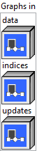
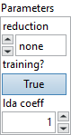

<h1>ScatterND</h1>

<h2>Description</h2>

ScatterND takes three inputs <code>data</code> tensor of rank r &gt;= 1, <code>indices</code> tensor of rank q &gt;= 1, and <code>updates</code> tensor of rank q + r – indices.shape[-1] – 1. The output of the operation is produced by creating a copy of the input <code>data</code>, and then updating its value to values specified by <code>updates</code> at specific index positions specified by <code>indices</code>. Its output shape is the same as the shape of <code>data</code>.

<code>indices</code> is an integer tensor. Let k denote indices.shape[-1], the last dimension in the shape of <code>indices</code>. <code>indices</code> is treated as a (q-1)-dimensional tensor of k-tuples, where each k-tuple is a partial-index into <code>data</code>. Hence, k can be a value at most the rank of <code>data</code>. When k equals rank(data), each update entry specifies an update to a single element of the tensor. When k is less than rank(data) each update entry specifies an update to a slice of the tensor. Index values are allowed to be negative, as per the usual convention for counting backwards from the end, but are expected in the valid range.

<code>updates</code> is treated as a (q-1)-dimensional tensor of replacement-slice-values. Thus, the first (q-1) dimensions of updates.shape must match the first (q-1) dimensions of indices.shape. The remaining dimensions of <code>updates</code> correspond to the dimensions of the replacement-slice-values. Each replacement-slice-value is a (r-k) dimensional tensor, corresponding to the trailing (r-k) dimensions of <code>data</code>. Thus, the shape of <code>updates</code> must equal indices.shape[0:q-1] ++ data.shape[k:r-1], where ++ denotes the concatenation of shapes.

The <code>output</code> is calculated via the following equation:

output

=

np

.

copy

(

data

)

update_indices

=

indices

.

shape

[:

-

1

]

for

idx

in

np

.

ndindex

(

update_indices

):

output

[

indices

[

idx

]]

=

updates

[

idx

]

The order of iteration in the above loop is not specified. In particular, indices should not have duplicate entries: that is, if idx1 != idx2, then indices[idx1] != indices[idx2]. This ensures that the output value does not depend on the iteration order.

<code>reduction</code> allows specification of an optional reduction operation, which is applied to all values in <code>updates</code> tensor into <code>output</code> at the specified <code>indices</code>. In cases where <code>reduction</code> is set to “none”, indices should not have duplicate entries: that is, if idx1 != idx2, then indices[idx1] != indices[idx2]. This ensures that the output value does not depend on the iteration order. When <code>reduction</code> is set to some reduction function <code>f</code>, <code>output</code> is calculated as follows:

output

=

np

.

copy

(

data

)

update_indices

=

indices

.

shape

[:

-

1

]

for

idx

in

np

.

ndindex

(

update_indices

):

output

[

indices

[

idx

]]

=

f

(

output

[

indices

[

idx

]],

updates

[

idx

])

where the <code>f</code> is <code>+</code>, <code>*</code>, <code>max</code> or <code>min</code> as specified.

This operator is the inverse of GatherND.

<h3>Input parameters</h3>

<table>
  <tbody>
    <tr>
      <td width="64" valign="top"></td>
      <td valign="top"><strong><a href="../../../../../../more-deep-learning/nodes-parameters/specified_outputs_name/README.md">specified_outputs_name</a> : <em>array, </em></strong>this parameter lets you manually assign custom names to the output tensors of a node.</td>
    </tr>
  </tbody>
</table>

<table>
  <tbody>
    <tr>
      <td valign="top" width="70%"><table>
  <tbody>
    <tr>
      <td width="64" valign="top"></td>
      <td valign="top"><strong>Graphs in :</strong> <strong><em>cluster,</em></strong> ONNX model architecture.</td>
    </tr>
    <tr>
      <td></td>
      <td valign="top"><table>
  <tbody>
    <tr>
      <td width="64" valign="top"></td>
      <td valign="top"><strong>data (heterogeneous) – T : <em>object, </em></strong>tensor of rank r >= 1.</td>
    </tr>
    <tr>
      <td width="64" valign="top"></td>
      <td valign="top"><strong>indices (heterogeneous) – tensor(int64) : <em>object, </em></strong>tensor of rank q >= 1.</td>
    </tr>
    <tr>
      <td width="64" valign="top"></td>
      <td valign="top"><strong>updates (heterogeneous) – T : <em>object, </em></strong>tensor of rank q + r – indices_shape[-1] – 1.</td>
    </tr>
  </tbody>
</table></td>
    </tr>
  </tbody>
</table></td>
      <td valign="top" width="30%">

</td>
    </tr>
  </tbody>
</table>

<table>
  <tbody>
    <tr>
      <td valign="top" width="70%"><table>
  <tbody>
    <tr>
      <td width="64" valign="top"></td>
      <td valign="top"><strong>Parameters : <em>cluster,</em></strong></td>
    </tr>
    <tr>
      <td></td>
      <td valign="top"><table>
  <tbody>
    <tr>
      <td width="64" valign="top"></td>
      <td valign="top"><strong>reduction : <em>enum,</em></strong> type of reduction to apply: none (default), add, mul, max, min. ‘none’: no reduction applied. ‘add’: reduction using the addition operation. ‘mul’: reduction using the addition operation. ‘max’: reduction using the maximum operation.‘min’: reduction using the minimum operation.</td>
    </tr>
    <tr>
      <td width="64" valign="top"></td>
      <td valign="top">Default value “none”.</td>
    </tr>
    <tr>
      <td width="64" valign="top"></td>
      <td valign="top"><strong>training? :</strong> <em><strong>boolean</strong></em>, whether the layer is in training mode (can store data for backward).</td>
    </tr>
    <tr>
      <td width="64" valign="top"></td>
      <td valign="top">Default value “True”.</td>
    </tr>
    <tr>
      <td width="64" valign="top"></td>
      <td valign="top"><strong>lda coeff :</strong> <em><strong>float</strong></em>, defines the coefficient by which the loss derivative will be multiplied before being sent to the previous layer (since during the backward run we go backwards).</td>
    </tr>
    <tr>
      <td width="64" valign="top"></td>
      <td valign="top">Default value “1”.</td>
    </tr>
  </tbody>
</table></td>
    </tr>
    <tr>
      <td width="64" valign="top"></td>
      <td valign="top"><strong>name (optional) :</strong> <em><strong>string,</strong></em> name of the node.</td>
    </tr>
  </tbody>
</table></td>
      <td valign="top" width="30%">

</td>
    </tr>
  </tbody>
</table>

<h3>Output parameters</h3>

<table>
  <tbody>
    <tr>
      <td width="64" valign="top"></td>
      <td valign="top"><strong>output (heterogeneous) – T : <em>object, </em></strong>tensor of rank r >= 1.</td>
    </tr>
  </tbody>
</table>

<h2>Type Constraints</h2>

<strong>T</strong> in (<code>tensor(bfloat16)</code>, <code>tensor(bool)</code>, <code>tensor(complex128)</code>, <code>tensor(complex64)</code>, <code>tensor(double)</code>, <code>tensor(float)</code>, <code>tensor(float16)</code>,  <code>tensor(int16)</code>, <code>tensor(int32)</code>, <code>tensor(int64)</code>, <code>tensor(int8)</code>, <code>tensor(string)</code>, <code>tensor(uint16)</code>, <code>tensor(uint32)</code>, <code>tensor(uint64)</code>, <code>tensor(uint8)</code>) : Constrain input and output types to any tensor type.

<h2>Example</h2>

All these exemples are snippets PNG, you can drop these Snippet onto the block diagram and get the depicted code added to your VI (Do not forget to install Deep Learning library to run it).

