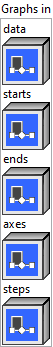

<h1>Slice</h1>

<h2>Description</h2>

Produces a slice of the input tensor along multiple axes. Similar to numpy : <a href="https://numpy.org/doc/stable/user/basics.indexing.html?highlight=slice#slicing-and-striding">https://numpy.org/doc/stable/user/basics.indexing.html?highlight=slice#slicing-and-striding</a>

Slice uses the <code>starts</code>, <code>ends</code>, <code>axes</code> and <code>steps</code> inputs to select a sub-tensor of its input <code>data</code> tensor.

An effective <code>starts</code>, <code>ends</code>, and <code>steps</code> must be computed for each <code>i</code> in <code>[0, ... r-1]</code> where <code>r = rank(input)</code> as follows:

If <code>axes</code> are omitted, they are set to <code>[0, ..., r-1]</code>. If <code>steps</code> are omitted, they are set to <code>[1, ..., 1]</code> of length <code>len(starts)</code>

The effective values are initialized as <code>start = 0</code>, <code>ends = dims</code> where <code>dims</code> are the dimensions of <code>input</code> and <code>steps = 1</code>.

All negative elements of <code>axes</code> are made non-negative by adding <code>r</code> to them, where <code>r =rank(input)</code>.

All negative values in <code>starts</code> and <code>ends</code> have <code>dims[axes]</code> added to them, where <code>dims</code> are the dimensions of <code>input</code>. Then <code>start[axes]</code> is the adjusted <code>starts</code> is clamped into the range <code>[0, dims[axes]]</code> for positive stepping and <code>[0, dims[axes]-1]</code> for negative stepping.

The clamping for the adjusted <code>ends</code> depends on the sign of <code>steps</code> and must accommodate copying 0 through <code>dims[axes]</code> elements, so for positive stepping <code>ends[axes]</code> is clamped to <code>[0, dims[axes]]</code>, while for negative stepping it is clamped to <code>[-1, dims[axes]-1]</code>.

Finally, <code>steps[axes] = steps</code>.

For slicing to the end of a dimension with unknown size, it is recommended to pass in <code>INT_MAX</code> when slicing forward and ‘INT_MIN’ when slicing backward.

<h3>Input parameters</h3>

<table>
  <tbody>
    <tr>
      <td width="64" valign="top"></td>
      <td valign="top"><strong><a href="../../../../../../more-deep-learning/nodes-parameters/specified_outputs_name/README.md">specified_outputs_name</a> : <em>array, </em></strong>this parameter lets you manually assign custom names to the output tensors of a node.</td>
    </tr>
  </tbody>
</table>

<table>
  <tbody>
    <tr>
      <td valign="top" width="70%"><table>
  <tbody>
    <tr>
      <td width="64" valign="top"></td>
      <td valign="top"><strong>Graphs in :</strong> <strong><em>cluster,</em></strong> ONNX model architecture.</td>
    </tr>
    <tr>
      <td></td>
      <td valign="top"><table>
  <tbody>
    <tr>
      <td width="64" valign="top"></td>
      <td valign="top"><strong>data (heterogeneous) – T : <em>object, </em></strong>tensor of data to extract slices from.</td>
    </tr>
    <tr>
      <td width="64" valign="top"></td>
      <td valign="top"><strong>starts (heterogeneous) – Tind : <em>object, </em></strong>1-D tensor of starting indices of corresponding axis in <code>axes</code>.</td>
    </tr>
    <tr>
      <td width="64" valign="top"></td>
      <td valign="top"><strong>ends (heterogeneous) – Tind : <em>object, </em></strong>1-D tensor of ending indices (exclusive) of corresponding axis in <code>axes</code>.</td>
    </tr>
    <tr>
      <td width="64" valign="top"></td>
      <td valign="top"><strong>axes (optional, heterogeneous) – Tind : <em>object, </em></strong>1-D tensor of axes that <code>starts</code> and <code>ends</code> apply to. Negative value means counting dimensions from the back. Accepted range is [-r, r-1] where r = rank(data). Behavior is undefined if an axis is repeated.</td>
    </tr>
    <tr>
      <td width="64" valign="top"></td>
      <td valign="top"><strong>steps (optional, heterogeneous) – Tind : <em>object, </em></strong>1-D tensor of slice step of corresponding axis in <code>axes</code>. Negative value means slicing backward. ‘steps’ cannot be 0. Defaults to 1s.</td>
    </tr>
  </tbody>
</table></td>
    </tr>
  </tbody>
</table></td>
      <td valign="top" width="30%">

</td>
    </tr>
  </tbody>
</table>

<table>
  <tbody>
    <tr>
      <td valign="top" width="70%">
<strong>Parameters : <em>cluster,</em></strong>

<table>
  <tbody>
    <tr>
      <td width="64" valign="top"></td>
      <td valign="top"><strong>training? :</strong> <em><strong>boolean</strong></em>, whether the layer is in training mode (can store data for backward).</td>
    </tr>
    <tr>
      <td width="64" valign="top"></td>
      <td valign="top">Default value “True”.</td>
    </tr>
    <tr>
      <td width="64" valign="top"></td>
      <td valign="top"><strong>lda coeff :</strong> <em><strong>float</strong></em>, defines the coefficient by which the loss derivative will be multiplied before being sent to the previous layer (since during the backward run we go backwards).</td>
    </tr>
    <tr>
      <td width="64" valign="top"></td>
      <td valign="top">Default value “1”.</td>
    </tr>
    <tr>
      <td width="64" valign="top"></td>
      <td valign="top"><strong>name (optional) :</strong> <em><strong>string,</strong></em> name of the node.</td>
    </tr>
  </tbody>
</table></td>
      <td valign="top" width="30%">

</td>
    </tr>
  </tbody>
</table>

<h3>Output parameters</h3>

<table>
  <tbody>
    <tr>
      <td width="64" valign="top"></td>
      <td valign="top"><strong>output (heterogeneous) – T : <em>object, </em></strong>sliced data tensor.</td>
    </tr>
  </tbody>
</table>

<h2>Type Constraints</h2>

<strong>T</strong> in (<code>tensor(bfloat16)</code>, <code>tensor(bool)</code>, <code>tensor(complex128)</code>, <code>tensor(complex64)</code>, <code>tensor(double)</code>, <code>tensor(float)</code>, <code>tensor(float16)</code>,  <code>tensor(int16)</code>, <code>tensor(int32)</code>, <code>tensor(int64)</code>, <code>tensor(int8)</code>, <code>tensor(string)</code>, <code>tensor(uint16)</code>, <code>tensor(uint32)</code>, <code>tensor(uint64)</code>, <code>tensor(uint8)</code>) : Constrain input and output types to all tensor types.

<strong>Tind</strong> in (<code>tensor(int32)</code>, <code>tensor(int64)</code>) : Constrain indices to integer types

<h2>Example</h2>

All these exemples are snippets PNG, you can drop these Snippet onto the block diagram and get the depicted code added to your VI (Do not forget to install Deep Learning library to run it).

