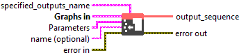
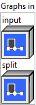
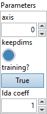

<h1>SplitToSequence</h1>

<h2>Description</h2>

Split a tensor into a sequence of tensors, along the specified ‘axis’. Lengths of the parts can be specified using the optional argument ‘split’. If the argument <code>split' is not specified, a default scalar value of 1 is used as the value of </code>split’. ‘split’ must contain only positive numbers. ‘split’ is either a scalar (tensor of empty shape), or a 1-D tensor. If ‘split’ is a scalar, then ‘input’ will be split into chunks all of size ‘split’ if possible. The last chunk alone may be smaller than ‘split’ if the ‘input’ size along the given axis ‘axis’ is not divisible by ‘split’. If ‘split’ is a 1-dimensional tensor, the input tensor is split into ‘size(split)’ chunks, with lengths of the parts on ‘axis’ specified in ‘split’. In this scenario, the sum of entries in ‘split’ must be equal to the dimension size of input tensor on ‘axis’.

<h3>Input parameters</h3>

<table>
  <tbody>
    <tr>
      <td width="64" valign="top"></td>
      <td valign="top"><strong><a href="../../../../../../more-deep-learning/nodes-parameters/specified_outputs_name/README.md">specified_outputs_name</a> : <em>array, </em></strong>this parameter lets you manually assign custom names to the output tensors of a node.</td>
    </tr>
  </tbody>
</table>

<table>
  <tbody>
    <tr>
      <td valign="top" width="70%"><table>
  <tbody>
    <tr>
      <td width="64" valign="top"></td>
      <td valign="top"><strong>Graphs in :</strong> <strong><em>cluster,</em></strong> ONNX model architecture.</td>
    </tr>
    <tr>
      <td></td>
      <td valign="top"><table>
  <tbody>
    <tr>
      <td width="64" valign="top"></td>
      <td valign="top"><strong>input (heterogeneous) – T : <em>object, </em></strong>the tensor to split.</td>
    </tr>
    <tr>
      <td width="64" valign="top"></td>
      <td valign="top"><strong>split (optional, heterogeneous) – I : <em>object, </em></strong>length of each output. It can be either a scalar(tensor of empty shape), or a 1-D tensor. All values must be >= 0.</td>
    </tr>
  </tbody>
</table></td>
    </tr>
  </tbody>
</table></td>
      <td valign="top" width="30%">

</td>
    </tr>
  </tbody>
</table>

<table>
  <tbody>
    <tr>
      <td valign="top" width="70%"><table>
  <tbody>
    <tr>
      <td width="64" valign="top"></td>
      <td valign="top"><strong>Parameters : <em>cluster,</em></strong></td>
    </tr>
    <tr>
      <td></td>
      <td valign="top"><table>
  <tbody>
    <tr>
      <td width="64" valign="top"></td>
      <td valign="top"><strong>axis: <em>integer,</em></strong> which axis to split on. A negative value means counting dimensions from the back. Accepted range is [-rank, rank-1].</td>
    </tr>
    <tr>
      <td width="64" valign="top"></td>
      <td valign="top">Default value “0”.</td>
    </tr>
    <tr>
      <td width="64" valign="top"></td>
      <td valign="top"><strong>keepdims :</strong> <em><strong>boolean</strong></em>, keep the split dimension or not. True, which means we keep split dimension. If input ‘split’ is specified, this attribute is ignored.</td>
    </tr>
    <tr>
      <td width="64" valign="top"></td>
      <td valign="top">Default value “True”.</td>
    </tr>
    <tr>
      <td width="64" valign="top"></td>
      <td valign="top"><strong>training? :</strong> <em><strong>boolean</strong></em>, whether B should be transposed on the last two dimensions before doing multiplication.</td>
    </tr>
    <tr>
      <td width="64" valign="top"></td>
      <td valign="top">Default value “True”.</td>
    </tr>
    <tr>
      <td width="64" valign="top"></td>
      <td valign="top"><strong>lda coeff :</strong> <em><strong>float</strong></em>, defines the coefficient by which the loss derivative will be multiplied before being sent to the previous layer (since during the backward run we go backwards).</td>
    </tr>
    <tr>
      <td width="64" valign="top"></td>
      <td valign="top">Default value “1”.</td>
    </tr>
  </tbody>
</table></td>
    </tr>
    <tr>
      <td width="64" valign="top"></td>
      <td valign="top"><strong>name (optional) :</strong> <em><strong>string,</strong></em> name of the node.</td>
    </tr>
  </tbody>
</table></td>
      <td valign="top" width="30%">

</td>
    </tr>
  </tbody>
</table>

<h3>Output parameters</h3>

<table>
  <tbody>
    <tr>
      <td width="64" valign="top"></td>
      <td valign="top"><strong>output_sequence (heterogeneous) – S : <em>object, </em></strong>one or more outputs forming a sequence of tensors after splitting.</td>
    </tr>
  </tbody>
</table>

<h2>Type Constraints</h2>

<strong>T</strong> in (<code>tensor(bool)</code>, <code>tensor(complex128)</code>, <code>tensor(complex64)</code>, <code>tensor(double)</code>, <code>tensor(float)</code>, <code>tensor(float16)</code>, <code>tensor(int16)</code>,  <code>tensor(int32)</code>, <code>tensor(int64)</code>, <code>tensor(int8)</code>, <code>tensor(string)</code>, <code>tensor(uint16)</code>, <code>tensor(uint32)</code>, <code>tensor(uint64)</code>, <code>tensor(uint8)</code>) : Constrain input types to all tensor types.

<strong>I</strong> in (<code>tensor(int32)</code>, <code>tensor(int64)</code>) : Constrain split size to integral tensor.

<strong>S</strong> in (<code>seq(tensor(bool))</code>, <code>seq(tensor(complex128))</code>, <code>seq(tensor(complex64))</code>, <code>seq(tensor(double))</code>, <code>seq(tensor(float))</code>,  <code>seq(tensor(float16))</code>, <code>seq(tensor(int16))</code>, <code>seq(tensor(int32))</code>, <code>seq(tensor(int64))</code>, <code>seq(tensor(int8))</code>, <code>seq(tensor(string))</code>, <code>seq(tensor(uint16))</code>, <code>seq(tensor(uint32))</code>, <code>seq(tensor(uint64))</code>, <code>seq(tensor(uint8))</code>) : Constrain output types to all tensor types.

<h2>Example</h2>

All these exemples are snippets PNG, you can drop these Snippet onto the block diagram and get the depicted code added to your VI (Do not forget to install Deep Learning library to run it).

