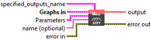
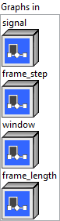
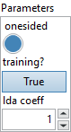

<h1>STFT</h1>

<h2>Description</h2>

Computes the Short-time Fourier Transform of the signal.

<h3>Input parameters</h3>

<table>
  <tbody>
    <tr>
      <td width="64" valign="top"></td>
      <td valign="top"><strong><a href="../../../../../../more-deep-learning/nodes-parameters/specified_outputs_name/README.md">specified_outputs_name</a> : <em>array, </em></strong>this parameter lets you manually assign custom names to the output tensors of a node.</td>
    </tr>
  </tbody>
</table>

<table>
  <tbody>
    <tr>
      <td valign="top" width="70%"><table>
  <tbody>
    <tr>
      <td width="64" valign="top"></td>
      <td valign="top"><strong>Graphs in :</strong> <strong><em>cluster,</em></strong> ONNX model architecture.</td>
    </tr>
    <tr>
      <td></td>
      <td valign="top"><table>
  <tbody>
    <tr>
      <td width="64" valign="top"></td>
      <td valign="top"><strong>signal (heterogeneous) – T1 : <em>object, </em></strong>input tensor representing a real or complex valued signal. For real input, the following shape is expected: [batch_size][signal_length][1]. For complex input, the following shape is expected: [batch_size][signal_length][2], where [batch_size][signal_length][0] represents the real component and [batch_size][signal_length][1] represents the imaginary component of the signal.</td>
    </tr>
    <tr>
      <td width="64" valign="top"></td>
      <td valign="top"><strong>frame_step (heterogeneous) – T2 : <em>object, </em></strong>the number of samples to step between successive DFTs.</td>
    </tr>
    <tr>
      <td width="64" valign="top"></td>
      <td valign="top"><strong>window (optional, heterogeneous) – T1 : <em>object, </em></strong>a tensor representing the window that will be slid over the signal.The window must have rank 1 with shape: [window_shape]. It’s an optional value.</td>
    </tr>
    <tr>
      <td width="64" valign="top"></td>
      <td valign="top"><strong>frame_length (optional, heterogeneous) – T2 : <em>object, </em></strong>a scalar representing the size of the DFT. It’s an optional value.</td>
    </tr>
  </tbody>
</table></td>
    </tr>
  </tbody>
</table></td>
      <td valign="top" width="30%">

</td>
    </tr>
  </tbody>
</table>

<table>
  <tbody>
    <tr>
      <td valign="top" width="70%"><table>
  <tbody>
    <tr>
      <td width="64" valign="top"></td>
      <td valign="top"><strong>Parameters : <em>cluster,</em></strong></td>
    </tr>
    <tr>
      <td></td>
      <td valign="top"><table>
  <tbody>
    <tr>
      <td width="64" valign="top"></td>
      <td valign="top"><strong>onesided :</strong> <em><strong>boolean</strong></em>, if onesided is true, only values for w in [0, 1, 2, …, floor(n_fft/2) + 1] are returned because the real-to-complex Fourier transform satisfies the conjugate symmetry, i.e., X[m, w] = X[m,w]=X[m,n_fft-w]*. Note if the input or window tensors are complex, then onesided output is not possible. Enabling onesided with real inputs performs a Real-valued fast Fourier transform (RFFT).</td>
    </tr>
    <tr>
      <td width="64" valign="top"></td>
      <td valign="top">Default value “True”.</td>
    </tr>
    <tr>
      <td width="64" valign="top"></td>
      <td valign="top"><strong>training? :</strong> <em><strong>boolean</strong></em>, whether B should be transposed on the last two dimensions before doing multiplication.</td>
    </tr>
    <tr>
      <td width="64" valign="top"></td>
      <td valign="top">Default value “True”.</td>
    </tr>
    <tr>
      <td width="64" valign="top"></td>
      <td valign="top"><strong>lda coeff :</strong> <em><strong>float</strong></em>, defines the coefficient by which the loss derivative will be multiplied before being sent to the previous layer (since during the backward run we go backwards).</td>
    </tr>
    <tr>
      <td width="64" valign="top"></td>
      <td valign="top">Default value “1”.</td>
    </tr>
  </tbody>
</table></td>
    </tr>
    <tr>
      <td width="64" valign="top"></td>
      <td valign="top"><strong>name (optional) :</strong> <em><strong>string,</strong></em> name of the node.</td>
    </tr>
  </tbody>
</table></td>
      <td valign="top" width="30%">

</td>
    </tr>
  </tbody>
</table>

<h3>Output parameters</h3>

<table>
  <tbody>
    <tr>
      <td width="64" valign="top"></td>
      <td valign="top"><strong>output (heterogeneous) – T1 : <em>object, </em></strong>the Short-time Fourier Transform of the signals.If onesided is 1, the output has the shape: [batch_size][frames][dft_unique_bins][2], where dft_unique_bins is frame_length // 2 + 1 (the unique components of the DFT) If onesided is 0, the output has the shape: [batch_size][frames][frame_length][2], where frame_length is the length of the DFT.</td>
    </tr>
  </tbody>
</table>

<h2>Type Constraints</h2>

<strong>T1</strong> in (<code>tensor(bfloat16)</code>, <code>tensor(double)</code>, <code>tensor(float)</code>, <code>tensor(float16)</code>) : Constrain signal and output to float tensors.

<strong>T2</strong> in (<code>tensor(int32)</code>, <code>tensor(int64)</code>) : Constrain scalar length types to int64_t.

<h2>Example</h2>

All these exemples are snippets PNG, you can drop these Snippet onto the block diagram and get the depicted code added to your VI (Do not forget to install Deep Learning library to run it).

