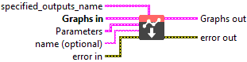
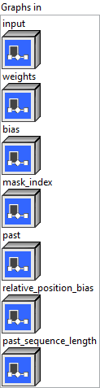
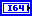
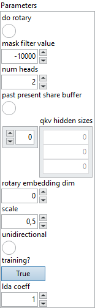

<h1>Attention</h1>

<h2>Description</h2>

Multi-Head Attention that can be either unidirectional (like GPT-2) or bidirectional (like BERT).

The weights for input projection of Q, K and V are merged. The data is stacked on the second dimension. Its shape is (input_hidden_size, hidden_size + hidden_size + v_hidden_size). Here hidden_size is the hidden dimension of Q and K, and v_hidden_size is that of V.

The mask_index is optional. Besides raw attention mask with shape (batch_size, total_sequence_length) or (batch_size, sequence_length, total_sequence_length) with value 0 for masked and 1 otherwise, we support other two formats: When input has right-side padding, mask_index is one dimension with shape (batch_size), where value is actual sequence length excluding padding. When input has left-side padding, mask_index has shape (2 * batch_size), where the values are the exclusive end positions followed by the inclusive start positions.

When unidirectional is 1, each token only attends to previous tokens.

Both past and present state are optional. They shall be used together, and not allowed to use only one of them. The qkv_hidden_sizes is required only when K and V have different hidden sizes.

When there is past state, hidden dimension for Q, K and V shall be the same.

The total_sequence_length is past_sequence_length + kv_sequence_length. Here kv_sequence_length is the length of K or V. For self attention, kv_sequence_length equals to sequence_length (sequence length of Q). For cross attention, query and key might have different lengths.

<table>
  <tbody>
    <tr>
      <td width="64" valign="top"></td>
      <td valign="top">

<h3>Input parameters</h3>

 <strong><a href="../../../../../../more-deep-learning/nodes-parameters/specified_outputs_name/README.md">specified_outputs_name</a> : <em>array, </em></strong>this parameter lets you manually assign custom names to the output tensors of a node.

</td>
    </tr>
  </tbody>
</table>

<table>
  <tbody>
    <tr>
      <td valign="top" width="70%"><table>
  <tbody>
    <tr>
      <td width="64" valign="top"></td>
      <td valign="top"><strong>Graphs in :</strong> <strong><em>cluster,</em></strong> ONNX model architecture.</td>
    </tr>
    <tr>
      <td></td>
      <td valign="top"><table>
  <tbody>
    <tr>
      <td width="64" valign="top"></td>
      <td valign="top"><strong>input – T : <em>object, </em></strong>input tensor with shape (batch_size, sequence_length, input_hidden_size).</td>
    </tr>
    <tr>
      <td width="64" valign="top"></td>
      <td valign="top"><strong>weights – T : <em>object, </em></strong>merged Q/K/V weights with shape (input_hidden_size, hidden_size + hidden_size + v_hidden_size).</td>
    </tr>
    <tr>
      <td width="64" valign="top"></td>
      <td valign="top"><strong>bias – T : <em>object, </em></strong>bias tensor with shape (hidden_size + hidden_size + v_hidden_size) for input projection.</td>
    </tr>
    <tr>
      <td width="64" valign="top"></td>
      <td valign="top"><strong>mask_index – M : <em>object, </em></strong>attention mask with shape (batch_size, 1, max_sequence_length, max_sequence_length), (batch_size, total_sequence_length) or (batch_size, sequence_length, total_sequence_length), or index with shape (batch_size) or (2 * batch_size) or (3 * batch_size + 2).</td>
    </tr>
    <tr>
      <td width="64" valign="top"></td>
      <td valign="top"><strong>past – T : <em>object, </em></strong>past state for key and value with shape (2, batch_size, num_heads, past_sequence_length, head_size)When past_present_share_buffer is set, its shape is (2, batch_size, num_heads, max_sequence_length, head_size).</td>
    </tr>
    <tr>
      <td width="64" valign="top"></td>
      <td valign="top"><strong>relative_position_bias</strong> <strong>– T : <em>object, </em></strong>additional add to QxK’ with shape (batch_size or 1, num_heads or 1, sequence_length, total_sequence_length).</td>
    </tr>
    <tr>
      <td width="64" valign="top"></td>
      <td valign="top"><strong>past_sequence_length – M : <em>object, </em></strong>when past_present_share_buffer is used, it is required to specify past_sequence_length (could be 0).</td>
    </tr>
  </tbody>
</table></td>
    </tr>
  </tbody>
</table></td>
      <td valign="top" width="30%">

</td>
    </tr>
  </tbody>
</table>

<table>
  <tbody>
    <tr>
      <td valign="top" width="70%"><table>
  <tbody>
    <tr>
      <td width="64" valign="top"></td>
      <td valign="top"><strong>Parameters : <em>cluster,</em></strong></td>
    </tr>
    <tr>
      <td></td>
      <td valign="top"><table>
  <tbody>
    <tr>
      <td width="64" valign="top"></td>
      <td valign="top"><strong>do rotary :</strong> <em><strong>boolean</strong></em>, whether to use rotary position embedding.</td>
    </tr>
    <tr>
      <td width="64" valign="top"></td>
      <td valign="top">Default value “False”.</td>
    </tr>
    <tr>
      <td width="64" valign="top"></td>
      <td valign="top"><strong>mask filter value : <em>float,</em></strong> the value to be filled in the attention mask.</td>
    </tr>
    <tr>
      <td width="64" valign="top"></td>
      <td valign="top">Default value “-10000”.</td>
    </tr>
    <tr>
      <td width="64" valign="top"></td>
      <td valign="top"><strong>num heads : <em>integer,</em></strong> number of attention heads.</td>
    </tr>
    <tr>
      <td width="64" valign="top"></td>
      <td valign="top">Default value “2”.</td>
    </tr>
    <tr>
      <td width="64" valign="top"></td>
      <td valign="top"><strong>past present share buffer :</strong> <em><strong>boolean</strong></em>, corresponding past and present are same tensor, its size is (2, batch_size, num_heads, max_sequence_length, head_size).</td>
    </tr>
    <tr>
      <td width="64" valign="top"></td>
      <td valign="top">Default value “False”.</td>
    </tr>
    <tr>
      <td width="64" valign="top"></td>
      <td valign="top"><strong>qkv hidden sizes : <em>array,</em></strong> hidden dimension of Q, K, V: hidden_size, hidden_size and v_hidden_size.</td>
    </tr>
    <tr>
      <td width="64" valign="top"></td>
      <td valign="top">Default value “empty”.</td>
    </tr>
    <tr>
      <td width="64" valign="top"></td>
      <td valign="top"><strong>rotary embedding dim : <em>integer,</em></strong> dimension of rotary embedding. Limited to 32, 64 or 128.</td>
    </tr>
    <tr>
      <td width="64" valign="top"></td>
      <td valign="top">Default value “0”.</td>
    </tr>
    <tr>
      <td width="64" valign="top"></td>
      <td valign="top"><strong>scale : <em>float,</em></strong> custom scale will be used if specified.</td>
    </tr>
    <tr>
      <td width="64" valign="top"></td>
      <td valign="top">Default value “0.5”.</td>
    </tr>
    <tr>
      <td width="64" valign="top"></td>
      <td valign="top"><strong>unidirectional :</strong> <em><strong>boolean</strong></em>, whether every token can only attend to previous tokens.</td>
    </tr>
    <tr>
      <td width="64" valign="top"></td>
      <td valign="top">Default value “False”.</td>
    </tr>
    <tr>
      <td width="64" valign="top"></td>
      <td valign="top"><strong>training? :</strong> <em><strong>boolean</strong></em>, whether the layer is in training mode (can store data for backward).</td>
    </tr>
    <tr>
      <td width="64" valign="top"></td>
      <td valign="top">Default value “True”.</td>
    </tr>
    <tr>
      <td width="64" valign="top"></td>
      <td valign="top"><strong>lda coeff :</strong> <em><strong>float</strong></em>, defines the coefficient by which the loss derivative will be multiplied before being sent to the previous layer (since during the backward run we go backwards).</td>
    </tr>
    <tr>
      <td width="64" valign="top"></td>
      <td valign="top">Default value “1”.</td>
    </tr>
  </tbody>
</table></td>
    </tr>
    <tr>
      <td width="64" valign="top"></td>
      <td valign="top"><strong>name (optional) :</strong> <em><strong>string,</strong></em> name of the node.</td>
    </tr>
  </tbody>
</table></td>
      <td valign="top" width="30%">

</td>
    </tr>
  </tbody>
</table>

<h3>Output parameters</h3>

<table>
  <tbody>
    <tr>
      <td valign="top" width="70%"><table>
  <tbody>
    <tr>
      <td width="64" valign="top"></td>
      <td valign="top"><strong>Graphs out :</strong> <strong><em>cluster,</em></strong> ONNX model architecture.</td>
    </tr>
    <tr>
      <td></td>
      <td valign="top"><table>
  <tbody>
    <tr>
      <td width="64" valign="top"></td>
      <td valign="top"><strong>output – T : <em>object, </em></strong>3D output tensor with shape (batch_size, sequence_length, v_hidden_size).</td>
    </tr>
    <tr>
      <td width="64" valign="top"></td>
      <td valign="top"><strong>present – T : <em>object, </em></strong>past state for key and value with shape (2, batch_size, num_heads, total_sequence_length, head_size). If past_present_share_buffer is set, its shape is (2, batch_size, num_heads, max_sequence_length, head_size), while effective_seq_length = (past_sequence_length + kv_sequence_length).</td>
    </tr>
  </tbody>
</table></td>
    </tr>
  </tbody>
</table></td>
      <td valign="top" width="30%">

</td>
    </tr>
  </tbody>
</table>

<h2>Type Constraints</h2>

<strong>T</strong> in (<code>tensor(float)</code>, <code>tensor(float16)</code>) : Constrain input and output types to float tensors.

<strong>M</strong> in (<code>tensor(int32)</code>) : Constrain mask index to integer types.

<h2>Example</h2>

All these exemples are snippets PNG, you can drop these Snippet onto the block diagram and get the depicted code added to your VI (Do not forget to install Deep Learning library to run it).

