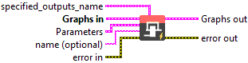
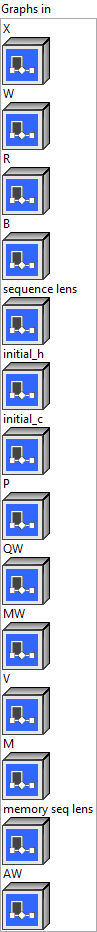
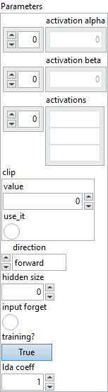
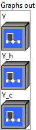

<h1>AttnLSTM</h1>

<h2>Description</h2>

Computes an one-layer RNN where its RNN Cell is an AttentionWrapper wrapped a LSTM Cell. The RNN layer contains following basic component: LSTM Cell, Bahdanau Attention Mechanism, AttentionWrapp.

<h3>Input parameters</h3>

<table>
  <tbody>
    <tr>
      <td width="64" valign="top"></td>
      <td valign="top"><strong><a href="../../../../../../more-deep-learning/nodes-parameters/specified_outputs_name/README.md">specified_outputs_name</a> : <em>array, </em></strong>this parameter lets you manually assign custom names to the output tensors of a node.</td>
    </tr>
  </tbody>
</table>

<table>
  <tbody>
    <tr>
      <td valign="top" width="70%"><table>
  <tbody>
    <tr>
      <td width="64" valign="top"></td>
      <td valign="top"><strong>Graphs in :</strong> <strong><em>cluster,</em></strong> ONNX model architecture.</td>
    </tr>
    <tr>
      <td></td>
      <td valign="top"><table>
  <tbody>
    <tr>
      <td width="64" valign="top"></td>
      <td valign="top"><strong>X – T : <em>object, </em></strong>the input sequences packed (and potentially padded) into one 3-D tensor with the shape of [seq_length, batch_size, input_size].</td>
    </tr>
    <tr>
      <td width="64" valign="top"></td>
      <td valign="top"><strong>W – T : <em>object, </em></strong>the weight tensor for the gates. Concatenation of W[iofc] and WB[iofc] (if bidirectional) along dimension 0. The tensor has shape [num_directions, 4*hidden_size, input_size].</td>
    </tr>
    <tr>
      <td width="64" valign="top"></td>
      <td valign="top"><strong>R – T : <em>object, </em></strong>the recurrence weight tensor. Concatenation of R[iofc] and RB[iofc] (if bidirectional) along dimension 0. This tensor has shape [num_directions, 4*hidden_size, hidden_size].</td>
    </tr>
    <tr>
      <td width="64" valign="top"></td>
      <td valign="top"><strong>B – T : <em>object, </em></strong>the bias tensor for input gate. Concatenation of [Wb[iofc], Rb[iofc]], and [WBb[iofc], RBb[iofc]] (if bidirectional) along dimension 0. This tensor has shape [num_directions, 8*hidden_size]. Optional: If not specified – assumed to be 0.</td>
    </tr>
    <tr>
      <td width="64" valign="top"></td>
      <td valign="top"><strong>sequence lens – T1 : </strong>object, optional tensor specifying lengths of the sequences in a batch. If not specified – assumed all sequences in the batch to have length seq_length. It has shape [batch_size].</td>
    </tr>
    <tr>
      <td width="64" valign="top"></td>
      <td valign="top"><strong>initial_h</strong> <strong>– T : <em>object, </em></strong>optional initial value of the hidden. If not specified – assumed to be 0. It has shape [num_directions, batch_size, hidden_size].</td>
    </tr>
    <tr>
      <td width="64" valign="top"></td>
      <td valign="top"><strong>initial_c</strong> <strong>– T : <em>object, </em></strong>optional initial value of the cell. If not specified – assumed to be 0. It has shape [num_directions, batch_size, hidden_size].</td>
    </tr>
    <tr>
      <td width="64" valign="top"></td>
      <td valign="top"><strong>P – T : <em>object, </em></strong>the weight tensor for peepholes. Concatenation of P[iof] and PB[iof] (if bidirectional) along dimension 0. It has shape [num_directions, 3*hidde_size]. Optional: If not specified – assumed to be 0.</td>
    </tr>
    <tr>
      <td width="64" valign="top"></td>
      <td valign="top"><strong>QW – T : <em>object, </em></strong>the weight tensor of the query layer in the attention mechanism. Should be of shape [num_directions, am_query_depth(hidden_size of lstm), am_attn_size].</td>
    </tr>
    <tr>
      <td width="64" valign="top"></td>
      <td valign="top"><strong>MW</strong> <strong>– T : <em>object, </em></strong>the weight tensor of the memory layer in the attention mechanism. Should be of shape [num_directions, memory_depth, am_attn_size].</td>
    </tr>
    <tr>
      <td width="64" valign="top"></td>
      <td valign="top"><strong>V – T : <em>object, </em></strong>the attention_v tensor in the attention mechanism. Should be of shape [num_directions, am_attn_size].</td>
    </tr>
    <tr>
      <td width="64" valign="top"></td>
      <td valign="top"><strong>M – T : <em>object, </em></strong>the sequence of the memory (input) for attention mechanism. Should be of [batch_size, max_memory_step, memory_depth].</td>
    </tr>
    <tr>
      <td width="64" valign="top"></td>
      <td valign="top"><strong>memory seq lens</strong> <strong>– T1 : <em>object, </em></strong>the sequence length of the input memory for the attention mechanism. Should be of [batch_size].</td>
    </tr>
    <tr>
      <td width="64" valign="top"></td>
      <td valign="top"><strong>AW</strong> <strong>– T : <em>object, </em></strong>the weights of attention layer in the attention wrapper. If exists, should be of shape [num_directions, memory_depth+hidden_size, aw_attn_size]. Please note that attention mechanism context depth is also memory_depth in the attention mechanism.</td>
    </tr>
  </tbody>
</table></td>
    </tr>
  </tbody>
</table></td>
      <td valign="top" width="30%">

</td>
    </tr>
  </tbody>
</table>

<table>
  <tbody>
    <tr>
      <td valign="top" width="70%"><table>
  <tbody>
    <tr>
      <td width="64" valign="top"></td>
      <td valign="top"><strong>Parameters : <em>cluster,</em></strong></td>
    </tr>
    <tr>
      <td></td>
      <td valign="top"><table>
  <tbody>
    <tr>
      <td width="64" valign="top"></td>
      <td valign="top"><strong>activation alpha :</strong> <em><strong>array</strong></em>, optional scaling values used by some activation functions. The values are consumed in the order of activation functions, for example (f, g, h) in LSTM. Default values are the same as of corresponding ONNX operators. For example with LeakyRelu, the default alpha is 0.01.</td>
    </tr>
    <tr>
      <td width="64" valign="top"></td>
      <td valign="top">Default value “empty”.</td>
    </tr>
    <tr>
      <td width="64" valign="top"></td>
      <td valign="top"><strong>activation beta :</strong> <em><strong>array</strong></em>, optional scaling values used by some activation functions. The values are consumed in the order of activation functions, for example (f, g, h) in LSTM. Default values are the same as of corresponding ONNX operators.</td>
    </tr>
    <tr>
      <td width="64" valign="top"></td>
      <td valign="top">Default value “empty”.</td>
    </tr>
    <tr>
      <td width="64" valign="top"></td>
      <td valign="top"><strong>activations : <em>array,</em></strong> a list of 3 (or 6 if bidirectional) activation functions for input, output, forget, cell, and hidden. The activation functions must be one of the activation functions specified above. Optional: See the equations for default if not specified.</td>
    </tr>
    <tr>
      <td width="64" valign="top"></td>
      <td valign="top">Default value “empty”.</td>
    </tr>
    <tr>
      <td width="64" valign="top"></td>
      <td valign="top"><strong>clip :</strong> <em><strong>float</strong></em>, cell clip threshold. Clipping bounds the elements of a tensor in the range of [-threshold, +threshold] and is applied to the input of activations. No clip if not specified.</td>
    </tr>
    <tr>
      <td width="64" valign="top"></td>
      <td valign="top">Default value “0”.</td>
    </tr>
    <tr>
      <td width="64" valign="top"></td>
      <td valign="top"><strong>direction : <em>enum,</em></strong> specify if the RNN is forward, reverse, or bidirectional. Must be one of forward, reverse, or bidirectional.</td>
    </tr>
    <tr>
      <td width="64" valign="top"></td>
      <td valign="top">Default value “forward”.</td>
    </tr>
    <tr>
      <td width="64" valign="top"></td>
      <td valign="top"><strong>hidden size : <em>integer,</em></strong> number of neurons in the hidden layer.</td>
    </tr>
    <tr>
      <td width="64" valign="top"></td>
      <td valign="top">Default value “0”.</td>
    </tr>
    <tr>
      <td width="64" valign="top"></td>
      <td valign="top"><strong>input forget :</strong> <em><strong>boolean</strong></em>, couple the input and forget gates if true.</td>
    </tr>
    <tr>
      <td width="64" valign="top"></td>
      <td valign="top">Default value “False”.</td>
    </tr>
    <tr>
      <td width="64" valign="top"></td>
      <td valign="top"><strong>training? :</strong> <em><strong>boolean</strong></em>, whether the layer is in training mode (can store data for backward).</td>
    </tr>
    <tr>
      <td width="64" valign="top"></td>
      <td valign="top">Default value “True”.</td>
    </tr>
    <tr>
      <td width="64" valign="top"></td>
      <td valign="top"><strong>lda coeff :</strong> <em><strong>float</strong></em>, defines the coefficient by which the loss derivative will be multiplied before being sent to the previous layer (since during the backward run we go backwards).</td>
    </tr>
    <tr>
      <td width="64" valign="top"></td>
      <td valign="top">Default value “1”.</td>
    </tr>
  </tbody>
</table></td>
    </tr>
    <tr>
      <td width="64" valign="top"></td>
      <td valign="top"><strong>name (optional) :</strong> <em><strong>string,</strong></em> name of the node.</td>
    </tr>
  </tbody>
</table></td>
      <td valign="top" width="30%">

</td>
    </tr>
  </tbody>
</table>

<h3>Output parameters</h3>

<table>
  <tbody>
    <tr>
      <td valign="top" width="70%"><table>
  <tbody>
    <tr>
      <td width="64" valign="top"></td>
      <td valign="top"><strong>Graphs out :</strong> <strong><em>cluster,</em></strong> ONNX model architecture.</td>
    </tr>
    <tr>
      <td></td>
      <td valign="top"><table>
  <tbody>
    <tr>
      <td width="64" valign="top"></td>
      <td valign="top"><strong>Y – T : <em>object, </em></strong>a tensor that concats all the intermediate output values of the hidden. It has shape [seq_length, num_directions, batch_size, hidden_size].</td>
    </tr>
    <tr>
      <td width="64" valign="top"></td>
      <td valign="top"><strong>Y_h – T : <em>object, </em></strong>the last output value of the hidden. It has shape [num_directions, batch_size, hidden_size].</td>
    </tr>
    <tr>
      <td width="64" valign="top"></td>
      <td valign="top"><strong>Y_c – T : <em>object, </em></strong>the last output value of the cell. It has shape [num_directions, batch_size, hidden_size].</td>
    </tr>
  </tbody>
</table></td>
    </tr>
  </tbody>
</table></td>
      <td valign="top" width="30%">

</td>
    </tr>
  </tbody>
</table>

<h2>Type Constraints</h2>

<strong>T</strong> in (<code>tensor(float)</code>, <code>tensor(double)</code>) : Constrain input and output types to float tensors.

<strong>T1</strong> in (<code>tensor(int32)</code>) : Constrain seq_lens to integral tensors.

<h2>Example</h2>

All these exemples are snippets PNG, you can drop these Snippet onto the block diagram and get the depicted code added to your VI (Do not forget to install Deep Learning library to run it).

