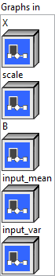
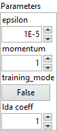
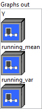

<h1>BatchNormalization</h1>

<h2>Description</h2>

Carries out batch normalization as described in the paper <a href="https://arxiv.org/abs/1502.03167">https://arxiv.org/abs/1502.03167</a>.

Depending on the mode it is being run, There are five required inputs ‘X’, ‘scale’, ‘B’, ‘input_mean’ and ‘input_var’. Note that ‘input_mean’ and ‘input_var’ are expected to be the estimated statistics in inference mode (training_mode=False, default), and the running statistics in training mode (training_mode=True). There are multiple cases for the number of outputs, which we list below:

<ul>
<li>Output case #1: Y, running_mean, running_var (training_mode=True)</li>
<li>Output case #2: Y (training_mode=False)</li>
</ul>

When training_mode=False, extra outputs are invalid. The outputs are updated as follows when training_mode=True:

running_mean

=

input_mean

*

momentum

+

current_mean

*

(

1

-

momentum

)

running_var

=

input_var

*

momentum

+

current_var

*

(

1

-

momentum

)

Y

=

(

X

-

current_mean

)

/

sqrt

(

current_var

+

epsilon

)

*

scale

+

B

where:

current_mean

=

ReduceMean

(

X

,

axis

=

all_except_channel_index

)

current_var

=

ReduceVar

(

X

,

axis

=

all_except_channel_index

)

Notice that <code>ReduceVar</code> refers to the population variance, and it equals to <code>sum(sqrd(x_i - x_avg)) / N</code> where <code>N</code> is the population size (this formula does not use sample size <code>N - 1</code>).

The computation of ReduceMean and ReduceVar uses float to avoid overflow for float16 inputs.

When training_mode=False:

Y

=

(

X

-

input_mean

)

/

sqrt

(

input_var

+

epsilon

)

*

scale

+

B

For previous (depreciated) non-spatial cases, implementors are suggested to flatten the input shape to (N x C * D1 * D2 * … * Dn) before a BatchNormalization Op. This operator has <strong>optional</strong> inputs/outputs. See <a href="https://github.com/onnx/onnx/blob/main/docs/IR.md">ONNX IR</a> for more details about the representation of optional arguments. An empty string may be used in the place of an actual argument’s name to indicate a missing argument. Trailing optional arguments (those not followed by an argument that is present) may also be simply omitted.

<h3>Input parameters</h3>

<table>
  <tbody>
    <tr>
      <td width="64" valign="top"></td>
      <td valign="top"><strong><a href="../../../../../../more-deep-learning/nodes-parameters/specified_outputs_name/README.md">specified_outputs_name</a> : <em>array, </em></strong>this parameter lets you manually assign custom names to the output tensors of a node.</td>
    </tr>
  </tbody>
</table>

<table>
  <tbody>
    <tr>
      <td valign="top" width="70%"><table>
  <tbody>
    <tr>
      <td width="64" valign="top"></td>
      <td valign="top"><strong>Graphs in :</strong> <strong><em>cluster,</em></strong> ONNX model architecture.</td>
    </tr>
    <tr>
      <td></td>
      <td valign="top"><table>
  <tbody>
    <tr>
      <td width="64" valign="top"></td>
      <td valign="top"><strong>X (heterogeneous) – T : <em>object, </em></strong>input data tensor from the previous operator; dimensions are in the form of (N x C x D1 x D2 … Dn), where N is the batch size, C is the number of channels. Statistics are computed for every channel of C over N and D1 to Dn dimensions. For image data, input dimensions become (N x C x H x W). The op also accepts single dimension input of size N in which case C is assumed to be 1.</td>
    </tr>
    <tr>
      <td width="64" valign="top"></td>
      <td valign="top"><strong>scale (heterogeneous) – T1 : <em>object, </em></strong>scale tensor of shape ©.</td>
    </tr>
    <tr>
      <td width="64" valign="top"></td>
      <td valign="top"><strong>B (heterogeneous) – T1 : <em>object, </em></strong>bias tensor of shape ©.</td>
    </tr>
    <tr>
      <td width="64" valign="top"></td>
      <td valign="top"><strong>input_mean (heterogeneous) – T2 : <em>object,</em></strong> running (training) or estimated (testing) mean tensor of shape ©.</td>
    </tr>
    <tr>
      <td width="64" valign="top"></td>
      <td valign="top"><strong>input_var</strong> <strong>(heterogeneous) </strong><strong>– T2 : <em>object, </em></strong>running (training) or estimated (testing) variance tensor of shape ©.</td>
    </tr>
  </tbody>
</table></td>
    </tr>
  </tbody>
</table></td>
      <td valign="top" width="30%">

</td>
    </tr>
  </tbody>
</table>

<table>
  <tbody>
    <tr>
      <td valign="top" width="70%"><table>
  <tbody>
    <tr>
      <td width="64" valign="top"></td>
      <td valign="top"><strong>Parameters : <em>cluster,</em></strong></td>
    </tr>
    <tr>
      <td></td>
      <td valign="top"><table>
  <tbody>
    <tr>
      <td width="64" valign="top"></td>
      <td valign="top"><strong>epsilon : <em>float,</em></strong> the epsilon value to use to avoid division by zero.</td>
    </tr>
    <tr>
      <td width="64" valign="top"></td>
      <td valign="top">Default value “1e-05”.</td>
    </tr>
    <tr>
      <td width="64" valign="top"></td>
      <td valign="top"><strong>momentum :</strong> <em><strong>float</strong></em>, factor used in computing the running mean and variance.e.g., running_mean = running_mean * momentum + mean * (1 – momentum).</td>
    </tr>
    <tr>
      <td width="64" valign="top"></td>
      <td valign="top">Default value “1”.</td>
    </tr>
    <tr>
      <td width="64" valign="top"></td>
      <td valign="top"><strong>training_mode :</strong> <em><strong>boolean</strong></em>, whether the layer is in training mode (can store data for backward).</td>
    </tr>
    <tr>
      <td width="64" valign="top"></td>
      <td valign="top">Default value “False”.</td>
    </tr>
    <tr>
      <td width="64" valign="top"></td>
      <td valign="top"><strong>lda coeff :</strong> <em><strong>float</strong></em>, defines the coefficient by which the loss derivative will be multiplied before being sent to the previous layer (since during the backward run we go backwards).</td>
    </tr>
    <tr>
      <td width="64" valign="top"></td>
      <td valign="top">Default value “1”.</td>
    </tr>
  </tbody>
</table></td>
    </tr>
    <tr>
      <td width="64" valign="top"></td>
      <td valign="top"><strong>name (optional) :</strong> <em><strong>string,</strong></em> name of the node.</td>
    </tr>
  </tbody>
</table></td>
      <td valign="top" width="30%">

</td>
    </tr>
  </tbody>
</table>

<h3>Output parameters</h3>

<table>
  <tbody>
    <tr>
      <td valign="top" width="70%"><table>
  <tbody>
    <tr>
      <td width="64" valign="top"></td>
      <td valign="top"><strong>Graphs out :</strong> <strong><em>cluster,</em></strong> ONNX model architecture.</td>
    </tr>
    <tr>
      <td></td>
      <td valign="top"><table>
  <tbody>
    <tr>
      <td width="64" valign="top"></td>
      <td valign="top"><strong>Y (heterogeneous) – T : <em>object, </em></strong>the output tensor of the same shape as X.</td>
    </tr>
    <tr>
      <td width="64" valign="top"></td>
      <td valign="top"><strong>running_mean (optional, heterogeneous) – T2 : <em>object, </em></strong>the running mean after the BatchNormalization operator.</td>
    </tr>
    <tr>
      <td width="64" valign="top"></td>
      <td valign="top"><strong>running_var (optional, heterogeneous) – T2 : <em>object, </em></strong>the running variance after the BatchNormalization operator. This op uses the population size (N) for calculating variance, and not the sample size N-1.</td>
    </tr>
  </tbody>
</table></td>
    </tr>
  </tbody>
</table></td>
      <td valign="top" width="30%">

</td>
    </tr>
  </tbody>
</table>

<h2>Type Constraints</h2>

<strong>T</strong> in (<code>tensor(bfloat16)</code>, <code>tensor(double)</code>, <code>tensor(float)</code>, <code>tensor(float16)</code>) : Constrain input and output types to float tensors.

<strong>T1</strong> in (<code>tensor(bfloat16)</code>, <code>tensor(double)</code>, <code>tensor(float)</code>, <code>tensor(float16)</code>) : Constrain scale and bias types to float tensors.

<strong>T2</strong> in (<code>tensor(bfloat16)</code>, <code>tensor(double)</code>, <code>tensor(float)</code>, <code>tensor(float16)</code>) : Constrain mean and variance types to float tensors.

<h2>Example</h2>

All these exemples are snippets PNG, you can drop these Snippet onto the block diagram and get the depicted code added to your VI (Do not forget to install Deep Learning library to run it).

