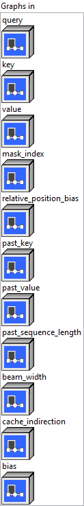
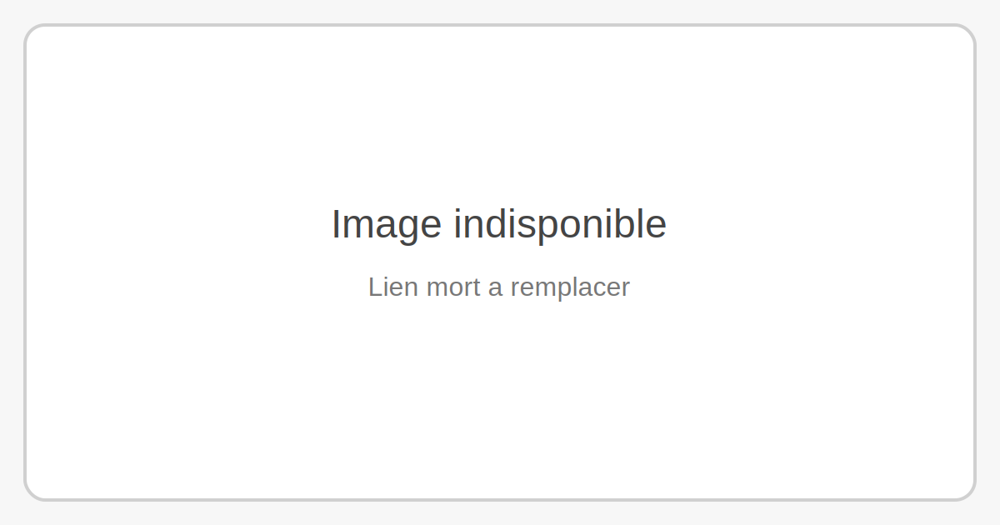
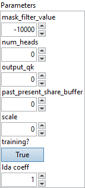
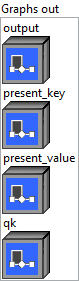

<h1>DecoderMaskedMultiHeadAttention</h1>

<h2>Description</h2>

Multihead attention that supports input sequence length of 1. Similar to DecoderMaskedSelfAttention but this op excludes QKV MatMul and Bias. This op supports both Self and Cross Attention.

<h3>Input parameters</h3>

<table>
  <tbody>
    <tr>
      <td width="64" valign="top"></td>
      <td valign="top"><strong><a href="../../../../../../more-deep-learning/nodes-parameters/specified_outputs_name/README.md">specified_outputs_name</a> : <em>array, </em></strong>this parameter lets you manually assign custom names to the output tensors of a node.</td>
    </tr>
  </tbody>
</table>

<table>
  <tbody>
    <tr>
      <td valign="top" width="70%"><table>
  <tbody>
    <tr>
      <td width="64" valign="top"></td>
      <td valign="top"><strong>Graphs in :</strong> <strong><em>cluster,</em></strong> ONNX model architecture.</td>
    </tr>
    <tr>
      <td></td>
      <td valign="top"><table>
  <tbody>
    <tr>
      <td width="64" valign="top"></td>
      <td valign="top"><strong>query – T : <em>object, </em></strong>query with shape (batch_size, 1, hidden_size) or packed QKV with shape (batch_size, 1, 2 * hidden_size + v_hidden_size).</td>
    </tr>
    <tr>
      <td width="64" valign="top"></td>
      <td valign="top"><strong>key (optional) – T : <em>object, </em></strong>key with shape (batch_size, 1, hidden_size) for self attention or past_key with shape (batch_size, num_heads, kv_sequence_length, head_size) for cross attention.</td>
    </tr>
    <tr>
      <td width="64" valign="top"></td>
      <td valign="top"><strong>value (optional) – T : <em>object, </em></strong>value with shape (batch_size, 1, v_hidden_size) for self attention or past_value with shape (batch_size, num_heads, kv_sequence_length, head_size) for cross attention.</td>
    </tr>
    <tr>
      <td width="64" valign="top"></td>
      <td valign="top"><strong>mask_index (optional) – M : <em>object, </em></strong>mask values of shape (batch_size, total_sequence_length) or (batch_size, kv_sequence_length).</td>
    </tr>
    <tr>
      <td width="64" valign="top"></td>
      <td valign="top"><strong>relative_position_bias (optional) – T : <em>object, </em></strong>additional add to QxK’ with shape (batch_size or 1, num_heads or 1, sequence_length, total_sequence_length).</td>
    </tr>
    <tr>
      <td width="64" valign="top"></td>
      <td valign="top"><strong>past_key</strong> <strong>(optional)</strong> <strong>– T : <em>object, </em></strong>past state for key with shape (batch_size, num_heads, past_sequence_length, head_size) for self attentionWhen past_present_share_buffer is set, its shape is (batch_size, num_heads, max_sequence_length, head_size). The keys buffer is re-ordered in such a way that its virtual sub-tensor of shape (batch_size, num_heads, max_sequence_length, head_size) which may be perceived as being of shape (batch_size, num_heads, max_sequence_length, head_size / x, x) is reordered to become (batch_size, num_heads, head_size / x, max_sequence_length, x) where `x = 16 / sizeof(T)`.</td>
    </tr>
    <tr>
      <td width="64" valign="top"></td>
      <td valign="top"><strong>past_value</strong> <strong>(optional)</strong> <strong>– T : <em>object, </em></strong>past state for value with shape (batch_size, num_heads, past_sequence_length, head_size) for self attentionWhen past_present_share_buffer is set, its shape is (batch_size, num_heads, max_sequence_length, head_size).</td>
    </tr>
    <tr>
      <td width="64" valign="top"></td>
      <td valign="top"><strong>past_sequence_length</strong> <strong>(optional) – M : <em>object, </em></strong>when past_present_share_buffer is used, it is required to specify past_sequence_length (could be 0).Cross Attention doesn’t need this input.</td>
    </tr>
    <tr>
      <td width="64" valign="top"></td>
      <td valign="top"><strong>beam_width</strong> <strong>(optional) </strong><strong>– M : <em>object, </em></strong>the beam width that is being used while decoding. If not provided, the beam width will be assumed to be 1.</td>
    </tr>
    <tr>
      <td width="64" valign="top"></td>
      <td valign="top"><strong>cache_indirection</strong> <strong>(optional) </strong><strong>– M : <em>object, </em></strong>a buffer of shape [batch_size, beam_width, max_output_length] where an `[i, j, k]` entry specifies which beam the `k`-th token came from for the `j`-th beam for batch `i` in the current iteration.</td>
    </tr>
    <tr>
      <td width="64" valign="top"></td>
      <td valign="top"><strong>bias (optional) – T : <em>object, </em></strong>bias tensor with shape (hidden_size + hidden_size + v_hidden_size) from input projection.</td>
    </tr>
  </tbody>
</table></td>
    </tr>
  </tbody>
</table></td>
      <td valign="top" width="30%">

</td>
    </tr>
  </tbody>
</table>

<table>
  <tbody>
    <tr>
      <td valign="top" width="70%"><table>
  <tbody>
    <tr>
      <td width="64" valign="top"></td>
      <td valign="top"><strong>Parameters : <em>cluster,</em></strong></td>
    </tr>
    <tr>
      <td></td>
      <td valign="top"><table>
  <tbody>
    <tr>
      <td width="64" valign="top"></td>
      <td valign="top"><strong>mask_filter_value</strong> <strong>: <em>float,</em></strong> the value to be filled in the attention mask.</td>
    </tr>
    <tr>
      <td width="64" valign="top"></td>
      <td valign="top">Default value “-10000”.</td>
    </tr>
    <tr>
      <td width="64" valign="top"></td>
      <td valign="top"><strong>num_heads :</strong> <em><strong>integer</strong></em>, number of attention heads.</td>
    </tr>
    <tr>
      <td width="64" valign="top"></td>
      <td valign="top">Default value “0”.</td>
    </tr>
    <tr>
      <td width="64" valign="top"></td>
      <td valign="top"><strong>output_qk :</strong> <em><strong>integer</strong></em>, need output the cross attention MatMul(Q, K).</td>
    </tr>
    <tr>
      <td width="64" valign="top"></td>
      <td valign="top">Default value “0”.</td>
    </tr>
    <tr>
      <td width="64" valign="top"></td>
      <td valign="top"><strong>past_present_share_buffer :</strong> <em><strong>integer</strong></em>, corresponding past and present are same tensor, its size is (batch_size, num_heads, max_sequence_length, head_size).</td>
    </tr>
    <tr>
      <td width="64" valign="top"></td>
      <td valign="top">Default value “0”.</td>
    </tr>
    <tr>
      <td width="64" valign="top"></td>
      <td valign="top"><strong>scale : <em>float,</em></strong> custom scale will be used if specified. Default value is 1/sqrt(head_size).</td>
    </tr>
    <tr>
      <td width="64" valign="top"></td>
      <td valign="top">Default value “0”.</td>
    </tr>
    <tr>
      <td width="64" valign="top"></td>
      <td valign="top"><strong>training? :</strong> <em><strong>boolean</strong></em>, whether the layer is in training mode (can store data for backward).</td>
    </tr>
    <tr>
      <td width="64" valign="top"></td>
      <td valign="top">Default value “True”.</td>
    </tr>
    <tr>
      <td width="64" valign="top"></td>
      <td valign="top"><strong>lda coeff :</strong> <em><strong>float</strong></em>, defines the coefficient by which the loss derivative will be multiplied before being sent to the previous layer (since during the backward run we go backwards).</td>
    </tr>
    <tr>
      <td width="64" valign="top"></td>
      <td valign="top">Default value “1”.</td>
    </tr>
  </tbody>
</table></td>
    </tr>
    <tr>
      <td width="64" valign="top"></td>
      <td valign="top"><strong>name (optional) :</strong> <em><strong>string,</strong></em> name of the node.</td>
    </tr>
  </tbody>
</table></td>
      <td valign="top" width="30%">

</td>
    </tr>
  </tbody>
</table>

<h3>Output parameters</h3>

<table>
  <tbody>
    <tr>
      <td valign="top" width="70%"><table>
  <tbody>
    <tr>
      <td width="64" valign="top"></td>
      <td valign="top"><strong>Graphs out :</strong> <strong><em>cluster,</em></strong> ONNX model architecture.</td>
    </tr>
    <tr>
      <td></td>
      <td valign="top"><table>
  <tbody>
    <tr>
      <td width="64" valign="top"></td>
      <td valign="top"><strong>output – T : <em>object, </em></strong>3D output tensor with shape (batch_size, sequence_length, v_hidden_size).</td>
    </tr>
    <tr>
      <td width="64" valign="top"></td>
      <td valign="top"><strong>present_key</strong> <strong>(optional) – T : <em>object, </em></strong>present state for key with shape (batch_size, num_heads, total_sequence_length, head_size). If past_present_share_buffer is set, its shape is (batch_size, num_heads, max_sequence_length, head_size), while effective_seq_length = (past_sequence_length + kv_sequence_length).</td>
    </tr>
    <tr>
      <td width="64" valign="top"></td>
      <td valign="top"><strong>present_value_cache (optional) – T : <em>object, </em></strong>present state for value with shape (batch_size, num_heads, total_sequence_length, head_size). If past_present_share_buffer is set, its shape is (batch_size, num_heads, max_sequence_length, head_size), while effective_seq_length = (past_sequence_length + kv_sequence_length).</td>
    </tr>
    <tr>
      <td width="64" valign="top"></td>
      <td valign="top"><strong>qk (optional) – QK : <em>object, </em></strong>normalized Q * K, of shape (batch_size, num_heads, 1, total_sequence_length).</td>
    </tr>
  </tbody>
</table></td>
    </tr>
  </tbody>
</table></td>
      <td valign="top" width="30%">

</td>
    </tr>
  </tbody>
</table>

<h2>Type Constraints</h2>

<strong>T</strong> in (<code>tensor(float)</code>, <code>tensor(float16)</code>) : Constrain input and output types to float tensors.

<strong>QK</strong> in (<code>tensor(float)</code>, <code>tensor(float16)</code>) : Constrain QK output to float32 or float16 tensors, independent of input type or output type.

<strong>M</strong> in (<code>tensor(int32)</code>) : Constrain mask index to integer types.

<h2>Example</h2>

All these exemples are snippets PNG, you can drop these Snippet onto the block diagram and get the depicted code added to your VI (Do not forget to install Deep Learning library to run it).

