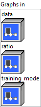
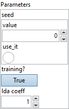

<h1>Dropout</h1>

<h2>Description</h2>

Dropout takes an input floating-point tensor, an optional input ratio (floating-point scalar) and an optional input training_mode (boolean scalar). It produces two tensor outputs, output (floating-point tensor) and mask (optional <code>Tensor&lt;bool&gt;</code>). If <code>training_mode</code> is true then the output Y will be a random dropout; Note that this Dropout scales the masked input data by the following equation, so to convert the trained model into inference mode, the user can simply not pass <code>training_mode</code> input or set it to false.

output

=

scale

*

data

*

mask

,

where

scale

=

1.

/

(

1.

-

ratio

)

.

This operator has <strong>optional</strong> inputs/outputs. See <a href="https://github.com/onnx/onnx/blob/main/docs/IR.md">ONNX IR</a> for more details about the representation of optional arguments. An empty string may be used in the place of an actual argument’s name to indicate a missing argument. Trailing optional arguments (those not followed by an argument that is present) may also be simply omitted.

<h3>Input parameters</h3>

<table>
  <tbody>
    <tr>
      <td width="64" valign="top"></td>
      <td valign="top"><strong><a href="../../../../../../more-deep-learning/nodes-parameters/specified_outputs_name/README.md">specified_outputs_name</a> : <em>array, </em></strong>this parameter lets you manually assign custom names to the output tensors of a node.</td>
    </tr>
  </tbody>
</table>

<table>
  <tbody>
    <tr>
      <td valign="top" width="70%"><table>
  <tbody>
    <tr>
      <td width="64" valign="top"></td>
      <td valign="top"><strong>Graphs in :</strong> <strong><em>cluster,</em></strong> ONNX model architecture.</td>
    </tr>
    <tr>
      <td></td>
      <td valign="top"><table>
  <tbody>
    <tr>
      <td width="64" valign="top"></td>
      <td valign="top"><strong>data (heterogeneous) – T : <em>object, </em></strong>the input data as tensor.</td>
    </tr>
    <tr>
      <td width="64" valign="top"></td>
      <td valign="top"><strong>ratio (optional, heterogeneous) – T1 : <em>object, </em></strong>the ratio of random dropout, with value in [0, 1). If this input was not set, or if it was set to 0, the output would be a simple copy of the input. If it’s non-zero, output will be a random dropout of the scaled input, which is typically the case during training. It is an optional value, if not specified it will default to 0.5.</td>
    </tr>
    <tr>
      <td width="64" valign="top"></td>
      <td valign="top"><strong>training mode</strong> <strong>(optional, heterogeneous)</strong> <strong>– T2 : <em>object, </em></strong>if set to true then it indicates dropout is being used for training. It is an optional value hence unless specified explicitly, it is false. If it is false, ratio is ignored and the operation mimics inference mode where nothing will be dropped from the input data and if mask is requested as output it will contain all ones.</td>
    </tr>
  </tbody>
</table></td>
    </tr>
  </tbody>
</table></td>
      <td valign="top" width="30%">

</td>
    </tr>
  </tbody>
</table>

<table>
  <tbody>
    <tr>
      <td valign="top" width="70%"><table>
  <tbody>
    <tr>
      <td width="64" valign="top"></td>
      <td valign="top"><strong>Parameters : <em>cluster,</em></strong></td>
    </tr>
    <tr>
      <td></td>
      <td valign="top"><table>
  <tbody>
    <tr>
      <td width="64" valign="top"></td>
      <td valign="top"><strong>seed : <em>integer,</em></strong> seed to the random generator, if not specified we will auto generate one.</td>
    </tr>
    <tr>
      <td width="64" valign="top"></td>
      <td valign="top">Default value “0”.</td>
    </tr>
    <tr>
      <td width="64" valign="top"></td>
      <td valign="top"><strong>training? :</strong> <em><strong>boolean</strong></em>, whether the layer is in training mode (can store data for backward).</td>
    </tr>
    <tr>
      <td width="64" valign="top"></td>
      <td valign="top">Default value “True”.</td>
    </tr>
    <tr>
      <td width="64" valign="top"></td>
      <td valign="top"><strong>lda coeff :</strong> <em><strong>float</strong></em>, defines the coefficient by which the loss derivative will be multiplied before being sent to the previous layer (since during the backward run we go backwards).</td>
    </tr>
    <tr>
      <td width="64" valign="top"></td>
      <td valign="top">Default value “1”.</td>
    </tr>
  </tbody>
</table></td>
    </tr>
    <tr>
      <td width="64" valign="top"></td>
      <td valign="top"><strong>name (optional) :</strong> <em><strong>string,</strong></em> name of the node.</td>
    </tr>
  </tbody>
</table></td>
      <td valign="top" width="30%">

</td>
    </tr>
  </tbody>
</table>

<h3>Output parameters</h3>

<table>
  <tbody>
    <tr>
      <td valign="top" width="70%"><table>
  <tbody>
    <tr>
      <td width="64" valign="top"></td>
      <td valign="top"><strong>Graphs out :</strong> <strong><em>cluster,</em></strong> ONNX model architecture.</td>
    </tr>
    <tr>
      <td></td>
      <td valign="top"><table>
  <tbody>
    <tr>
      <td width="64" valign="top"></td>
      <td valign="top"><strong>output (heterogeneous) – T : <em>object, </em></strong>the output.</td>
    </tr>
    <tr>
      <td width="64" valign="top"></td>
      <td valign="top"><strong>mask (optional, heterogeneous) – T2 : <em>object, </em></strong>the output mask.</td>
    </tr>
  </tbody>
</table></td>
    </tr>
  </tbody>
</table></td>
      <td valign="top" width="30%">

</td>
    </tr>
  </tbody>
</table>

<h2>Type Constraints</h2>

<strong>T</strong> in (<code>tensor(bfloat16)</code>, <code>tensor(double)</code>, <code>tensor(float)</code>, <code>tensor(float16)</code>) : Constrain input and output types to float tensors.

<strong>T1</strong> in (<code>tensor(double)</code>, <code>tensor(float)</code>, <code>tensor(float16)</code>) : Constrain input ‘ratio’ types to float tensors.

<strong>T2</strong> in (<code>tensor(bool)</code>) : Constrain output ‘mask’ types to boolean tensors.

<h2>Example</h2>

All these exemples are snippets PNG, you can drop these Snippet onto the block diagram and get the depicted code added to your VI (Do not forget to install Deep Learning library to run it).

