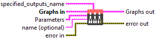
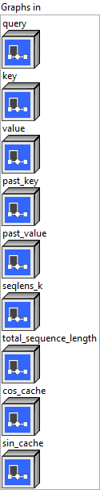
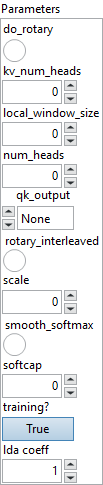
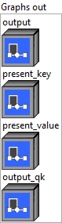

<h1>GroupQueryAttention</h1>

<h2>Description</h2>

Group Query Self/Cross Attention.

<h3>Input parameters</h3>

<table>
  <tbody>
    <tr>
      <td width="64" valign="top"></td>
      <td valign="top"><strong><a href="../../../../../../more-deep-learning/nodes-parameters/specified_outputs_name/README.md">specified_outputs_name</a> : <em>array, </em></strong>this parameter lets you manually assign custom names to the output tensors of a node.</td>
    </tr>
  </tbody>
</table>

<table>
  <tbody>
    <tr>
      <td valign="top" width="70%"><table>
  <tbody>
    <tr>
      <td width="64" valign="top"></td>
      <td valign="top"><strong>Graphs in :</strong> <strong><em>cluster,</em></strong> ONNX model architecture.</td>
    </tr>
    <tr>
      <td></td>
      <td valign="top"><table>
  <tbody>
    <tr>
      <td width="64" valign="top"></td>
      <td valign="top"><strong>query (heterogeneous) – T : <em>object, </em></strong>query with shape (batch_size, sequence_length, hidden_size), or packed QKV with shape(batch_size, sequence_length, d) where d is (num_heads * head_size + 2 * kv_num_heads * head_size).</td>
    </tr>
    <tr>
      <td width="64" valign="top"></td>
      <td valign="top"><strong>key (optional, heterogeneous) – T : <em>object, </em></strong>key with shape (batch_size, kv_sequence_length, kv_hidden_size).</td>
    </tr>
    <tr>
      <td width="64" valign="top"></td>
      <td valign="top"><strong>value (optional, heterogeneous) – T : <em>object, </em></strong>value with shape (batch_size, kv_sequence_length, kv_hidden_size).</td>
    </tr>
    <tr>
      <td width="64" valign="top"></td>
      <td valign="top"><strong>past_key (optional, heterogeneous) – T : <em>object, </em></strong>past state key with support for format BNSH. When past_key uses same tensor as present_key(k-v cache), it is of length max_sequence_length… otherwise of length past_sequence_length.</td>
    </tr>
    <tr>
      <td width="64" valign="top"></td>
      <td valign="top"><strong>past_value (optional, heterogeneous) – T : <em>object, </em></strong>past state value with support for format BNSH. When past_value uses same tensor as present_value(k-v cache), it is of length max_sequence_length… otherwise of length past_sequence_length.</td>
    </tr>
    <tr>
      <td width="64" valign="top"></td>
      <td valign="top"><strong>seqlens_k (heterogeneous) – M : <em>object, </em></strong>1D Tensor of shape (batch_size). Equivalent to (total_sequence_lengths – 1).</td>
    </tr>
    <tr>
      <td width="64" valign="top"></td>
      <td valign="top"><strong>total_sequence_length (heterogeneous) – M : <em>object, </em></strong>scalar tensor equivalent to the maximum total sequence length (past + new) of the batch. Used for checking inputs and determining prompt vs token generation case.</td>
    </tr>
    <tr>
      <td width="64" valign="top"></td>
      <td valign="top"><strong>cos_cache (optional, heterogeneous) – T : <em>object, </em></strong>2D tensor with shape (max_sequence_length, head_size / 2).</td>
    </tr>
    <tr>
      <td width="64" valign="top"></td>
      <td valign="top"><strong>sin_cache (optional, heterogeneous) – T : <em>object, </em></strong>2D tensor with shape (max_sequence_length, head_size / 2).</td>
    </tr>
  </tbody>
</table></td>
    </tr>
  </tbody>
</table></td>
      <td valign="top" width="30%">

</td>
    </tr>
  </tbody>
</table>

<table>
  <tbody>
    <tr>
      <td valign="top" width="70%"><table>
  <tbody>
    <tr>
      <td width="64" valign="top"></td>
      <td valign="top"><strong>Parameters : <em>cluster,</em></strong></td>
    </tr>
    <tr>
      <td></td>
      <td valign="top"><table>
  <tbody>
    <tr>
      <td width="64" valign="top"></td>
      <td valign="top"><strong>do rotary :</strong> <em><strong>boolean</strong></em>, whether to use rotary position embedding.</td>
    </tr>
    <tr>
      <td width="64" valign="top"></td>
      <td valign="top">Default value “False”.</td>
    </tr>
    <tr>
      <td width="64" valign="top"></td>
      <td valign="top"><strong>kv_num_heads : <em>integer,</em></strong> number of attention heads for k and v.</td>
    </tr>
    <tr>
      <td width="64" valign="top"></td>
      <td valign="top">Default value “0”.</td>
    </tr>
    <tr>
      <td width="64" valign="top"></td>
      <td valign="top"><strong>local_window_size : <em>integer,</em></strong> left_window_size for local attention (like Mistral).</td>
    </tr>
    <tr>
      <td width="64" valign="top"></td>
      <td valign="top">Default value “0”.</td>
    </tr>
    <tr>
      <td width="64" valign="top"></td>
      <td valign="top"><strong>num_heads : <em>integer,</em></strong> number of attention heads for q.</td>
    </tr>
    <tr>
      <td width="64" valign="top"></td>
      <td valign="top">Default value “0”.</td>
    </tr>
    <tr>
      <td width="64" valign="top"></td>
      <td valign="top"><strong>qk_output : <em>enum,</em></strong> output values of QK matrix multiplication before (1) or after (2) softmax normalization.</td>
    </tr>
    <tr>
      <td width="64" valign="top"></td>
      <td valign="top">Default value “None”.</td>
    </tr>
    <tr>
      <td width="64" valign="top"></td>
      <td valign="top"><strong>rotary_interleaved :</strong> <em><strong>boolean</strong></em>, rotate using interleaved pattern.</td>
    </tr>
    <tr>
      <td width="64" valign="top"></td>
      <td valign="top">Default value “False”.</td>
    </tr>
    <tr>
      <td width="64" valign="top"></td>
      <td valign="top"><strong>scale : <em>float,</em></strong> custom scale will be used if specified.</td>
    </tr>
    <tr>
      <td width="64" valign="top"></td>
      <td valign="top">Default value “0”.</td>
    </tr>
    <tr>
      <td width="64" valign="top"></td>
      <td valign="top"><strong>smooth_softmax :</strong> <em><strong>boolean</strong></em>, use a smooth factor in softmax.</td>
    </tr>
    <tr>
      <td width="64" valign="top"></td>
      <td valign="top">Default value “False”.</td>
    </tr>
    <tr>
      <td width="64" valign="top"></td>
      <td valign="top"><strong>softcap :</strong> <em><strong>float</strong></em>, softcap value for attention weights.</td>
    </tr>
    <tr>
      <td width="64" valign="top"></td>
      <td valign="top">Default value “0”.</td>
    </tr>
    <tr>
      <td width="64" valign="top"></td>
      <td valign="top"><strong>training? :</strong> <em><strong>boolean</strong></em>, whether the layer is in training mode (can store data for backward).</td>
    </tr>
    <tr>
      <td width="64" valign="top"></td>
      <td valign="top">Default value “True”.</td>
    </tr>
    <tr>
      <td width="64" valign="top"></td>
      <td valign="top"><strong>lda coeff :</strong> <em><strong>float</strong></em>, defines the coefficient by which the loss derivative will be multiplied before being sent to the previous layer (since during the backward run we go backwards).</td>
    </tr>
    <tr>
      <td width="64" valign="top"></td>
      <td valign="top">Default value “1”.</td>
    </tr>
  </tbody>
</table></td>
    </tr>
    <tr>
      <td width="64" valign="top"></td>
      <td valign="top"><strong>name (optional) :</strong> <em><strong>string,</strong></em> name of the node.</td>
    </tr>
  </tbody>
</table></td>
      <td valign="top" width="30%">

</td>
    </tr>
  </tbody>
</table>

<h3>Output parameters</h3>

<table>
  <tbody>
    <tr>
      <td valign="top" width="70%"><table>
  <tbody>
    <tr>
      <td width="64" valign="top"></td>
      <td valign="top"><strong>Graphs out :</strong> <strong><em>cluster,</em></strong> ONNX model architecture.</td>
    </tr>
    <tr>
      <td></td>
      <td valign="top"><table>
  <tbody>
    <tr>
      <td width="64" valign="top"></td>
      <td valign="top"><strong>output (heterogeneous) – T : <em>object, </em></strong>3D output tensor with shape (batch_size, sequence_length, hidden_size).</td>
    </tr>
    <tr>
      <td width="64" valign="top"></td>
      <td valign="top"><strong>present_key (heterogeneous) – T : <em>object, </em></strong>present state key with support for format BNSH. When past_key uses same tensor as present_key(k-v buffer), it is of length max_sequence_length… otherwise of length past_sequence_length +kv_sequence_length.</td>
    </tr>
    <tr>
      <td width="64" valign="top"></td>
      <td valign="top"><strong>present_value (heterogeneous) – T : <em>object, </em></strong>present state value with support for format BNSH. When past_value uses same tensor as present_value(k-v buffer), it is of length max_sequence_length… otherwise of length past_sequence_length +kv_sequence_length.</td>
    </tr>
    <tr>
      <td width="64" valign="top"></td>
      <td valign="top"><strong>output_qk (optional, heterogeneous) – T : <em>object, </em></strong>values of QK matrix multiplication, either before or after softmax normalization.</td>
    </tr>
  </tbody>
</table></td>
    </tr>
  </tbody>
</table></td>
      <td valign="top" width="30%">

</td>
    </tr>
  </tbody>
</table>

<h2>Type Constraints</h2>

<strong>T</strong> in (<code>tensor(float)</code>, <code>tensor(float16)</code>, <code>tensor(bfloat16)</code>) : Constrain input and output to float tensors.

<strong>M</strong> in (<code>tensor(int32)</code>) : Constrain mask to int tensor.

<h2>Example</h2>

All these exemples are snippets PNG, you can drop these Snippet onto the block diagram and get the depicted code added to your VI (Do not forget to install Deep Learning library to run it).

