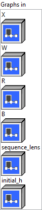
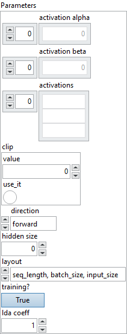
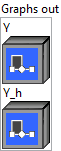

<h1>RNN</h1>

<h2>Description</h2>

Computes an one-layer simple RNN.

<h3>Input parameters</h3>

<table>
  <tbody>
    <tr>
      <td width="64" valign="top"></td>
      <td valign="top"><strong><a href="../../../../../../more-deep-learning/nodes-parameters/specified_outputs_name/README.md">specified_outputs_name</a> : <em>array, </em></strong>this parameter lets you manually assign custom names to the output tensors of a node.</td>
    </tr>
  </tbody>
</table>

<table>
  <tbody>
    <tr>
      <td valign="top" width="70%"><table>
  <tbody>
    <tr>
      <td width="64" valign="top"></td>
      <td valign="top"><strong>Graphs in :</strong> <strong><em>cluster,</em></strong> ONNX model architecture.</td>
    </tr>
    <tr>
      <td></td>
      <td valign="top"><table>
  <tbody>
    <tr>
      <td width="64" valign="top"></td>
      <td valign="top"><strong>X (heterogeneous) – T : <em>object, </em></strong>the input sequences packed (and potentially padded) into one 3-D tensor with the shape of <code>[seq_length, batch_size, input_size]</code>.</td>
    </tr>
    <tr>
      <td width="64" valign="top"></td>
      <td valign="top"><strong>W (heterogeneous) – T : <em>object, </em></strong>the weight tensor for input gate. Concatenation of <code>Wi</code> and <code>WBi</code> (if bidirectional). The tensor has shape <code>[num_directions, hidden_size, input_size]</code>.</td>
    </tr>
    <tr>
      <td width="64" valign="top"></td>
      <td valign="top"><strong>R (heterogeneous) – T : <em>object, </em></strong>the recurrence weight tensor. Concatenation of <code>Ri</code> and <code>RBi</code> (if bidirectional). The tensor has shape <code>[num_directions, hidden_size, hidden_size]</code>.</td>
    </tr>
    <tr>
      <td width="64" valign="top"></td>
      <td valign="top"><strong>B (optional, heterogeneous) – T : <em>object, </em></strong>the bias tensor for input gate. Concatenation of <code>[Wbi, Rbi]</code> and <code>[WBbi, RBbi]</code> (if bidirectional). The tensor has shape <code>[num_directions, 2*hidden_size]</code>. Optional: If not specified – assumed to be 0.</td>
    </tr>
    <tr>
      <td width="64" valign="top"></td>
      <td valign="top"><strong>sequence lens (optional, heterogeneous) – T1 : </strong>optional tensor specifying lengths of the sequences in a batch. If not specified – assumed all sequences in the batch to have length <code>seq_length</code>. It has shape <code>[batch_size]</code>.</td>
    </tr>
    <tr>
      <td width="64" valign="top"></td>
      <td valign="top"><strong>initial_h</strong> <strong>(optional, heterogeneous) </strong><strong>– T : <em>object, </em></strong>optional initial value of the hidden. If not specified – assumed to be 0. It has shape <code>[num_directions, batch_size, hidden_size]</code>.</td>
    </tr>
  </tbody>
</table></td>
    </tr>
  </tbody>
</table></td>
      <td valign="top" width="30%">

</td>
    </tr>
  </tbody>
</table>

<table>
  <tbody>
    <tr>
      <td valign="top" width="70%"><table>
  <tbody>
    <tr>
      <td width="64" valign="top"></td>
      <td valign="top"><strong>Parameters : <em>cluster,</em></strong></td>
    </tr>
    <tr>
      <td></td>
      <td valign="top"><table>
  <tbody>
    <tr>
      <td width="64" valign="top"></td>
      <td valign="top"><strong>activation alpha :</strong> <em><strong>array</strong></em>, optional scaling values used by some activation functions. The values are consumed in the order of activation functions, for example (f, g, h) in LSTM. Default values are the same as of corresponding ONNX operators.For example with LeakyRelu, the default alpha is 0.01.</td>
    </tr>
    <tr>
      <td width="64" valign="top"></td>
      <td valign="top">Default value “empty”.</td>
    </tr>
    <tr>
      <td width="64" valign="top"></td>
      <td valign="top"><strong>activation beta :</strong> <em><strong>array</strong></em>, optional scaling values used by some activation functions. The values are consumed in the order of activation functions, for example (f, g, h) in LSTM. Default values are the same as of corresponding ONNX operators.</td>
    </tr>
    <tr>
      <td width="64" valign="top"></td>
      <td valign="top">Default value “empty”.</td>
    </tr>
    <tr>
      <td width="64" valign="top"></td>
      <td valign="top"><strong>activations : <em>array,</em></strong> one (or two if bidirectional) activation function for input gate. The activation function must be one of the activation functions specified above. Optional: Default <code>Tanh</code> if not specified.</td>
    </tr>
    <tr>
      <td width="64" valign="top"></td>
      <td valign="top">Default value “empty”.</td>
    </tr>
    <tr>
      <td width="64" valign="top"></td>
      <td valign="top"><strong>clip :</strong> <em><strong>float</strong></em>, cell clip threshold. Clipping bounds the elements of a tensor in the range of [-threshold, +threshold] and is applied to the input of activations. No clip if not specified.</td>
    </tr>
    <tr>
      <td width="64" valign="top"></td>
      <td valign="top">Default value “0”.</td>
    </tr>
    <tr>
      <td width="64" valign="top"></td>
      <td valign="top"><strong>direction : <em>enum,</em></strong> specify if the RNN is forward, reverse, or bidirectional. Must be one of forward (default), reverse, or bidirectional.</td>
    </tr>
    <tr>
      <td width="64" valign="top"></td>
      <td valign="top">Default value “forward”.</td>
    </tr>
    <tr>
      <td width="64" valign="top"></td>
      <td valign="top"><strong>hidden size : <em>integer,</em></strong> number of neurons in the hidden layer.</td>
    </tr>
    <tr>
      <td width="64" valign="top"></td>
      <td valign="top">Default value “0”.</td>
    </tr>
    <tr>
      <td width="64" valign="top"></td>
      <td valign="top"><strong>layout : <em>enum,</em></strong> the shape format of inputs X, initial_h and outputs Y, Y_h. If 0, the following shapes are expected: X.shape = [seq_length, batch_size, input_size], Y.shape = [seq_length, num_directions, batch_size, hidden_size], initial_h.shape = Y_h.shape = [num_directions, batch_size, hidden_size]. If 1, the following shapes are expected: X.shape = [batch_size, seq_length, input_size], Y.shape = [batch_size, seq_length, num_directions, hidden_size], initial_h.shape = Y_h.shape = [batch_size, num_directions, hidden_size].</td>
    </tr>
    <tr>
      <td width="64" valign="top"></td>
      <td valign="top">Default value “seq_length, batch_size, input_size”.</td>
    </tr>
    <tr>
      <td width="64" valign="top"></td>
      <td valign="top"><strong>training? :</strong> <em><strong>boolean</strong></em>, whether the layer is in training mode (can store data for backward).</td>
    </tr>
    <tr>
      <td width="64" valign="top"></td>
      <td valign="top">Default value “True”.</td>
    </tr>
    <tr>
      <td width="64" valign="top"></td>
      <td valign="top"><strong>lda coeff :</strong> <em><strong>float</strong></em>, defines the coefficient by which the loss derivative will be multiplied before being sent to the previous layer (since during the backward run we go backwards).</td>
    </tr>
    <tr>
      <td width="64" valign="top"></td>
      <td valign="top">Default value “1”.</td>
    </tr>
  </tbody>
</table></td>
    </tr>
    <tr>
      <td width="64" valign="top"></td>
      <td valign="top"><strong>name (optional) :</strong> <em><strong>string,</strong></em> name of the node.</td>
    </tr>
  </tbody>
</table></td>
      <td valign="top" width="30%">

</td>
    </tr>
  </tbody>
</table>

<h3>Output parameters</h3>

<table>
  <tbody>
    <tr>
      <td valign="top" width="70%"><table>
  <tbody>
    <tr>
      <td width="64" valign="top"></td>
      <td valign="top"><strong>Graphs out :</strong> <strong><em>cluster,</em></strong> ONNX model architecture.</td>
    </tr>
    <tr>
      <td></td>
      <td valign="top"><table>
  <tbody>
    <tr>
      <td width="64" valign="top"></td>
      <td valign="top"><strong>Y (optional, heterogeneous) – T : <em>object, </em></strong>a tensor that concats all the intermediate output values of the hidden. It has shape <code>[seq_length, num_directions, batch_size, hidden_size]</code>.</td>
    </tr>
    <tr>
      <td width="64" valign="top"></td>
      <td valign="top"><strong>Y_h (optional, heterogeneous) – T : <em>object, </em></strong>the last output value of the hidden. It has shape <code>[num_directions, batch_size, hidden_size]</code>.</td>
    </tr>
  </tbody>
</table></td>
    </tr>
  </tbody>
</table></td>
      <td valign="top" width="30%">

</td>
    </tr>
  </tbody>
</table>

<h2>Type Constraints</h2>

<strong>T</strong> in (<code>tensor(double)</code>, <code>tensor(float)</code>, <code>tensor(float16)</code>) : Constrain input and output types to float tensors.

<strong>T1</strong> in (<code>tensor(int32)</code>) : Constrain seq_lens to integer tensor.

<h2>Example</h2>

All these exemples are snippets PNG, you can drop these Snippet onto the block diagram and get the depicted code added to your VI (Do not forget to install Deep Learning library to run it).

