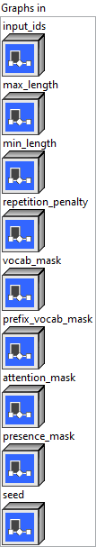
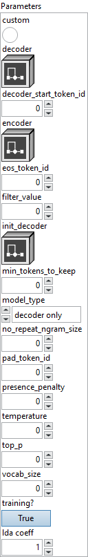
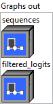

<h1>Sampling</h1>

<h2>Description</h2>

Greedy Sampling for text generation.

<h3>Input parameters</h3>

<table>
  <tbody>
    <tr>
      <td width="64" valign="top"></td>
      <td valign="top"><strong><a href="../../../../../../more-deep-learning/nodes-parameters/specified_outputs_name/README.md">specified_outputs_name</a> : <em>array, </em></strong>this parameter lets you manually assign custom names to the output tensors of a node.</td>
    </tr>
  </tbody>
</table>

<table>
  <tbody>
    <tr>
      <td valign="top" width="70%"><table>
  <tbody>
    <tr>
      <td width="64" valign="top"></td>
      <td valign="top"><strong>Graphs in :</strong> <strong><em>cluster,</em></strong> ONNX model architecture.</td>
    </tr>
    <tr>
      <td></td>
      <td valign="top"><table>
  <tbody>
    <tr>
      <td width="64" valign="top"></td>
      <td valign="top"><strong>input_ids (heterogeneous) – I : <em>object, </em></strong>the sequence used as a prompt for the generation. Shape is (batch_size, sequence_length).</td>
    </tr>
    <tr>
      <td width="64" valign="top"></td>
      <td valign="top"><strong>max_length (heterogeneous) – I : <em>object, </em></strong>the maximum length of the sequence to be generated. Shape is (1).</td>
    </tr>
    <tr>
      <td width="64" valign="top"></td>
      <td valign="top"><strong>min_length (optional, heterogeneous) – I : <em>object, </em></strong>the minimum length below which the score of eos_token_id is set to -Inf. Shape is (1).</td>
    </tr>
    <tr>
      <td width="64" valign="top"></td>
      <td valign="top"><strong>repetition_penalty (optional, heterogeneous) – T : <em>object, </em></strong>the parameter for repetition penalty. Default value 1.0 means no penalty. Accepts value > 0.0. Shape is (1).</td>
    </tr>
    <tr>
      <td width="64" valign="top"></td>
      <td valign="top"><strong>vocab_mask (optional, heterogeneous) – I : <em>object, </em></strong>mask of vocabulary. Words that masked with 0 are not allowed to be generated, and 1 is allowed. Shape is (vocab_size).</td>
    </tr>
    <tr>
      <td width="64" valign="top"></td>
      <td valign="top"><strong>prefix_vocab_mask (optional, heterogeneous) – I : <em>object, </em></strong>mask of vocabulary for first step. Words that masked with 0 are not allowed to be generated, and 1 is allowed. Shape is (batch_size, vocab_size).</td>
    </tr>
    <tr>
      <td width="64" valign="top"></td>
      <td valign="top"><strong>attention_mask (optional, heterogeneous) – I : <em>object, </em></strong>custom attention mask. Shape is (batch_size, sequence_length).</td>
    </tr>
    <tr>
      <td width="64" valign="top"></td>
      <td valign="top"><strong>presence_mask (optional, heterogeneous) – I : <em>object, </em></strong>presence penalty mask. Shape is (batch_size, vocab_size).</td>
    </tr>
    <tr>
      <td width="64" valign="top"></td>
      <td valign="top"><strong>seed (optional, heterogeneous) – I : <em>object, </em></strong>seed for random number generator. Shape is (1).</td>
    </tr>
  </tbody>
</table></td>
    </tr>
  </tbody>
</table></td>
      <td valign="top" width="30%">

</td>
    </tr>
  </tbody>
</table>

<table>
  <tbody>
    <tr>
      <td valign="top" width="70%"><table>
  <tbody>
    <tr>
      <td width="64" valign="top"></td>
      <td valign="top"><strong>Parameters : <em>cluster,</em></strong></td>
    </tr>
    <tr>
      <td></td>
      <td valign="top"><table>
  <tbody>
    <tr>
      <td width="64" valign="top"></td>
      <td valign="top"><strong>custom :</strong> <em><strong>boolean</strong></em>, if true custom sampling logic.</td>
    </tr>
    <tr>
      <td width="64" valign="top"></td>
      <td valign="top">Default value “False”.</td>
    </tr>
    <tr>
      <td width="64" valign="top"></td>
      <td valign="top"><strong>decoder : <em>object,</em></strong> decoder subgraph to execute in a loop.</td>
    </tr>
    <tr>
      <td width="64" valign="top"></td>
      <td valign="top"><strong>decoder_start_token_id :</strong> <em><strong>integer</strong></em>, the id of the token that indicates decoding starts.</td>
    </tr>
    <tr>
      <td width="64" valign="top"></td>
      <td valign="top">Default value “0”.</td>
    </tr>
    <tr>
      <td width="64" valign="top"></td>
      <td valign="top"><strong>encoder : <em>object,</em></strong> the subgraph for initialization of encoder and decoder. It will be called once before decoder subgraph.</td>
    </tr>
    <tr>
      <td width="64" valign="top"></td>
      <td valign="top"><strong>eos_token_id :</strong> <em><strong>integer</strong></em>, the id of the end-of-sequence token.</td>
    </tr>
    <tr>
      <td width="64" valign="top"></td>
      <td valign="top">Default value “0”.</td>
    </tr>
    <tr>
      <td width="64" valign="top"></td>
      <td valign="top"><strong>filter_value :</strong> <em><strong>float</strong></em>, all filtered values will be set to this float value.</td>
    </tr>
    <tr>
      <td width="64" valign="top"></td>
      <td valign="top">Default value “0”.</td>
    </tr>
    <tr>
      <td width="64" valign="top"></td>
      <td valign="top"><strong>init_decoder : <em>object,</em></strong> the subgraph for the first decoding run. It will be called once before `decoder` subgraph. This is relevant only for the GPT2 model. If this attribute is missing, the `decoder` subgraph will be used for all decoding runs.</td>
    </tr>
    <tr>
      <td width="64" valign="top"></td>
      <td valign="top"><strong>min_tokens_to_keep :</strong> <em><strong>integer</strong></em>, minimumber of tokens we keep per batch example in the output.</td>
    </tr>
    <tr>
      <td width="64" valign="top"></td>
      <td valign="top">Default value “0”.</td>
    </tr>
    <tr>
      <td width="64" valign="top"></td>
      <td valign="top"><strong>model_type : <em>enum,</em></strong> model type.</td>
    </tr>
    <tr>
      <td width="64" valign="top"></td>
      <td valign="top">Default value “decoder only”.</td>
    </tr>
    <tr>
      <td width="64" valign="top"></td>
      <td valign="top"><strong>no_repeat_ngram_size :</strong> <em><strong>integer</strong></em>, no repeat ngrams size.</td>
    </tr>
    <tr>
      <td width="64" valign="top"></td>
      <td valign="top">Default value “0”.</td>
    </tr>
    <tr>
      <td width="64" valign="top"></td>
      <td valign="top"><strong>pad_token_id :</strong> <em><strong>integer</strong></em>, the id of the padding token.</td>
    </tr>
    <tr>
      <td width="64" valign="top"></td>
      <td valign="top">Default value “0”.</td>
    </tr>
    <tr>
      <td width="64" valign="top"></td>
      <td valign="top"><strong>presence_penalty :</strong> <em><strong>float</strong></em>, presence penalty for custom sampling.</td>
    </tr>
    <tr>
      <td width="64" valign="top"></td>
      <td valign="top">Default value “0”.</td>
    </tr>
    <tr>
      <td width="64" valign="top"></td>
      <td valign="top"><strong>temperature :</strong> <em><strong>float</strong></em>, the value used to module the next token probabilities.</td>
    </tr>
    <tr>
      <td width="64" valign="top"></td>
      <td valign="top">Default value “0”.</td>
    </tr>
    <tr>
      <td width="64" valign="top"></td>
      <td valign="top"><strong>top_p :</strong> <em><strong>float</strong></em>, if set to float < 1, only the smallest set of most probable tokens with probabilities that add up to `top_p` or higher are kept for generation.</td>
    </tr>
    <tr>
      <td width="64" valign="top"></td>
      <td valign="top">Default value “0”.</td>
    </tr>
    <tr>
      <td width="64" valign="top"></td>
      <td valign="top"><strong>vocab_size :</strong> <em><strong>integer</strong></em>, size of the vocabulary. If not provided, it will be inferred from the decoder subgraph’s output shape.</td>
    </tr>
    <tr>
      <td width="64" valign="top"></td>
      <td valign="top">Default value “0”.</td>
    </tr>
    <tr>
      <td width="64" valign="top"></td>
      <td valign="top"><strong>training? :</strong> <em><strong>boolean</strong></em>, whether the layer is in training mode (can store data for backward).</td>
    </tr>
    <tr>
      <td width="64" valign="top"></td>
      <td valign="top">Default value “True”.</td>
    </tr>
    <tr>
      <td width="64" valign="top"></td>
      <td valign="top"><strong>lda coeff :</strong> <em><strong>float</strong></em>, defines the coefficient by which the loss derivative will be multiplied before being sent to the previous layer (since during the backward run we go backwards).</td>
    </tr>
    <tr>
      <td width="64" valign="top"></td>
      <td valign="top">Default value “1”.</td>
    </tr>
  </tbody>
</table></td>
    </tr>
    <tr>
      <td width="64" valign="top"></td>
      <td valign="top"><strong>name (optional) :</strong> <em><strong>string,</strong></em> name of the node.</td>
    </tr>
  </tbody>
</table></td>
      <td valign="top" width="30%">

</td>
    </tr>
  </tbody>
</table>

<h3>Output parameters</h3>

<table>
  <tbody>
    <tr>
      <td valign="top" width="70%"><table>
  <tbody>
    <tr>
      <td width="64" valign="top"></td>
      <td valign="top"><strong>Graphs out :</strong> <strong><em>cluster,</em></strong> ONNX model architecture.</td>
    </tr>
    <tr>
      <td></td>
      <td valign="top"><table>
  <tbody>
    <tr>
      <td width="64" valign="top"></td>
      <td valign="top"><strong>sequences (heterogeneous) – I : <em>object, </em></strong>word IDs of generated sequences. Shape is (batch_size, max_sequence_length).</td>
    </tr>
    <tr>
      <td width="64" valign="top"></td>
      <td valign="top"><strong>filtered_logits (optional, heterogeneous) – T : <em>object, </em></strong>filtered logits as input to the mutinomial function for debug purpose. Shape is (batch_size, vocab_size).</td>
    </tr>
  </tbody>
</table></td>
    </tr>
  </tbody>
</table></td>
      <td valign="top" width="30%">

</td>
    </tr>
  </tbody>
</table>

<h2>Type Constraints</h2>

<strong>T</strong> in (<code>tensor(float)</code>) : Constrain input and output types to float tensors.

<b>I </b>in (<code>tensor(int32)</code>) : Constrain to integer types.

<h2>Example</h2>

All these exemples are snippets PNG, you can drop these Snippet onto the block diagram and get the depicted code added to your VI (Do not forget to install Deep Learning library to run it).

